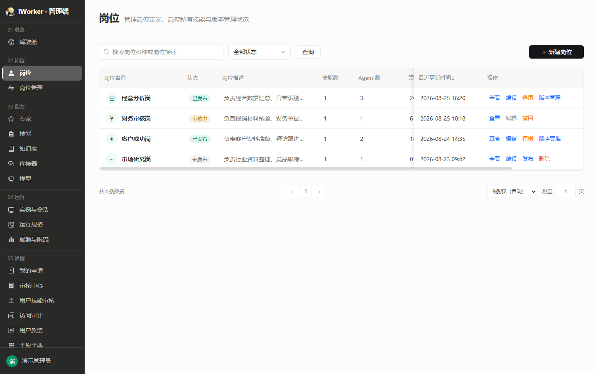

# 岗位产品需求

## 一、导航栏

### 1. 功能说明

导航栏用于帮助管理员搜索岗位、筛选状态，并进入新建岗位流程。岗位用于定义一类工作角色并关联岗位私有技能，发布后供岗位管理使用。

- **页面入口**：侧边栏"02 岗位 / 岗位"。
- **页面标题**：展示"岗位"。
- **页面说明**：文案"管理岗位定义、岗位私有技能与版本管理状态"。
- **搜索框**：占位提示为"搜索岗位名称或岗位描述"，支持按岗位名称或描述模糊搜索。
- **状态筛选**：默认"全部状态"，可选择"未发布、审核中、已发布"。
- **查询按钮**：按照当前搜索内容和状态刷新列表。
- **新建入口**：右侧展示【＋ 新建岗位】，点击后打开居中弹窗（岗位名称最多 64 个字符 + 岗位描述最多 2000 个字符，与人格页签口径一致），创建后提示"岗位已创建，请完善岗位配置"并进入岗位详情页。
- 无匹配结果时展示"没有符合条件的岗位"。

### 2. 交互规则

- 搜索和状态筛选可组合使用；搜索内容在点击【查询】或按回车后生效。
- 清空搜索内容后点击【查询】或按回车，按剩余条件刷新。
- 切换状态筛选后列表立即刷新。
- 点击【＋ 新建岗位】保留列表当前筛选条件。

### 3. 页面状态与异常场景

- **加载中**：列表区域展示加载状态。
- **暂无数据 / 无查询结果**：展示"没有符合条件的岗位"，保留当前条件。
- **加载失败**：展示"加载失败"和【重试】；点击【重试】后重新加载列表。失败状态优先于空状态展示。
- **无页面权限**：不展示岗位入口，也不允许进入岗位页面。

## 二、岗位列表

### 1. 列表展示

岗位列表集中展示平台已定义的岗位。

- **岗位名称**：展示图标和岗位名称。
- **状态**：作为独立列紧跟名称列之后展示，标签为【未发布】【审核中】【已发布】。
- **岗位描述**：单行缩略，悬停查看完整内容；无描述显示"—"。
- **技能数**：展示当前关联的岗位私有技能总数；悬停提示"当前岗位关联的岗位私有技能总数"。
- **Agent 数**：展示基于该岗位创建的 Agent 总数；悬停提示"基于该岗位创建的 Agent 总数"。
- **领用数**：展示当前已领用该岗位的用户总数；悬停提示"当前已领用该岗位的用户总数"。
- **最新版本**：展示最近一次审核通过并正式发布的版本号；尚无版本时显示"—"。不展示待审核版本号。
- **最近更新时间**：展示最近一次保存的时间，精确到分钟；支持点击列头排序。
- **操作**：按状态展示【查看】【编辑】【发布】【撤回】【停用】【删除】【版本管理】。

列表支持分页，平台各列表页采用同一套分页策略：每页条数按页面可用高度自动计算作为初值（最少 5 条、最多 30 条），用户可从 10 / 20 / 30 / 50 手动切换，自动值不在档位内时在下拉中单列并标注"（自动）"；分页条位于列表卡片之外整行展示，左侧"共 N 条数据"、中间页码、右侧每页条数与"跳至 __ 页"（输入框常显当前页，越界自动修正到合法范围）。

### 2. 排序规则

- 默认按最近更新时间由近到远排列，点击列头切换升降序。
- 保存岗位配置或提交审核操作后，按新的最近更新时间重新排列。

### 3. 操作

#### 3.1 操作按钮展示规则

- 【查看】和【编辑】为固定操作，所有状态展示；审核中【编辑】置灰并提示"审核中不可编辑"。
- 各状态按钮组合：
  - **未发布**：【查看】【编辑】【发布】【删除】，共 4 个按钮；【删除】按钮悬停提示"删除前需二次确认"。
  - **审核中**：【查看】【编辑】（置灰）【撤回】，共 3 个按钮。
  - **已发布**：【查看】【编辑】【停用】【版本管理】，共 4 个按钮。
- 存在审核中操作时，仅展示【查看】和【撤回】，其他发布 / 停用 / 删除入口均隐藏。

#### 3.2 查看 / 编辑

- 点击【查看】进入岗位详情页只读状态；点击【编辑】进入可编辑状态。
- 审核中的岗位只能查看，不可编辑。

#### 3.3 发布（首发）

- 【发布】用于"未发布"的岗位。满足全部发布前置条件后，点击后打开发布前检查弹窗。
- 岗位名称、岗位图标、岗位描述、领用页文案（至少 1 条）、示例问题（3 条）、岗位 SOP、Agent 与技能（至少 1 个 Agent 且该 Agent 至少引用 1 个技能）、自动化任务（至少 1 条）任一未完成时不执行发布，【发布岗位】点击后自动定位到缺失项所在页签并展示具体缺失项。
- 在发布弹窗确认提交后进入审核：岗位状态变为"审核中"，提示"已提交发布审核"。
- 审核通过后状态变为"已发布"，自动生成版本号并上线；审核被拒绝后回到"未发布"。

#### 3.4 撤回

- 【撤回】仅在"审核中"展示。
- 点击后弹出确认窗口，说明撤回后恢复提交审核前的状态。
- 待审发布撤回后回到"未发布"；待审停用撤回后回到"已发布"。
- 撤回成功提示"已撤回"。

#### 3.5 停用

- 【停用】在"已发布"且无审核中操作时展示。
- 有被用户领用时不可停用，弹窗提示"该岗位已被 N 个用户领用，需先解除领用后再停用"。
- 无领用时点击后弹出确认窗口，文案"停用「岗位名」需提交停用审核。审核通过前客户端仍可正常使用。"，确认按钮【提交停用审核】。
- 确认后提交停用审核，状态变为"审核中"；审核通过后岗位变为"未发布"，客户端停止提供；被拒绝或撤回后恢复"已发布"。
- 停用审核通过后已有领用关系保留不解除，该岗位仍受领用保护约束、不可删除（见 §3.6）。

#### 3.6 删除

- 【删除】仅在"未发布"且无审核中操作时展示。
- 有被用户领用时不可删除，弹窗提示"该岗位已被 N 个用户领用，需先解除领用后再删除"。
- 无领用时弹出二次确认"删除后「岗位名」将不可用，确认删除？"。
- 删除成功提示"岗位已删除"，岗位从列表移除。

#### 3.7 版本管理

- 入口：列表页【发布】或【版本管理】。
- 版本号格式：`vX.Y.Z`（语义版本），提交时提供三种升级类型选项：
  - **重大更新**（Major）：版本号第一位 +1，如 v1.0.0 → v2.0.0
  - **功能更新**（Minor）：版本号第二位 +1，如 v1.0.0 → v1.1.0
  - **修复更新**（Patch）：版本号第三位 +1，如 v1.0.0 → v1.0.1
- 系统根据所选类型自动计算并填充下一个版本号，不支持手动输入版本号。

### 4. 状态规则

- 列表仅展示"未发布、审核中、已发布"三态，审核中不细分发布审核 / 停用审核 / 新版审核。
- 新建岗位后均为"未发布"。
- 提交发布、停用后变为"审核中"；审核通过后按申请类型生效，被拒绝或撤回后恢复提交前状态。
- 已发布岗位提交新版本：审核期间列表显示"审核中"，当前已发布版本继续可用；审核通过后新版本自动启用。
- 存在审核中操作时，详情页锁定，仅允许查看和撤回。
- 删除仅适用于未发布且不在审核中的岗位；领用保护独立生效。

### 5. 列表异常场景

- **搜索或筛选无结果**：展示"没有符合条件的岗位"，保留当前条件。
- **重复点击操作**：进行中的按钮展示进行中状态，不重复提交。
- **状态已变化**：操作不满足条件时提示具体原因，刷新后按最新状态重新生成按钮。
- **删除被领用岗位**：不生效，弹出领用提示并引导先解除领用。
- **停用被领用岗位**：不生效，弹出领用提示并引导先解除领用。

## 三、岗位详情页

### 1. 页面框架

#### 1.1 进入方式

- 从岗位列表点击【查看】或【编辑】进入岗位详情页。
- 点击【＋ 新建岗位】打开居中弹窗（岗位名称 + 岗位描述），填写后创建并进入岗位详情页。

#### 1.2 顶部栏

岗位详情页顶部展示以下元素：

- **返回按钮**：【← 返回】，点击返回岗位列表。
- **岗位名称**：静态文本显示，不可在顶栏直接编辑；修改请进入「人格」页签的「岗位名称」区域。
- **状态标签**：展示当前岗位状态（未发布 / 审核中 / 已发布），对应灰色 / 橙色 / 绿色标签。
- **版本号**：已发布岗位展示当前版本号（如 v2.1.0）；未发布不展示。
- **未保存提示**：存在未保存修改时展示"有未保存的修改"；无未保存时隐藏。
- **保存按钮**：【保存】（plain 样式），点击保存当前配置，提示"岗位配置已保存"。
- **发布岗位按钮**：【发布岗位】（primary 样式），点击后自动切到人格页签并执行发布校验。

- 只读状态和审核中状态隐藏【保存】和【发布岗位】按钮。

#### 1.3 页签结构

岗位详情页固定展示 7 个页签：

1. **人格**（`persona`）：配置岗位图标、描述、领用页文案、示例问题、SOP 和人格。
2. **采集字段**（`intake`）：配置岗位需要采集的用户信息字段。
3. **工作档案**（`workProfile`）：管理岗位工作档案模板。
4. **知识**（`knowledge`）：管理岗位关联的知识库。
5. **Agent 与技能**（`agents`）：配置岗位 Agent 和引用技能。
6. **自动化任务**（`tasks`）：配置岗位自动化任务规则。
7. **连接器**（`businessSystems`）：管理岗位引用的岗位私有类型的 MCP、API 和业务系统连接器。

- 默认进入"人格"页签。
- 切换页签保留各页签内的编辑状态（未保存标记不丢失）。
- 发布岗位时自动切换到"人格"页签并定位到缺失项。

### 2. 人格页签

人格页签包含 7 个配置区域，纵向排列：岗位名称、岗位图标、岗位描述、领用页文案、示例问题、岗位 SOP、岗位人格。

#### 2.1 岗位名称

- **类型**：单行文本输入。
- **副标题**："用于列表、标题栏与员工端展示"。
- **限制**：必填，最多 64 个字符。
- **说明**：岗位名称编辑框从顶部栏移入本区域；修改后点击顶部【保存】提交。

#### 2.3 岗位描述

- **类型**：多行文本输入。
- **占位提示**："说明该岗位负责什么、可以帮助用户完成哪些工作"。
- **限制**：必填。字符上限为 2000 个字符（新建岗位弹窗与人格页签统一，2026-09-08 负责人裁决）。
- **校验**：发布前必须填写，为空时阻断发布。

#### 2.4 岗位图标

- **类型**：图标选择器。
- **规则**：点击【从图标库选择】打开图标库弹窗；选中图标后即时更新预览，保存后用于列表、编辑页和客户端展示。也支持上传图标，支持 PNG、JPG/JPEG、WebP、GIF、SVG，单个文件不超过 5 MB，上传后进入方形裁剪界面。
- **限制**：必填（2026-09-21 负责人拍板由「选填」改必填）；新建岗位不预置默认图标，须由配置者自行选择。卡头标必填红星。
- **校验**：发布前必须选择，未选时阻断发布（见 §9.1）；保存不阻断。

#### 2.5 领用页文案

- **类型**：动态文本列表。
- **副标题**："员工领用时看到的卖点，可多条，最多 6 条"。
- **规则**：点击【＋ 新增一条】添加一条领用页文案输入框，每条最多 300 个字符，行内可直接编辑。空态展示"暂无领用页文案，点击"新增一条"添加"。
- **限制**：必填，至少 1 条，最多 6 条，每条不超过 300 个字符（2026-09-21 负责人拍板由「可选」改必填）。达到 6 条上限后提示"领用页文案最多 6 条"。
- **操作**：行内可编辑、可删除；删除时提示"领用页文案已删除"；保存时提示"领用页文案已保存"。空条目保存时提示"请输入领用页文案"。
- **校验**：发布前至少填写 1 条，为空时阻断发布（见 §9.1）；保存不阻断。

#### 2.6 示例问题

- **类型**：3 个单行文本输入框。
- **占位提示**：
  - 第 1 条："如：帮我分析本周经营数据"
  - 第 2-3 条："请输入示例问题"
- **限制**：3 条均为必填，每条不超过 300 个字符。
- **AI 生成**：输入框旁展示【AI 生成】按钮（plain 样式）。**岗位描述为空时按钮置灰禁用，hover 展示 tooltip「请先填写岗位描述」**；岗位描述填写后按钮恢复可用。点击后按钮变为"生成中…"并添加 loading 状态，延迟 500ms 后自动生成 3 条示例问题填入输入框，提示"已生成示例问题"。重复点击可重新生成，覆盖当前内容。
- **校验**：发布前 3 条示例问题必须全部填写，否则阻断发布。

#### 2.7 岗位 SOP

- **类型**：多行文本输入。
- **占位提示**："说明岗位如何组合使用 Agent、技能、知识与工具完成工作"。
- **限制**：最多 4000 个字符，必填。
- **AI 生成**：【AI 生成】按钮（plain 样式）。与示例问题一致，岗位描述为空时按钮置灰禁用，hover 展示 tooltip「请先填写岗位描述」；岗位描述填写后按钮恢复可用。点击后按钮变为"生成中…"，延迟 500ms 后自动生成 SOP 内容填入，提示"已生成岗位 SOP"。只读态下按钮同样置灰不可点。
- **校验**：发布前必须填写，为空时阻断发布。

#### 2.8 岗位人格

- **类型**：富文本编辑器（contenteditable）。
- **占位提示**："你是一名严谨的经营分析助手。优先核对数据口径，先给结论，再展示关键依据和风险提示。"
- **工具栏**：撤销、重做、段落样式、加粗、斜体、无序列表、有序列表、插入表格。
- **规则**：支持 Markdown 格式，保存后用于客户端展示。

### 3. 采集字段页签

#### 3.1 字段列表

- 以表格展示当前已配置的采集字段，**最多 10 个**；达到上限后【新增采集字段】按钮置灰禁用，表头同步展示「最多10个」提示。
- **字段**：字段名、字段 key、类型、必填、选项、操作。
- 无字段时展示空状态。

#### 3.2 新增 / 编辑字段

- 点击【新增采集字段】或行内【编辑】打开抽屉弹窗。
- **弹窗标题**：新增时为"新增采集字段"，编辑时为"编辑采集字段"。
- **字段**：

| 字段 | 类型 | 规则 |
|---|---|---|
| 字段名 | 输入框 | 必填，最多 40 字符，占位"如：客户公司名称" |
| 字段 key | 输入框 | 英文，留空自动生成，占位"auto" |
| 类型 | 下拉选择 | 单行文本 / 多行文本 / 单选 / 多选 / 数字 / 日期 |
| 必填 | 开关 | 默认关闭 |
| 选项 | 动态列表 | 仅单选 / 多选时展示，支持添加 / 删除选项 |

- **底部按钮**：【取消】【保存】。
- 单选 / 多选类型下，保存时校验选项列表：若所有选项均为空，阻断保存并 toast 提示「请至少填写一个选项」。
- 保存后提示"采集字段已保存"，列表刷新。

#### 3.3 删除字段

- 行内【删除】（danger-link 样式），点击弹出确认。
- **弹窗内容**："删除该采集字段？删除后员工领用时不再采集该项。"
- **确认按钮**：【删除】。
- 删除后提示"采集字段已删除"。

#### 3.4 发布校验

- 采集字段不参与发布阻断校验。

### 4. 工作档案页签

#### 4.1 左侧：档案列表面板

1. **档案卡片**：展示已创建的档案，卡片显示档案名称 + 该档案下的字段数量。
2. **＋ 新增按钮**：点击新增一条档案，右侧弹出档案表单，用于新建档案模型。

#### 4.2 右侧：档案编辑区域

分为「基本信息」「编目信息」「档案详情」三块，右上角提供【保存】【取消】按钮。

##### 4.2.1 基本信息模块

| 控件 | 功能说明 |
| --- | --- |
| 档案名称 | 档案的名称，如「经营分析报告」；最多 64 个字符 |
| 档案说明 | 描述档案用途，如「沉淀岗位生成的周期分析结论」；最多 500 个字符 |
| 抽取方式 | 复选框「自动抽取」：勾选后由系统在会话中自动识别并抽取；不勾选则仅在用户指定时触发 |
| 置信度阈值 | 下拉：高 / 中（推荐）/ 低 |
| 用户确认 | 下拉：低置信需确认（推荐）/ 全部需要确认 / 不需要确认 |

> 右上角：【保存】保存当前档案全部配置，提示"配置已保存到页面草稿"；【取消】放弃本次编辑，提示"已取消未保存修改"。

##### 4.2.2 编目信息模块

- **字段名**：业务字段名称，如「分析周期」「核心结论」；最多 64 个字符。
- **字段类型**：下拉，可选日期 / 长文本 / 短文本 / 整数 / 小数 / 是否，定义数据存储格式。
- **字段用途**：下拉，可选普通 / 对象名 / 负责人 / 标签等，标记字段业务属性。
- **唯一 ID**：复选框，勾选代表该字段作为档案记录的唯一主键，不能重复；仅短文本 / 整数类型的字段可勾选为唯一 ID；同一份档案的编目信息中至多勾选 1 条，勾选新的一条时自动取消原有勾选。该标记仅用于向用户端传值，不联动改变该字段的必填属性。
- **说明**：输入框，填写字段业务释义；最多 200 个字符。
- **× 删除按钮**：删除本条编目条目。
- **＋ 新增条目**：增加一行编目字段配置。最多 8 条。

##### 4.2.3 档案详情模块

- **规则名**：抽取规则的名称，如「指标表现」「异常原因」。
- **规则描述**：提示词，描述 AI 要提取什么内容，如「记录核心指标及环比、同比变化」；最多 200 个字符。
- **归纳方式**：下拉，四选一——
  - 取最新：会被替换的状态；
  - 累积成列表：只增不减的清单；
  - 摘要最近 N 条：看趋势的叙述性字段；选中此项后，下方出现**最近 x 条**数字输入框，供用户配置 x；x 下限 1，上限 10，默认 5；
  - 保留冲突并列：变化即信号的数值。
- **× 删除按钮**：删除当前抽取规则。
- **＋ 新增条目**：新增一行抽取规则配置。最多 8 条。

#### 4.3 发布规则

- **工作档案没有填写时，同样可以创建岗位**（不参与发布阻断校验）。

### 5. 知识页签

#### 5.1 知识库列表

- 展示当前岗位已关联的知识库。
- **字段**：知识库名称、描述、数据源、文档数量、状态、操作。
- 列表为空时展示"暂无该岗位可见的知识库"。

#### 5.2 查看 / 检索测试

- 行内操作：【查看】【检索测试】。
- 【查看】：跳转至知识库模块并打开知识库查看抽屉（只读）。
- 【检索测试】：已发布知识库可用，打开检索测试弹窗。

#### 5.3 发布规则

- **知识库没有填写时，同样可以创建岗位**（不参与发布阻断校验）。

### 6. Agent 与技能页签

#### 6.1 Agent 与技能列表

- 以二级表格形式展示：Agent 为一级行，其引用的技能为二级子行，两级的展示信息与可用操作不同。
- Agent 行展示：Agent 名称、职责描述、行内【编辑】【删除】。
- **最多添加 20 个 Agent**；达到上限后【新增 Agent】按钮置灰禁用。

#### 6.2 新增 / 编辑 Agent

- 点击【新增 Agent】或行内【编辑】打开抽屉弹窗。
- **弹窗标题**：新建态"新建 Agent"，编辑态"编辑 Agent"。
- **字段**：

| 字段       | 类型   | 规则                                         |
| -------- | ---- | ------------------------------------------ |
| Agent 名称 | 输入框  | 必填，最多 64 字符，占位"如：客户洞察"                     |
| 职责描述     | 多行文本 | 必填，最多 2000 字符，占位"决定主实例把子任务委派给这个 Agent 时的执行口径" |

- **底部按钮**：新建态【取消】【新建】，编辑态【取消】【保存】。
- 保存后提示"Agent 已保存"。

#### 6.3 删除 Agent

- 行内【删除】（danger-link 样式），点击弹出确认。
- **弹窗内容**："删除该 Agent 后会解除其技能关联，技能本身不会被删除。确认删除？"
- **确认按钮**：【确认删除】。
- 删除后提示"Agent 已删除"。

#### 6.4 技能引用

- 每个 Agent 行下方以子行形式展示已引用的技能。
- 在 Agent 编辑抽屉内勾选技能完成引用。**Agent 只能引用岗位私有类型的技能**，抽屉候选列表仅展示已发布且未被当前岗位引用过的岗位私有技能。岗位私有技能不归属于某一个岗位，**同一个技能可被多个岗位重复引用**，各岗位的引用互不影响；同一岗位内同一技能只引用一次。**每个 Agent 最多引用 100 个技能**；抽屉内展示已勾选计数「已勾选：N/100」，达到上限后未勾选的复选框置灰、不可再勾选，并提示"每个 Agent 最多引用 100 个技能"。
- 技能子行展示：技能名称、技能分类、工具数量。
- 已引用技能展示【移除】，点击弹出确认"仅解除技能与当前 Agent 的关联，不删除技能本身。确认移除？"
- 技能子行提供行内【编辑】进入技能详情页编辑，编辑完成后可【← 返回】回到岗位详情页。

#### 6.5 发布规则

- **Agent 与技能参与发布阻断校验**：发布前至少配置 1 个 Agent，且该 Agent 至少引用 1 个技能；未满足时阻断发布（见 §9.1）。

### 7. 自动化任务页签

#### 7.1 页签布局

- **双栏结构**：左侧任务列表（240px 宽）+ 右侧编辑区。
- **左侧列表**：
  - 展示已创建的自动化任务条目，每个条目显示任务名称、副行摘要（周期人话 + 引用工具数 + 引用技能数）。
  - 条目支持拖拽排序（拖拽手柄 ⠿），排序后即时保存。
  - 缺少"一句话指令"时展示红色"缺指令"标签，提醒发布前补齐。
  - 行内操作：【删除】（红色链接样式）。
  - 底部【＋ 新增自动化任务】按钮，点击后右侧进入新建态。
  - 软上限 20 条，达到上限后新增按钮置灰并提示"已达 20 条任务上限"。
  - 列表为空时右侧展示空态占位："还没有自动化任务"。
  - 列表非空时默认选中第一条，右侧展示编辑器。
- **右侧编辑区**：
  - 未选中任何任务时展示占位："从左侧选一条任务"或"还没有自动化任务"。
  - 选中任务或点击新增后，展示任务编辑表单（分 7 个配置区：基本信息 / 调度计划 / 提示词 / 引用工具 / 执行动作 / 执行模型 / 引用平台技能）。
  - 切换任务或关闭页签时，若有未保存修改弹窗确认"有未保存的修改，切换将丢弃。继续？"。
  - 每个配置区以卡片形式展示，卡头为灰底 + 左侧 3px 绿条样式。

#### 7.2 基本信息

- **任务名称**（*）：单行文本输入，必填，最多 64 字符（与全站名称类字段统一，见《各模块必填选填字段一览表》），占位"如：每日经营分析报告"。
- **一句话指令**（*）：多行文本输入，必填，最多 2000 字符，占位"描述任务目标，如：分析昨日核心指标并生成周报"。发布前须补齐，列表侧以红色"缺指令"标签提示。
- **说明**：多行文本输入，可选，最多 500 字符，占位"补充任务背景或注意事项"。
- **启用 / 停用开关**：仅编辑态展示（新建态不展示），位于卡头右侧。默认启用状态，点击切换为停用；停用后该任务不再按调度执行。切换成功提示"任务已启用"或"任务已停用"。

#### 7.3 调度计划

- **执行频率**：三种模式，单选：
  - **按周期**：从以下固定周期中选择一种——每天、每周一、每周一三五、每周五、每月 1 日。
  - **每间隔**：指定间隔单位（小时 / 天 / 周）和间隔数，系统按固定间隔循环触发。
  - **单次**：仅在指定时间执行一次。
- **定点时间**：按周期 / 单次模式下设置任务触发时刻；每间隔模式下指定起始时刻。支持【＋ 添加时间】配置一天多个时间点，系统自动对同一天时间去重。
- **起止日期**：从哪天开始，不填写 = 立即生效；到哪天结束，不填写 = 一直有效（单次模式仅设起始时间）。
- **空闲时段提前准备**：勾选框，默认开启。
  - 勾选时提示（灰色注释）："送达前系统会在空闲时段先把结果做好，到点直接给你，不占用你工作时的资源。"
  - 关闭时提示："到点才开始执行，结果会晚几分钟。"
- **执行预览**：根据上述调度参数自动计算，展示接下来 N 次执行时间，用于校验调度配置是否符合预期。

#### 7.4 提示词

- 富文本编辑器输入区域，**必填**（卡头标红星 *），最多 8000 字符（2026-09-21 负责人拍板由「非必填」改必填）。为空时保存 / 创建阻断，提示"请填写提示词"。
- **用途**：描述任务目标、产出格式和推送方式。定时触发时，Agent 读取该内容作为任务指令执行业务。
- **引导文案**（卡头下方灰色提示）："使用自然语言描述任务目标、产出格式和推送方式。定时触发时，Agent 读取该内容作为任务指令执行业务。"
- **能力**：支持 Markdown 富文本编辑（加粗、列表、标题等）。
- **字数计数**：编辑器底部展示"已输入 N / 8000 字"。

#### 7.5 引用工具

- **搜索框**：输入工具名称 / 类型检索可用工具，占位"搜索工具名称或类型"。
- **已添加工具列表**：平铺展示当前任务绑定的工具，每个工具显示图标 + 名称 + 类型 + 健康度标签（"已验证"代表工具连通状态正常）+ 行内【移除】链接。
- **＋ 添加工具**（卡底虚线按钮）：点击打开工具选择弹窗，弹窗内复用 ToolPicker 组件勾选工具，确认后将选中工具添加到已引用列表。
- 无已添加工具时展示空态："暂无引用工具，点击下方添加"。

#### 7.6 执行动作

- **引导文案**（卡头下方灰色提示，"Agent""技能"两词加粗）："触发时由谁来办：整个交给某个 Agent，或按下面指定的技能执行。"
- **执行方式**（单选，标签"技能" / "Agent"，横向排列）：
  - **技能**：按下方「引用平台技能」中指定的技能执行，无额外输入框、无额外提示。
  - **Agent**：选中后展示"选择要执行的 Agent"下拉框，候选为该岗位下已创建的 Agent 列表（单选，可清空）；下方追加提示"下发时会自动带上该 Agent 名下的已发布技能。"
- **默认值**：技能。

#### 7.7 执行模型

- **引导文案**（卡头下方灰色提示，"不选 = 跟随平台默认模型"加粗）："这条任务用哪个模型跑。不选 = 跟随平台默认模型；领用者后续可自行调整，不影响下次下发。"
- **类型**：下拉选择，可清空。
- **占位文案**："跟随平台默认模型"（表示使用平台默认，不额外指定）。
- **可选模型**（label — 标识）：
  | 模型 | 标识 |
  | --- | --- |
  | GLM5.3 | `xopglm53` |
  | DeepSeek-V4-Flash（平台默认） | `xopdeepseekv4flash` |
  | GLM-5.2 | `xopglm52` |
  | PaddleOCR-VL-1.6 | `xoppaddleocrv16` |
  | DeepSeek-v4-pro | `xopdeepseekv4pro` |
  | Qwen3.6-35B-A3B（平台默认） | `xopqwen36v35b` |
- **默认值**：空（跟随平台默认）。

#### 7.8 引用平台技能

- 复用平台预置发布的系统技能，仅可引用已发布的平台技能。
- **已选技能**：以 chip 形式平铺展示，每个 chip 显示技能名称 + 关闭图标（点击移除引用）。
- **搜索框**：占位"搜索平台技能名称或描述"，输入关键词过滤候选列表。
- **候选列表**：默认收起，点击【＋ 添加技能】后展开。每个候选项显示技能名称、分类标签、描述，点击后添加到已选列表。
- **＋ 添加技能**（卡底满宽虚线按钮）：点击展开候选列表。
- 无已选技能时展示空态："暂无引用技能，点击下方添加"。
- **作用**：定时任务运行时，可复用已封装好的平台能力。

#### 7.9 保存与创建

- 底部展示【保存】按钮（编辑态）或【创建样例】按钮（新建态）。
- 点击【保存】：校验必填项（任务名称、一句话指令、提示词）后提交保存，提示"样例任务已保存"。
- 点击【创建样例】：校验必填项后创建新任务，提示"样例任务已创建"，左侧列表刷新并自动选中新建任务。
- 保存失败提示具体错误原因。

#### 7.10 删除任务

- 列表行内【删除】（红色链接样式），点击弹出确认"删除后该任务将不可恢复，确认删除？"。
- 确认后删除任务，提示"样例任务已删除"，列表刷新。
- 删除当前选中的任务后，右侧自动切换到空态占位。

#### 7.11 发布规则

- **自动化任务参与发布阻断校验**：发布前至少配置 1 条自动化任务；未满足时阻断发布（见 §9.1）。

### 8. 连接器页签

连接器页签管理岗位引用的连接器，分为三个区域纵向排列。每个区域包含标题、副标题说明文案、【新增】按钮和列表。列表样式与连接器管理页保持一致。空状态高度较小，仅作占位提示。

> **引用规则**：三个区域均只能引用在连接器管理中登记为**岗位私有**类型且**已发布**的连接器（MCP / API / 业务系统），通用连接器与市场连接器不在可选范围内。岗位私有连接器不归属于某一个岗位，**同一个连接器可被多个岗位重复引用**，各岗位的引用关系互不影响；同一岗位内同一连接器只引用一次，已引用的不再出现在选择弹窗中。

#### 8.1 岗位私有 MCP

管理该岗位引用的岗位私有 MCP 连接器。

**列表字段**：

| 字段 | 展示规则 |
| --- | --- |
| 名称 | MCP 服务名称，图标 + 名称 |
| 描述 | 服务描述，超长省略 |
| 工具数 | 该 MCP 服务包含的工具数量 |
| 最近更新时间 | 列头可点击切换排序方向（↓ / ↑） |
| 操作 | 【查看】【移除】 |

- **查看**：打开 MCP 编辑抽屉（只读模式），展示详情。
- **移除**：弹出确认后解除该岗位对该 MCP 的引用（从岗位的 `connectorMcpIds` 中移除），不影响连接器本身及其他岗位对它的引用；移除后提示"已移除"。
- **新增**：弹出 MCP 选择弹窗，仅展示连接器类型为**岗位私有**、**已发布**且未被当前岗位引用的 MCP（其他岗位是否已引用不影响展示），支持按名称搜索；勾选后确认引用。

#### 8.2 岗位私有 API

管理该岗位引用的岗位私有 API 连接器。

**列表字段**：

| 字段 | 展示规则 |
| --- | --- |
| 名称 | API 名称 |
| 描述 | API 描述，超长省略 |
| 请求方式 | HTTP 方法（GET / POST 等），以标签展示 |
| 最近更新时间 | 列头可点击切换排序方向（↓ / ↑） |
| 操作 | 【查看】【移除】 |

- **查看**：打开 API 编辑抽屉（只读模式）。
- **移除**：弹出确认后解除该岗位对该 API 的引用（从岗位的 `connectorApiIds` 中移除），不影响连接器本身及其他岗位对它的引用。
- **新增**：弹出 API 选择弹窗，仅展示连接器类型为**岗位私有**、**已发布**且未被当前岗位引用的 API（其他岗位是否已引用不影响展示），支持按名称搜索；勾选后确认引用。

#### 8.3 岗位私有业务系统

管理该岗位引用的岗位私有业务系统连接器。

**列表字段**：

| 字段 | 展示规则 |
| --- | --- |
| 名称 | 业务系统名称 |
| 描述 | 系统描述，超长省略 |
| 登录地址 | 业务系统的登录入口 URL。有值时展示为可点击的超链接，点击后在新标签页打开（`target="_blank"`），超长时截断并显示省略号，悬停展示完整 URL；无值时展示"—" |
| 最近更新时间 | 列头可点击切换排序方向（↓ / ↑） |
| 操作 | 【查看】【移除】 |

- **查看**：打开业务系统编辑抽屉（只读模式）。
- **移除**：弹出确认后解除该岗位对该业务系统的引用（从岗位的 `businessSystemIds` 中移除），不影响连接器本身及其他岗位对它的引用。
- **新增**：弹出业务系统选择弹窗，仅展示连接器类型为**岗位私有**、**已发布**且未被当前岗位引用的业务系统（其他岗位是否已引用不影响展示），支持按名称搜索；勾选后确认引用。

#### 8.4 只读规则

- 只读模式下（审核中或查看态进入），隐藏各区域的【新增】按钮和【移除】按钮，仅保留【查看】。

#### 8.5 发布规则

- **连接器不参与发布阻断校验**：三个区域均未配置时，同样可以发布岗位。

### 9. 发布校验与流程

#### 9.1 阻断校验项

点击【发布岗位】时，系统自动切到人格页签并执行以下校验，任一不满足则阻断发布：

1. **岗位名称**：已填写。
2. **岗位图标**：已选择（2026-09-21 负责人拍板新增）。
3. **岗位描述**：已填写。
4. **领用页文案**：至少填写 1 条（2026-09-21 负责人拍板新增）。
5. **示例问题**：3 条全部已填写。
6. **岗位 SOP**：已填写。
7. **Agent 与技能**：至少配置 1 个 Agent，且该 Agent 至少引用 1 个技能。
8. **自动化任务**：至少配置 1 条。

校验失败时，toast 提示"请先填写：XXX、YYY"，并自动定位到第一个缺失项所在页签（人格 / 采集字段 / Agent 与技能 / 自动化任务）。

**保存时的完整性校验**：点击【保存】时同样执行上述 8 项检查，但**不阻断保存**——保存正常完成，同时在页面顶部以提示条列出尚未完成的项，便于配置者分次补齐。仅【发布岗位】时硬性阻断。

#### 9.2 发布前检查弹窗

通过阻断校验后，弹出"发布前检查"弹窗：

- **检查清单**：以列表展示当前配置状态：
  - 岗位名称：已填写"XXX"（✓）
  - 岗位图标：已选择（✓）
  - 领用页文案：已填写（✓）
  - 示例问题：N 个引导问题已填写（✓）
  - Agent 与技能：存在 X 个工具未验证，不阻断发布（! 警告样式）

- **提示文案**："存在告警项（不阻断），可选择修复或仍要发布。"

- **发布表单**：
  - **版本号**：格式 `vX.Y.Z`（语义版本），由系统根据所选升级类型自动计算并填充，不支持手动输入（见 §3.7）。
  - **升级说明**（*）：多行文本，最多 2000 字符，占位"简述本次更新了什么，方便记录与追溯"。
- **底部按钮**：【返回修改】【发布】。

#### 9.3 发布确认

- 点击【发布】：提交发布审核，状态变为"审核中"，提示"已提交发布审核"，关闭弹窗。
- 点击【返回修改】：关闭弹窗，保留当前编辑内容，不提交审核。

### 10. 状态与锁定

- **未发布**：全部页签可编辑。
- **审核中**：全部页签只读，顶部栏隐藏【保存】和【发布岗位】，仅可【撤回】。
- **已发布**：全部页签可编辑，保存后仍为已发布状态（不自动变更状态）。

### 11. 跨模块跳转

- 从岗位详情页"知识"页签可跳转至知识库模块查看 / 检索测试。
- 从岗位详情页"Agent 与技能"页签可跳转至技能模块编辑技能。
- 从岗位详情页"业务系统"页签点击【查看】时，在当前页面右侧打开抽屉展示业务系统详情（只读模式），不跳转到连接器模块。
- 跳转后保留岗位详情页状态，可通过浏览器返回或再次进入岗位详情页继续配置。

### 12. 异常场景

- **加载失败**：展示"加载失败"和【重试】【返回】。
- **保存失败**：提示"保存失败"并保留当前编辑内容。
- **发布失败**：弹窗保持打开，保留填写内容并提示原因。
- **重复提交**：审核中时不允许再次提交发布或停用。