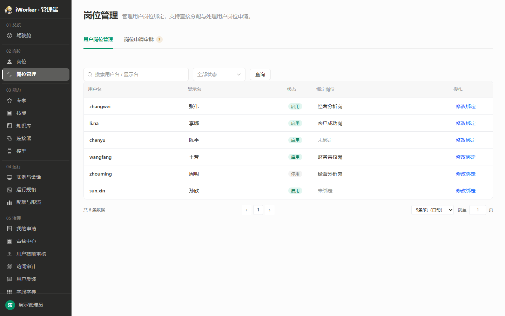
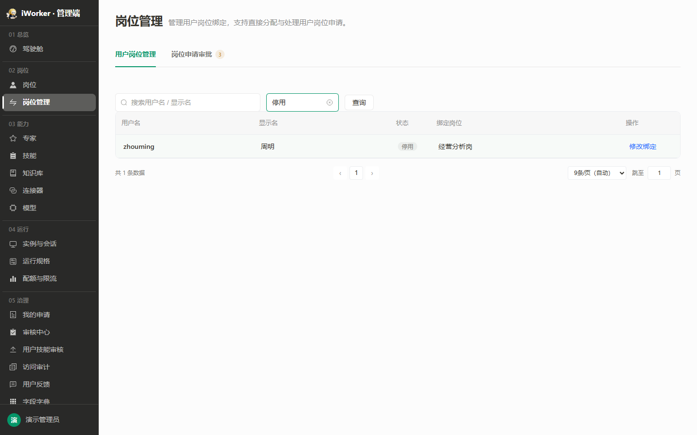
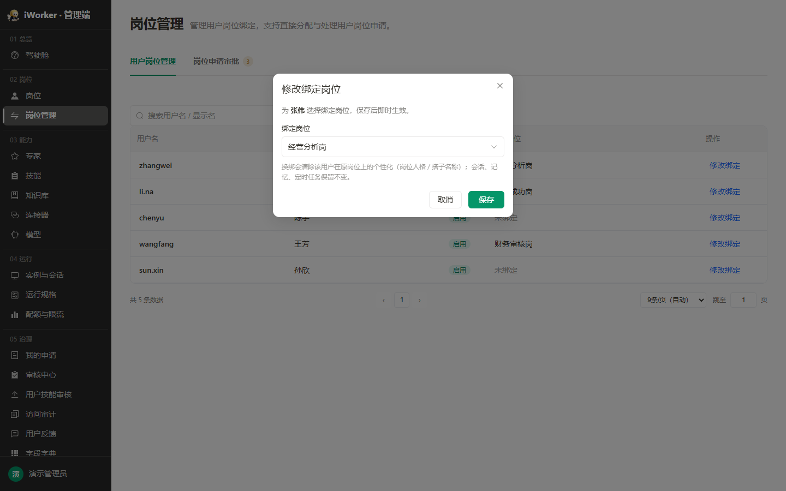

## 一、产品目标与入口

岗位管理以用户为核心维护"用户—岗位"一对一绑定关系，保存后即时生效；同时支持处理用户从客户端提交的岗位申请。

- **页面入口**：侧边栏"02 岗位 / 岗位管理"。
- **页面标题**：岗位管理。
- **页面说明**：管理用户岗位绑定，支持直接分配与处理用户岗位申请。
- **权限要求**：无页面权限时不展示入口。

## 二、页签结构

页面顶部展示两个页签：

| 页签 | 说明 |
| --- | --- |
| 用户岗位管理 | 以用户为核心查看与设置每个用户绑定的岗位，保存即时生效 |
| 岗位申请审批 | 查看和处理用户从客户端提交的岗位申请，支持分配岗位 |

- "岗位申请审批"页签标题后展示待审核数量徽标，数量为 0 时不展示徽标。
- 切换页签时保留各页签内的筛选条件和分页状态。
- 默认进入"用户岗位管理"页签。

## 三、用户岗位管理

### 3.1 查询区

查询区从左到右展示：

1. **搜索框**：占位"搜索用户名 / 显示名"，支持用户名、显示名模糊搜索；输入停顿后自动刷新列表，**不重置分页**，保留当前页码。
2. **状态筛选**：全部状态、启用、停用；切换后自动刷新列表，**不重置分页**，保留当前页码。
3. **查询按钮**：点击后按当前搜索词和状态筛选刷新列表，并**回到第 1 页**。

搜索和状态可以组合使用。无匹配结果时展示"没有匹配的用户"，保留查询条件。

### 3.2 分配列表

#### 3.2.1 展示字段

| 字段 | 展示规则 |
| --- | --- |
| 用户名 | 用户登录名，使用强调字重 |
| 显示名 | 用户显示名称；无内容显示"—" |
| 状态 | 启用为绿色标签，停用为灰色标签 |
| 绑定岗位 | 展示当前岗位名称；无岗位显示"未绑定" |
| 操作 | 固定展示【分配岗位】 |

列表根据页面可用高度动态计算每页条数，最少 5 条、最多 30 条，窗口尺寸变化后按新高度重新计算；底部展示总条数、每页条数和分页器。

#### 3.2.2 状态筛选

选择"停用"后仅展示停用用户。停用用户仍保留原岗位绑定关系，也允许管理员修改或清除绑定。

### 3.3 分配岗位

点击【分配岗位】打开"分配岗位"弹窗。

弹窗规则：

- 顶部提示"为 显示名 选择绑定岗位，保存后即时生效"。
- **绑定岗位**为单选下拉框，展示已发布及审核中的岗位（审核期间已发布版本持续可用，不影响分配）。
- 默认选中用户当前绑定岗位；首项为"未绑定"，用于清除绑定。
- 换绑提示：换绑会清除该用户在原岗位上的个性化（岗位人格 / 搭子名称）；会话、记忆、定时任务保留不变。
- 点击【保存】后更新绑定关系、关闭弹窗、刷新列表并提示"岗位绑定已更新"。
- 点击【取消】、关闭按钮或遮罩，放弃本次修改。

## 四、岗位申请审批

### 4.1 列表规则

- 展示全部岗位申请，含"待审核""已通过""已驳回""已重新绑定"四种状态，申请处理完成后仍保留在列表中。
- **展示过滤**：仅展示「当前绑定岗位与申请岗位不同」或「用户尚无绑定岗位」的申请单；若用户已绑定的岗位与申请岗位一致，则该申请不在列表中展示（无需再处理）。此过滤仅对待审核申请生效，已处理申请按原状态保留。
- **排序规则**：待审核申请统一排在已处理申请之前；两组内部各自按提交时间由近到远排列。点击列头"提交时间"可切换升降序，切换后"待审核优先"的分组规则保持不变，仅组内顺序反转。
- **审核状态筛选**：查询区提供"全部状态、待审核、已通过、已驳回、已重新绑定"，默认"全部状态"；切换后自动刷新列表并回到第 1 页。
- 无任何申请时展示空状态：标题"暂无岗位申请"，副文案"新的用户岗位申请会显示在这里"。
- 筛选后无匹配记录时展示"没有匹配的岗位申请"，保留当前筛选条件。
- 列表根据页面可用高度动态计算每页条数，最少 5 条、最多 30 条，窗口尺寸变化后按新高度重新计算；底部展示总条数、每页条数和分页器。

### 4.2 展示字段

| 字段 | 展示规则 |
| --- | --- |
| 用户名 | 用户登录名，使用强调字重 |
| 显示名 | 用户显示名称；无内容显示"—" |
| 状态 | 取该用户在分配列表中的启用/停用状态，启用为绿色标签，停用为灰色标签；用户记录不存在时默认展示为启用（绿色标签） |
| 现有绑定岗位 | 展示用户当前已绑定的岗位名称；无绑定显示"未绑定" |
| 申请岗位 | 展示用户申请的岗位名称，使用强调字重 |
| 提交时间 | 申请提交时间，精确到分钟；支持点击列头排序 |
| 审核结果 | 待审核（黄色标签）、已通过（绿色标签）、已驳回（红色标签）、已重新绑定（蓝色标签） |
| 处理时间 | 审核完成时间，精确到分钟；待审核记录显示"—" |
| 处理人 | 执行通过 / 驳回 / 重新绑定操作的管理员用户名；待审核记录显示"—" |
| 操作 | 待审核记录展示【分配岗位】（链接样式）；已处理记录不展示操作按钮，"已驳回"记录在"审核结果"标签上悬停展示完整驳回原因 |

### 4.3 操作

#### 4.3.1 分配岗位

点击【分配岗位】调用"分配岗位"弹窗（与 3.3 节分配岗位弹窗一致），完成后执行以下流程：

- 弹窗中可选择已发布及审核中的岗位，不限于申请岗位。
- 顶部提示"为 显示名 选择绑定岗位，保存后即时生效"。
- 换绑提示：换绑会清除该用户在原岗位上的个性化（岗位人格 / 搭子名称）；会话、记忆、定时任务保留不变。
- 管理员完成分配岗位操作后，无论分配的岗位是否与申请岗位一致，申请单均归档（状态变为"已重新绑定"并保留在申请列表中，不再展示操作按钮），关闭弹窗，自动切换到"用户岗位管理"页签，清空搜索和状态筛选，将刚操作的用户置顶高亮聚焦，并提示"岗位绑定已更新"。
- 点击【取消】、关闭按钮或遮罩，放弃本次操作，申请状态保持"待审核"不变。

#### 4.3.2 已处理记录

- 已通过、已驳回、已重新绑定的申请在列表中保留，不提供二次操作入口。
- "已驳回"记录的驳回原因在"审核结果"标签上悬停查看；原因过长时按弹出层完整展示。
- 同一用户可以多次提交岗位申请，历史申请各自独立成行、互不覆盖。
- 已处理记录长期保留，不做自动清理。

## 五、业务规则

- 每个用户同一时间最多绑定 1 个岗位。
- 换绑为覆盖关系，不保留多个并行岗位。
- 可绑定岗位包括"已发布"及"审核中"岗位（审核中指已发布岗位在审新版或停用审核，其已发布版本持续可用）；未发布岗位（含首次发布审核中）不进入下拉选项。
- 用户停用不自动解除岗位绑定。
- 清除绑定只解除岗位关系，不删除用户，不影响历史会话、记忆与定时任务。
- "分配岗位"操作允许管理员选择任意已发布及审核中的岗位（无需与申请岗位一致），处理完成后申请标记为"已重新绑定"。
- 申请一经处理即固化，处理结果与处理人、处理时间一并记录，供后续追溯。

## 六、异常与空状态

| 场景 | 页面处理 |
| --- | --- |
| 分配列表查询无结果 | 展示"没有匹配的用户"，保留条件 |
| 申请列表无任何记录 | 展示"暂无岗位申请"，副文案"新的用户岗位申请会显示在这里" |
| 申请列表筛选无结果 | 展示"没有匹配的岗位申请"，保留当前筛选条件 |
| 无可绑定岗位 | 分配岗位弹窗下拉框仅展示"未绑定" |
| 保存失败 | 弹窗保持打开并展示失败原因 |
| 绑定岗位在保存前被停用 | 阻止保存并刷新可选岗位 |
| 无操作权限 | 【分配岗位】置灰或不展示 |
