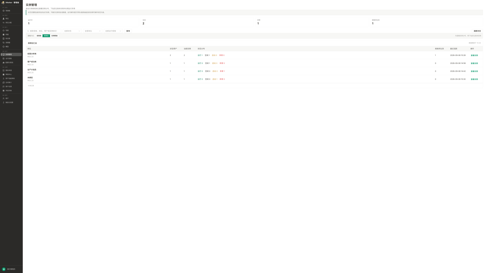
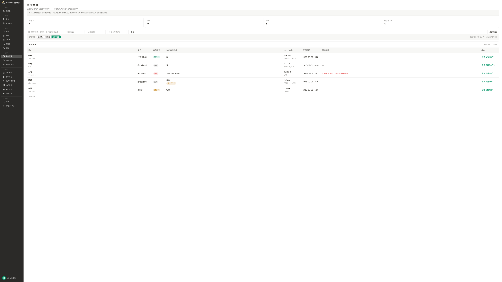
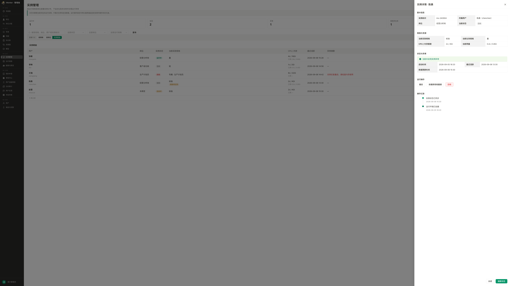

# 实例管理产品需求

> 所属模块：04运行 → 实例管理
> 文档状态：评审结论已同步
> 编写日期：2026-09-16
> 原模块名称：实例与会话
> 参考基线：运行规格产品需求、K8s Node与Pod管理调研、2026-09-16运行模块评审结论

## 一、评审结论与变更说明

### 1. 本次结论

1. 运行规格按现有PRD继续开发，本次不修改运行规格范围与规则。
2. “实例与会话”调整为“实例管理”，本期只查看和处置当前存在的运行实例。
3. 实例列表与详情取消当前无法可靠取得的任务相关字段，包括运行中任务数、排队任务数和“任务情况”。
4. 取消实例的【关联会话】入口、会话摘要以及实例与会话之间的跳转。
5. 取消【会话】页签及会话汇总、会话明细、会话详情和任务处置功能。
6. 会话维度的模型调用、Token消耗和成本分析，由后续独立的“Token用量与成本”模块承载。

### 2. 取消会话模块的原因

当前产品中一个会话对应一个任务，不存在一个会话承载多个任务的管理关系。会话运行状态与任务状态高度重合，单独设置会话监控会造成管理对象重复和统计指标重复。

管理侧对会话更核心的关注点是模型调用量、输入与输出Token、成本和异常消耗，而不是会话与实例之间的运行处置。因此，本期不再建设会话运行监控；相关分析由独立模块承载，实例管理只回答“当前谁在占用运行环境、实例运行得怎么样、异常后如何处置”。

### 3. 目录说明

本次迁移到GitHub长期PRD目录后，目录、文件名、产品页面名称、菜单名称和文档标题统一使用“实例管理”。产品项目中的历史工作路径继续保留，仅作为决策过程与历史来源。

## 二、业务背景与目标

数字员工执行任务时，系统会根据用户当前生效的运行规格创建或复用用户级运行实例。随着使用人数增加，管理员需要知道哪些用户正在占用运行环境、实例是否健康、运行规格修改后哪些实例仍在使用旧配置，并在异常或空闲时进行必要处置。

### 1. 模块边界

- **运行规格**：定义单个实例按照什么资源和运行策略创建。
- **实例管理**：查看当前实例分布、实例状态、实际规格与生效规格，并执行受控的运行处置。
- **配额与限流**：限制平台、岗位和用户最多能使用多少、能多快地使用。
- **Token用量与成本**：后续按用户、岗位、模型和会话分析Token消耗、成本及异常趋势。

### 2. 产品目标

- 管理员能够从全局快速识别运行中、空闲、异常和规格待生效实例。
- 管理员能够按运行规格或岗位查看实例分布，并下钻到具体用户实例。
- 管理员能够查看实例实际规格、当前生效规格、资源状态和异常信息。
- 管理员只能在服务端确认可操作时执行重启、按最新规格重建和回收，避免静默中断用户工作。

### 3. 业务角色

- **平台管理员**：查看全平台实例状态和业务化异常原因，执行受控的重启、重建和回收。
- **运维管理员**：在平台管理员能力基础上查看更详细的技术诊断信息；本期不提供网页终端、端口转发和Node运维操作。
- **普通用户**：不进入实例管理页面；在用户端接收实例暂不可用或重建中的反馈。
- **系统**：创建或复用实例，采集状态与资源信息，返回实例是否可操作及不可操作原因，执行自动回收并记录处置结果。

## 三、核心对象与业务规则

### 1. 核心对象

- **实例**：用户实际执行工作的运行环境，技术上主要对应用户级常驻Pod。
- 一个用户同一时间最多有一个主要运行实例。
- 一个实例在不同时段可以承载该用户的多次运行请求，但实例管理不展示任务或会话明细。
- 实例重启、重建或回收后，不处理或删除用户侧的会话与历史记录。

### 2. 核心业务规则

- 实例列表只展示当前仍存在的实例；已回收实例不继续占用主列表，其历史保留在操作和审计记录中。
- 页面采用“汇总 → 明细 → 详情”三级路径。
- 默认按运行规格汇总，也可按岗位汇总；具体用户实例只在实例明细中展示。
- 实例同时展示“当前实际规格”和“用户当前生效规格”。两者不一致时标记“规格待生效”。
- 运行规格变更不自动重启正在使用的实例；实例下次自然创建或管理员主动按最新规格重建时使用新配置。
- 页面不展示任务数量、排队数量、会话数量或关联会话入口。
- 重启、重建和回收是否可执行，以服务端返回的`operable`和不可操作原因为准，前端不得根据缺失的任务数量自行推断。
- Node由Kubernetes自动调度，本模块不展示或指定具体Node。

## 四、核心流程

1. 用户发起运行请求，系统检查其是否已有可复用实例。
2. 没有可用实例时，系统按照用户当前生效运行规格创建实例。
3. 系统持续采集实例状态、实际规格、资源状态、异常摘要和更新时间。
4. 管理员进入实例管理，先按运行规格或岗位查看分布，再下钻到实例明细。
5. 管理员查看实例详情，并根据服务端返回的可操作状态决定是否重启、重建或回收。
6. 操作提交后，系统返回受理结果并更新实例状态；失败时保留原状态并说明原因。

## 五、页面信息架构

### 1. 页面标题与说明

- 页面标题：**实例管理**。
- 页面说明：**按运行规格或岗位查看实例分布，下钻定位具体实例并处理运行异常**。
- 边界提示：**本页仅管理当前存在的运行实例，不展示任务和会话数据。运行操作是否可用以服务端返回的实例可操作状态为准。**
- 不再展示【实例】【会话】页签。

### 2. 运行摘要

展示以下四项指标：

- 运行中实例数；
- 空闲实例数；
- 异常实例数；
- 规格待生效实例数。

点击指标后进入实例明细并带入对应筛选；再次点击当前筛选时取消该条件。

### 3. 查询与筛选

- 搜索：支持规格名称、岗位、用户姓名、用户名和实例标识的部分匹配。
- 状态：启动中、运行中、空闲、异常、回收中。
- 岗位：按当前实例关联的用户岗位筛选，无岗位用户统一为“未绑定”。
- 运行规格：按照用户当前生效规格筛选。
- 【查询】：按当前条件刷新数据。
- 【刷新状态】：保留查询、查看方式和分页，重新获取实例状态与数据更新时间。

### 4. 查看方式

- **按规格**：默认视图，查看不同运行规格下的实例分布。
- **按岗位**：查看不同岗位下的实例分布。
- **实例明细**：查看具体用户实例。

## 六、汇总列表

### 1. 按规格汇总

每行展示：

- 运行规格；
- 涉及用户数；
- 当前实例数；
- 运行中、空闲、启动中和异常状态分布；
- 规格待生效数；
- 最近活跃时间；
- 【查看实例】。

### 2. 按岗位汇总

字段与按规格汇总一致，首列替换为岗位；无岗位用户单独汇总为“未绑定”。

### 3. 汇总规则

- 汇总数字必须按照当前搜索和筛选条件计算，不能混用未筛选的全局数据。
- 点击【查看实例】进入实例明细，并将所选规格或岗位作为可见筛选条件。
- 返回汇总视图时恢复此前的查询条件和查看方式。

## 七、实例明细

实例明细分页展示以下字段：

- **用户**：姓名、用户名；停用用户增加“已停用”标签。
- **岗位**：当前岗位；无岗位时展示“未绑定”。
- **实例状态**：启动中、运行中、空闲、异常或回收中。
- **当前实际规格**：实例创建时使用的规格；与当前生效规格不一致时展示“规格待生效”。
- **CPU/内存**：展示研发接口能够提供的资源额度和当前用量；暂不可用时展示“—”。
- **最近活跃**：实例最后一次有效活动时间。
- **异常摘要**：无异常展示“—”；有异常展示业务化原因。
- **操作**：【查看】和【运行操作】。

明确不展示：任务情况、运行中任务数、排队任务数、会话数量和关联会话。

### 排序规则

- 默认顺序：异常优先，其次启动中、运行中、空闲、回收中；同状态按最近活跃时间由近到远。
- 支持按最近活跃时间切换升序和降序。

## 八、实例详情

点击【查看】打开右侧抽屉，包含以下分区：

### 1. 基本信息

- 实例标识；
- 所属用户和用户名；
- 岗位；
- 当前状态。

### 2. 规格与资源

- 当前实际规格；
- 用户当前生效规格；
- 规格来源；
- CPU、内存等接口支持的资源额度；
- 当前资源用量及更新时间。

### 3. 状态与异常

- 启动时间；
- 最近活跃时间；
- 数据更新时间；
- 业务化异常摘要；
- 无异常时明确展示“当前未发现实例异常”。

### 4. 运行操作

- 重启；
- 按最新规格重建；
- 回收。

服务端返回不可操作时，按钮置灰并展示具体原因。详情不展示任务与会话摘要。

### 5. 操作记录

- 操作类型；
- 操作者；
- 操作时间；
- 执行结果和失败原因。

## 九、运行操作规则

### 1. 通用校验

- 前端发起操作前获取或使用最新的服务端可操作状态。
- 服务端必须在真正执行前再次校验，防止页面打开后实例状态变化。
- 接口至少返回：`operable`、`operationCode`和面向管理员的`operationReason`。
- 前端不得因没有任务数量字段而默认实例可以操作。

### 2. 重启

- 使用实例当前实际配置重新创建运行环境，不切换至最新生效规格。
- 成功提交后状态进入“启动中”；失败时保留原状态并展示原因。

### 3. 按最新规格重建

- 仅在当前实际规格与用户当前生效规格不一致时可用。
- 确认信息展示原规格与目标规格。
- 用户生效规格在确认后发生变化时停止操作，提示刷新后重试。

### 4. 回收

- 释放当前运行资源；用户下次发起运行请求时按生效规格创建新实例。
- 回收成功后实例从当前实例列表移除，操作历史继续保留。
- 本期不提供强制回收。

## 十、页面状态与异常

- **加载中**：表格展示骨架或加载状态，不清空已存在内容。
- **暂无实例**：展示“当前没有运行实例”；不提供手动创建入口。
- **无查询结果**：展示“没有符合条件的实例”和【清空筛选】。
- **加载失败**：保留筛选条件，展示“加载失败”和【重试】。
- **部分状态不可用**：可读取字段正常展示，不可读取字段展示“—”及最后更新时间。
- **实例状态已变化**：提示刷新后重试，不覆盖服务端最新状态。
- **权限不足**：不展示菜单，地址直达时返回无权限状态。

## 十一、权限、审计与隐私

- **实例查看权限**：查看汇总、明细和详情。
- **实例处置权限**：执行重启、按最新规格重建和回收。
- 每次处置记录实例标识、用户、操作人、操作前后状态、时间和结果。
- 页面只展示运行管理需要的元数据，不展示对话内容、上传文件或业务结果。

## 十二、不在本期范围

- 会话运行监控及会话详情；
- 任务列表、任务数量、排队数量和任务处置；
- Token用量与成本分析；
- 对话内容、文件和业务结果查看；
- 网页终端、日志原文下载、端口转发；
- Node管理、强制删除Pod和批量重建；
- 手动创建实例。

## 十三、验收标准

1. 页面、菜单和路由标题统一为“实例管理”。
2. 页面不存在会话页签、会话列表、关联会话入口及会话跳转。
3. 实例汇总支持按规格、按岗位查看并下钻实例明细。
4. 实例明细不展示任务情况、运行中任务数或排队任务数。
5. 实例详情只展示实例身份、规格、资源、状态、异常、时间和操作记录。
6. 重启、重建和回收以服务端可操作状态为准，不依赖任务数量字段。
7. 四张现役原型截图与页面、字段和本PRD一致。
8. 会话相关分析明确由后续Token用量与成本模块承载。
