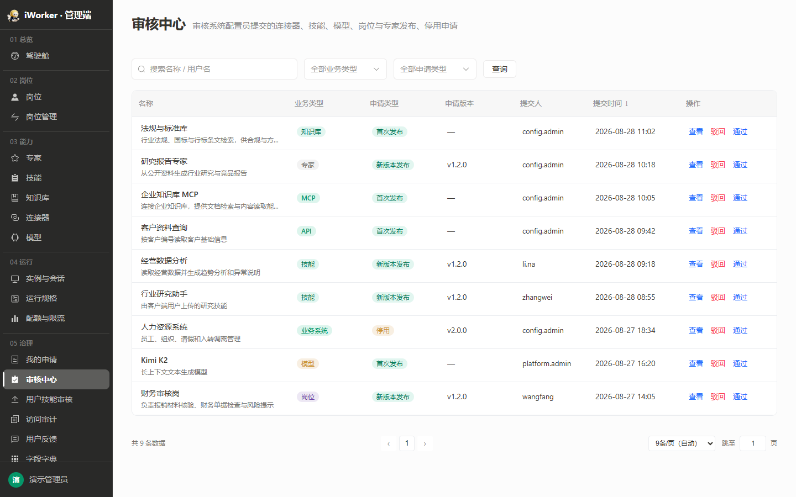
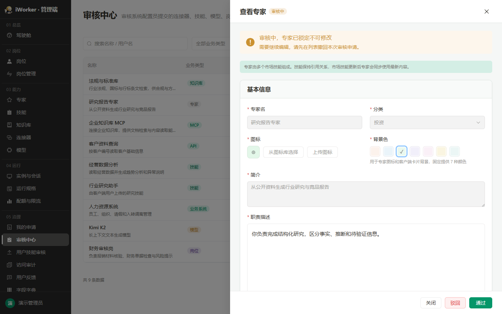
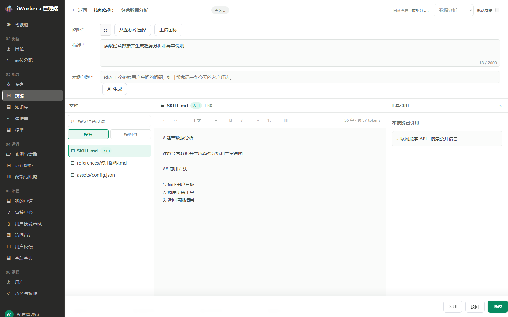
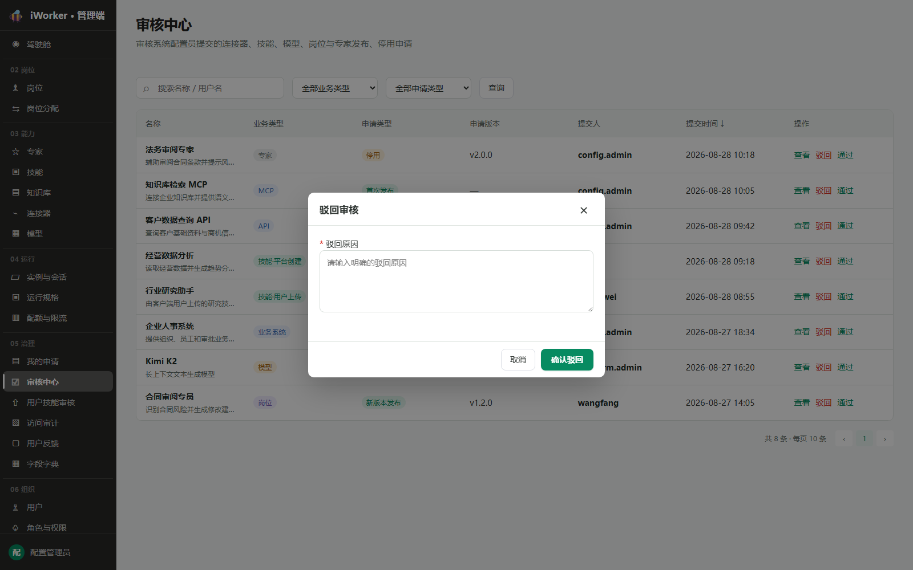
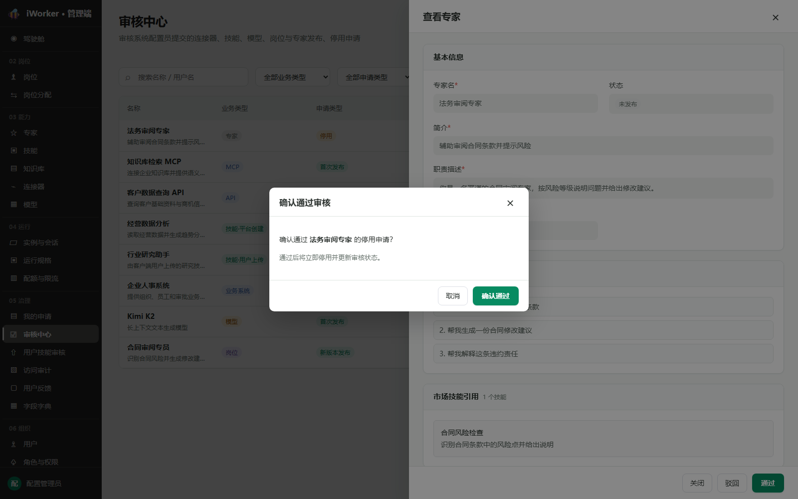

# 审核中心产品需求

## 一、产品目标与入口

审核中心面向审核管理员，审核系统配置员提交的岗位、专家、技能、知识库、连接器与模型的发布、停用申请，以及管理员提交的用户端版本（版本管理）的发布、停用申请。列表只展示待审核记录，审核完成后记录离开当前列表。

- **页面入口**：侧边栏“05 治理 / 审核中心”。
- **页面说明**：审核系统配置员提交的连接器、技能、模型、岗位与专家发布、停用申请，以及用户端版本的发布、停用申请。
- 需要审核权限；无权限时不展示入口和审核操作。

## 二、查询区

查询区从左到右展示：

1. **搜索框**：占位“搜索名称 / 用户名”，支持对象名称、描述、提交人用户名搜索。
2. **业务类型**：全部业务类型、岗位、专家、技能、知识库、MCP、API、业务系统、模型、版本管理。
3. **申请类型**：全部申请类型、首次发布、新版本发布、停用。
4. **查询按钮**：按当前条件刷新列表并回到第 1 页。

查询条件可以组合使用。

## 三、审核列表

### 3.1 展示字段

| 字段 | 展示规则 |
| --- | --- |
| 名称 | 展示申请对象名称，下一行展示对象描述。版本管理的申请对象名称为"终端 + 版本号"（如"Mac v1.2.0"），下一行为该版本的更新说明 |
| 业务类型 | 岗位、专家、技能、知识库、MCP、API、业务系统、模型、版本管理 |
| 申请类型 | 首次发布、新版本发布、停用。版本管理只有新版本发布和停用两种，**不区分首次发布**：发布申请（含重新启用旧版本）一律为“新版本发布”，停用申请为“停用” |
| 申请版本 | 有版本时展示版本号，无版本展示“—” |
| 提交人 | 展示提交人用户名 |
| 提交时间 | 精确到分钟，支持正序 / 倒序切换，箭头为“↓ / ↑” |
| 操作 | 按顺序展示【查看】【驳回】【通过】 |

列表根据页面高度动态分页，只展示待审核记录。

每条待审核记录均须带有申请类型与申请版本取值；演示数据同样按真实取值构造，确保「申请类型」列与筛选可正常使用。

## 四、查看审核详情

点击【查看】后复用对应业务模块的原生只读详情，详情主体与业务模块查看态一致，不插入额外审核说明；差异只保留在底部按钮【关闭】【驳回】【通过】。

- **专家、岗位、MCP、API、业务系统、模型、版本管理**：打开右侧详情抽屉；版本管理复用版本管理页的只读查看抽屉，额外展示申请人、申请时间。
- **技能**：打开完整只读详情页面，底部固定审核操作栏。
- 岗位、专家、技能三类业务对象由所属业务模块在提交审核时生成版本快照，审核详情读取该快照；知识库、MCP、API、业务系统、模型、版本管理不生成快照，审核详情读取业务模块的当前配置（版本管理的版本在审核期间被锁定，内容不会变）。
- 审核期间业务对象不可编辑、不可删除，因此两种取数方式在审核期内展示结果均保持稳定。

### 4.1 专家等抽屉详情

专家详情使用标准 780px 右侧抽屉，不使用全屏样式；岗位、MCP、API、业务系统保持 780px 右侧抽屉，模型使用 820px 右侧抽屉。

### 4.2 技能整页详情

技能保持完整只读页面，底部展示【关闭】【驳回】【通过】；点击关闭或返回后回到审核中心。

## 五、审核操作

### 5.1 驳回

列表或详情底部点击【驳回】打开“驳回审核”弹窗。

- **驳回原因**必填，最多 500 字。
- 为空时阻止提交并提示“请输入驳回原因”。
- 确认后记录审核人、审核时间和驳回原因，审核结果更新为已驳回，记录离开审核列表，并提示“已驳回审核”。

### 5.2 通过

列表或详情底部点击【通过】打开“确认通过审核”弹窗。

- 首次发布、新版本发布通过后，对象更新为已发布并启用相应版本。
- 停用申请通过后，对象变为未发布 / 已下架，不再对外提供。
- **版本管理**发布申请通过后，该版本变为已发布（发布人为申请人、发布时间为通过时间），**同一终端原下发的版本自动回到“未发布”**（保留其上次发布时间与发布人），用户端此后检测更新才会提示升级到该版本；**停用申请**通过后，该版本回到“未发布”（同样保留上次发布信息），该终端暂无下发版本，已升级的用户不受影响，也不会自动回退到上一个版本。申请被驳回则版本回到提交前的状态（发布申请驳回→未发布；停用申请驳回→仍是已发布，继续下发）。
- 确认后关闭详情并提示：发布类申请提示“已通过审核”，停用申请提示“已通过停用申请”。
- 确认后记录审核人和审核时间，记录离开审核列表。

## 六、状态与版本规则

- 审核中心只展示待审核状态。
- 申请类型包括首次发布、新版本发布、停用；同一条申请只对应一种类型。
- 新版本发布必须关联申请版本和版本说明。
- 发布通过时生成或启用对应版本快照；停用通过不删除历史版本。
- 同一对象同一时间只允许存在一条待审核申请；版本管理另外限定**同一终端同一时间只允许一个版本处于审核中**。
- 审核期间业务对象不可重复发布；需要修改时由提交人先撤回申请。

## 七、异常与空状态

| 场景 | 页面处理 |
| --- | --- |
| 查询无结果 | 展示“暂无审核数据”，保留条件 |
| 驳回原因为空 | 阻止提交并提示必填 |
| 记录已被其他审核人处理 | 操作失败，刷新后记录离开列表 |
| 业务快照缺失（岗位 / 专家 / 技能） | 阻止审核并提示联系提交人重新提交 |
| 无审核权限 | 隐藏操作按钮并禁止调用审核接口 |