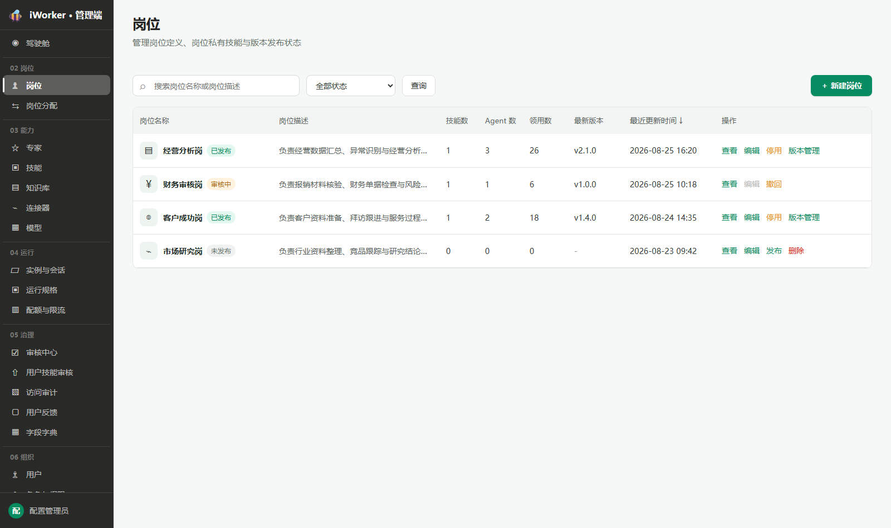

# 岗位产品需求

## 一、导航栏

### 1. 功能说明

导航栏用于帮助管理员搜索岗位、筛选状态，并进入新建岗位流程。岗位用于定义一类工作角色并关联岗位私有技能，发布后供岗位分配使用。

- **页面入口**：侧边栏"02 岗位 / 岗位"。
- **页面标题**：展示"岗位"。
- **页面说明**：文案"管理岗位定义、岗位私有技能与版本管理状态"。
- **搜索框**：占位提示为"搜索岗位名称或岗位描述"，支持按岗位名称或描述模糊搜索。
- **状态筛选**：默认"全部状态"，可选择"未发布、审核中、已发布"。岗位列表不增加"草稿"状态或筛选项，仅展示"未发布、审核中、已发布"。
- **查询按钮**：按照当前搜索内容和状态刷新列表。
- **新建入口**：右侧展示【＋ 新建岗位】，从页面右侧打开新建岗位抽屉。
- 无匹配结果时展示"没有符合条件的岗位"。

### 2. 交互规则

- 搜索和状态筛选可组合使用；搜索内容在点击【查询】或按回车后生效。
- 清空搜索内容后点击【查询】或按回车，按剩余条件刷新。
- 切换状态筛选后列表立即刷新。
- 点击【＋ 新建岗位】保留列表当前筛选条件。

### 3. 页面状态与异常场景

- **加载中**：列表区域展示加载状态。
- **暂无数据 / 无查询结果**：展示"没有符合条件的岗位"，保留当前条件。
- **加载失败**：展示"加载失败"和【重试】；点击【重试】后重新加载列表。失败状态优先于空状态展示。
- **无页面权限**：不展示岗位入口，也不允许进入岗位页面。

## 二、岗位列表

### 1. 列表展示

岗位列表集中展示平台已定义的岗位。页面不分页，一次展示当前查询条件下的全部岗位。

- **岗位名称**：展示图标、岗位名称和状态标签【未发布】【审核中】【已发布】；不设独立状态列。
- **岗位描述**：单行缩略，悬停查看完整内容；无描述显示"—"。
- **技能数**：展示当前关联的岗位私有技能总数；悬停提示"当前岗位关联的岗位私有技能总数"。
- **Agent 数**：展示基于该岗位创建的 Agent 总数；悬停提示"基于该岗位创建的 Agent 总数"。
- **领用数**：展示当前已领用该岗位的用户总数；悬停提示"当前已领用该岗位的用户总数"。
- **最新版本**：展示最近一次审核通过并正式发布的版本号；尚无版本时显示"—"。不展示待审核版本号。
- **最近更新时间**：展示最近一次保存的时间，精确到分钟；支持点击列头排序。
- **操作**：按状态展示【查看】【编辑】【发布】【撤回】【停用】【版本管理】【删除】。

### 2. 排序规则

- 默认按最近更新时间由近到远排列，点击列头切换升降序。
- 保存配置或提交审核操作后，按新的最近更新时间重新排列。

### 3. 操作

#### 3.1 操作按钮展示规则

- 【查看】和【编辑】固定展示；审核中【编辑】置灰并提示"审核中不可编辑"。
- 各状态按钮组合：

| 状态 | 固定按钮 | 状态按钮 |
| --- | --- | --- |
| 未发布 | 【查看】【编辑】 | 【发布】【删除】 |
| 审核中 | 【查看】【编辑】（置灰） | 【撤回】 |
| 已发布 | 【查看】【编辑】 | 【停用】【版本管理】 |

#### 3.2 查看 / 编辑

- 点击【查看】从右侧打开只读岗位抽屉；点击【编辑】打开可编辑抽屉。
- 审核中的岗位只能查看，不可编辑。
- 岗位抽屉的字段与规则详见岗位编辑页需求（另行补充）。
- **岗位名称**：必填，最多 64 字符。
- **岗位描述**：必填，最多 2000 字符。
- **图标**：必填。

> 图标配置统一规则（岗位、专家、技能、模型、MCP、API、业务系统一致）：
> - **图标库选择**：点击【从图标库选择】打开图标库弹窗；选中图标后即时更新预览，保存后用于列表、编辑页和客户端展示。
> - **上传图标**：点击【上传图标】调用本地文件选择器，支持 PNG、JPG/JPEG、WebP、GIF、SVG，单个文件不超过 5 MB。选择图片后进入方形裁剪界面，可拖动图片调整保留区域，通过缩放滑杆放大或缩小；点击【使用该区域】生成 256×256 的 PNG 图标并更新预览；点击【重新选择图片】可更换原始图片；点击【取消】不修改原图标。
> - **替换规则**：上传图片与图标库图标互斥。重新从图标库选择后清除已上传图片；重新上传并裁剪后使用新的图片图标。
> - **只读状态**：查看页展示当前图标，上传和图标库入口置灰不可点击。
> - **异常处理**：非图片文件提示"请选择图片文件"；文件超过 5 MB 提示"图片不能超过 5 MB"；读取失败时保留原图标并提示重新选择。

#### 3.3 发布

- 列表页【发布】和编辑页【发布】含义完全一致，均进入同一个版本管理侧栏；编辑页【发布】用于编辑保存后直接提交发布，无需返回列表。
- 【发布】是首次发布入口；【版本管理】是已发布岗位提交新版本的入口，两者进入同一个版本管理侧栏并使用同一套校验和提交逻辑。
- 【发布】用于"未发布"的岗位，可从列表页或编辑抽屉底部点击。
- 未关联任何岗位私有技能时，点击后提示"至少关联 1 个岗位私有技能才能发布"，不打开确认窗口。
- 首次发布固定预生成 v1.0.0，不展示更新类型；至少关联 1 个岗位私有技能，且升级说明必填。
- 满足条件时弹出确认窗口"确认将「岗位名」提交发布审核？审核通过后将在客户端可用"，确认按钮【提交审核】。
- 点击【提交发布 vX.Y.Z】只创建待审核版本 `pendingVersion`，状态变为"审核中"，配置锁定；此时当前已发布版本继续对外生效。
- 审核通过后状态变为"已发布"，生成不可变岗位配置快照、写入版本历史、更新最新版本号，并将新版本设为唯一启用版本；原启用版本自动禁用。
- 被拒绝或撤回后回到"未发布"，不生成快照，最新版本号保持不变。

#### 3.4 撤回

- 【撤回】仅在"审核中"展示。
- 点击后弹出确认窗口"「岗位名」当前处于审核中。撤回后回到修改前状态。"
- 撤回时不生成快照，最新版本号保持不变。首次发布回到"未发布"，新版本发布回到原"已发布"版本。
- 撤回时统一清理 `pendingAction`、`pendingVersion` 和 `pendingReleaseNotes`，避免残留数据影响下次提交。
- 确认后撤回，提示"审核申请已撤回"。

#### 3.5 停用

- 【停用】在"已发布"且无审核中操作时展示。
- 停用等同于下架当前启用版本；为防止数据不一致，仅当领用数为 0 时支持停用操作。领用数大于 0 时【停用】不置灰，点击后弹出提示"当前有 N 个用户领用该岗位，请先解除领用后再停用"，不执行停用。
- 点击后弹出确认窗口"停用「岗位名」需提交审核。审核通过前客户端仍可使用。"，确认按钮【提交停用审核】。
- 确认后提交停用审核，状态变为"审核中"；审核通过后岗位变为"未发布"，停止向用户开放；被拒绝或撤回后恢复"已发布"。

#### 3.6 版本管理

- 【版本管理】在"已发布"且无审核中操作时展示。
- 非首次发布支持修订更新、功能更新、重大更新，并基于当前最新发布版本预生成下一个版本号。
- 点击后从页面右侧打开版本管理弹窗，用于提交新版本审核（选择更新类型、填写升级说明）和管理版本历史（启用 / 禁用），交互与技能、专家的版本管理弹窗一致；详细规则另行补充。
- 编辑抽屉底部同样展示【发布】按钮，点击后自动保存当前编辑页的表单内容（不提示），然后与列表页【版本管理】进入同一版本管理弹窗，用于编辑保存后直接提交新版本，无需返回列表。
- 点击编辑页【保存】只保存当前配置，不生成版本快照，不修改列表中的最新版本号，也不自动提交审核。
- 同一时间只能有一个版本启用。仅剩一个启用版本时，【禁用】置灰或拦截，并提示先整体下架岗位。

#### 3.7 删除

- 【删除】仅在"未发布"且无审核中操作时展示。
- 点击后弹出二次确认"删除「岗位名」后会解除 N 条岗位技能关联。确认删除？"；确认按钮【删除】使用危险样式。
- 删除成功提示"岗位已删除"，从列表移除。

### 4. 状态规则

- 列表仅展示"未发布、审核中、已发布"三态，不增加"草稿"状态或筛选项，审核中不再细分发布审核 / 新版审核 / 停用审核。
- 未发布：未对用户开放；允许编辑、发布和删除。
- 审核中：存在待审核操作；配置锁定，仅允许查看和撤回。
- 已发布：已向用户开放；允许编辑、提交新版本和提交停用。
- 首次发布审核通过后变为"已发布"并生成 v1.0.0 版本快照；停用审核通过后回到"未发布"。
- "最新版本"统一指最近一次审核通过并正式发布的版本，不展示待审核版本号。

### 5. 列表异常场景

- **未关联技能时发布**：提示"至少关联 1 个岗位私有技能才能发布"，不打开确认窗口。
- **审核中编辑**：【编辑】置灰；查看抽屉为只读。
- **审核中删除或停用**：对应按钮隐藏。
- **已发布删除**：【删除】隐藏，需先完成停用审核。
- **操作进行中**：按钮展示进行中状态，不重复提交。
- **单项操作失败**：保留当前岗位和原状态，提示具体原因。
