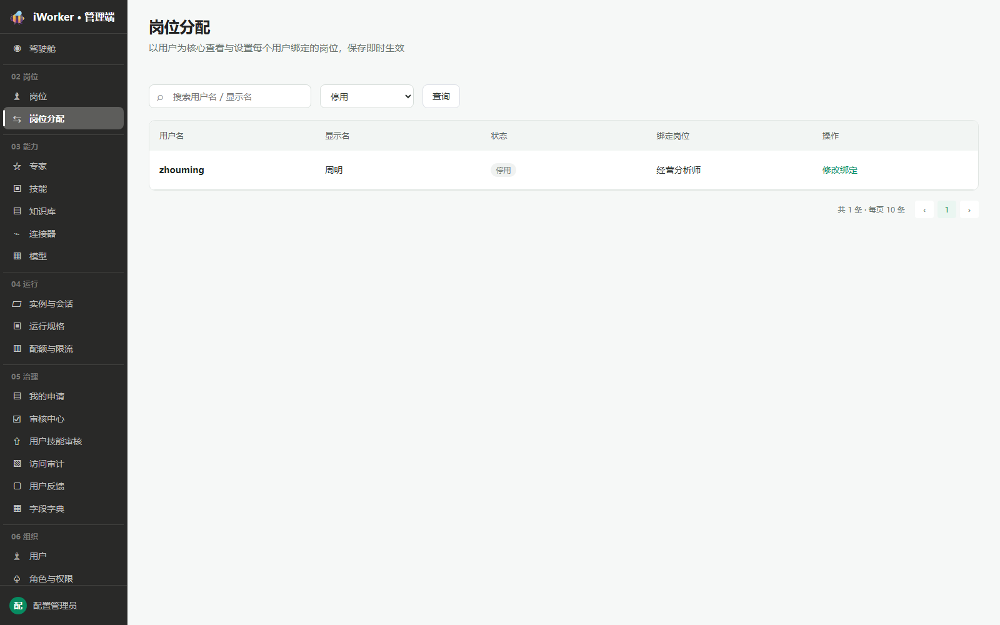

# 岗位分配产品需求

## 一、产品目标与入口

岗位分配以用户为核心维护“用户—岗位”一对一绑定关系，保存后即时生效。

- **页面入口**：侧边栏“02 岗位 / 岗位分配”。
- **页面标题**：岗位分配。
- **页面说明**：以用户为核心查看与设置每个用户绑定的岗位，保存即时生效。
- **权限要求**：无页面权限时不展示入口。

## 二、查询区

查询区从左到右展示：

1. **搜索框**：占位“搜索用户名 / 显示名”，支持用户名、显示名模糊搜索。
2. **状态筛选**：全部状态、启用、停用。
3. **查询按钮**：点击后按当前搜索词和状态筛选刷新列表，并回到第 1 页。

搜索和状态可以组合使用。无匹配结果时展示“没有匹配的用户”，保留查询条件。

## 三、岗位分配列表

### 3.1 展示字段

| 字段 | 展示规则 |
| --- | --- |
| 用户名 | 用户登录名，使用强调字重 |
| 显示名 | 用户显示名称；无内容显示“—” |
| 状态 | 启用为绿色标签，停用为灰色标签 |
| 绑定岗位 | 展示当前岗位名称；无岗位显示“未绑定” |
| 操作 | 固定展示【修改绑定】 |

列表根据页面可用高度动态计算每页条数，底部展示总条数、每页条数和分页器。

### 3.2 状态筛选

选择“停用”后仅展示停用用户。停用用户仍保留原岗位绑定关系，也允许管理员修改或清除绑定。

## 四、修改绑定

点击【修改绑定】打开“修改绑定岗位”弹窗。

弹窗规则：

- 顶部提示“为 显示名 选择绑定岗位，保存后即时生效”。
- **绑定岗位**为单选下拉框，只展示已发布岗位。
- 默认选中用户当前绑定岗位；首项为“未绑定”，用于清除绑定。
- 换绑提示：会清除用户在原岗位上的个性化配置（岗位人格、搭子名称）；会话、记忆、定时任务保留。
- 点击【保存】后更新绑定关系、关闭弹窗、刷新列表并提示“岗位绑定已更新”。
- 点击【取消】、关闭按钮或遮罩，放弃本次修改。

## 五、业务规则

- 每个用户同一时间最多绑定 1 个岗位。
- 换绑为覆盖关系，不保留多个并行岗位。
- 可绑定岗位仅包括“已发布”岗位；未发布、审核中及已停用岗位不进入下拉选项。
- 用户停用不自动解除岗位绑定。
- 清除绑定只解除岗位关系，不删除用户，不影响历史会话、记忆与定时任务。

## 六、异常与空状态

| 场景 | 页面处理 |
| --- | --- |
| 查询无结果 | 展示“没有匹配的用户”，保留条件 |
| 无可绑定岗位 | 下拉框仅展示“未绑定” |
| 保存失败 | 弹窗保持打开并展示失败原因 |
| 绑定岗位在保存前被停用 | 阻止保存并刷新可选岗位 |
| 无操作权限 | 【修改绑定】置灰或不展示 |