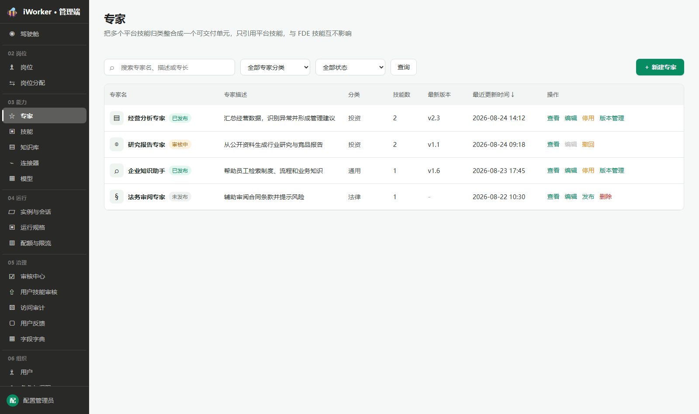
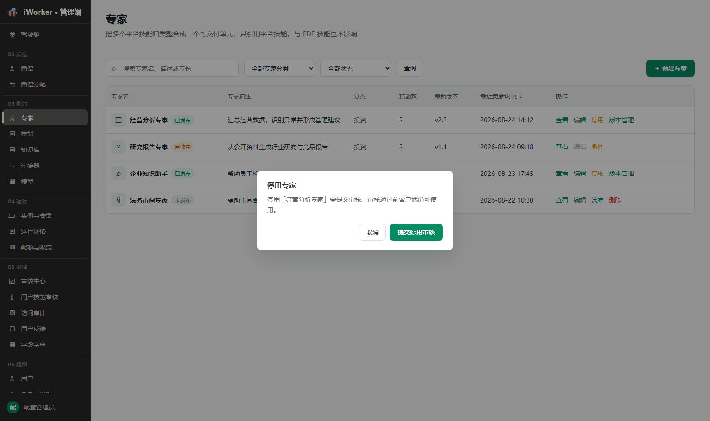
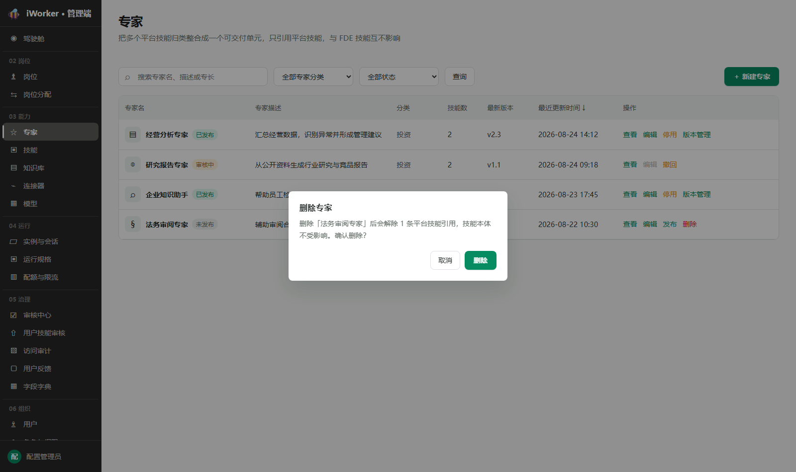
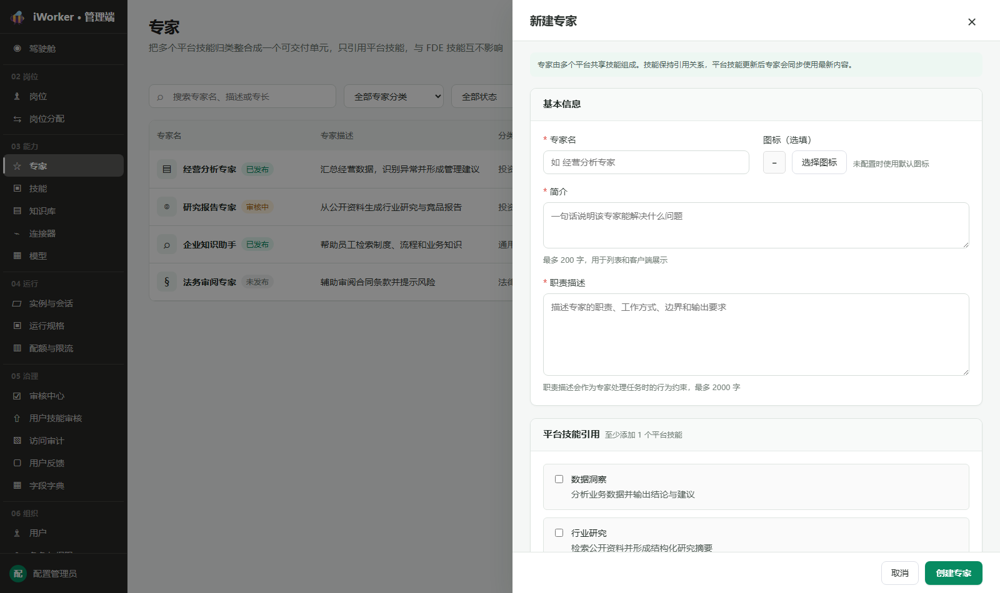
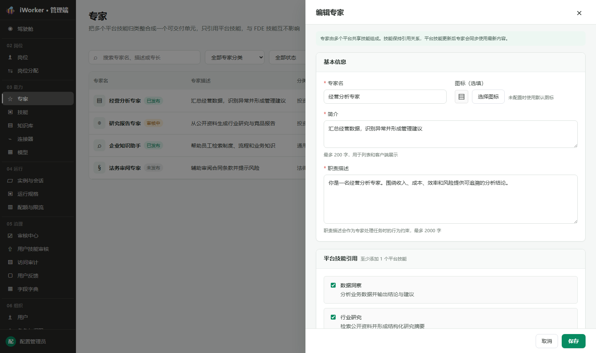
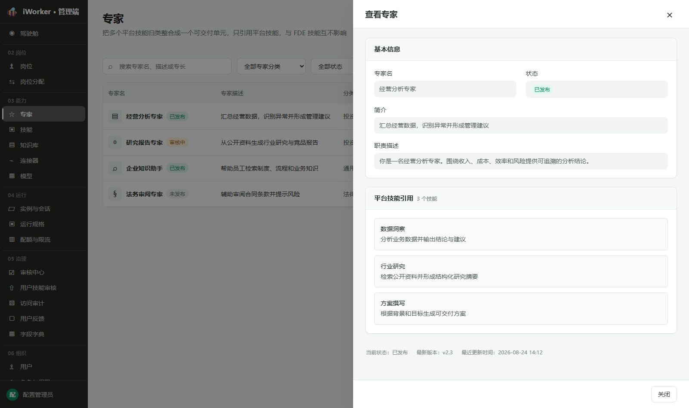
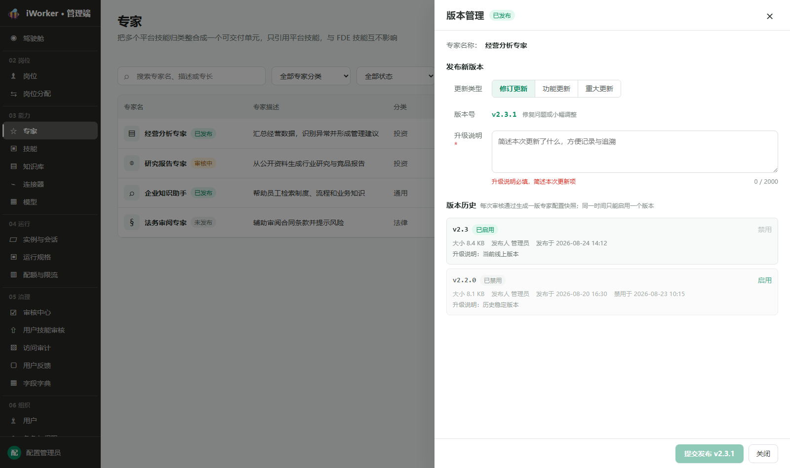

# 专家产品需求

## 一、导航栏

### 1. 功能说明

导航栏用于帮助管理员搜索专家、筛选专家分类和状态，并进入新建专家流程。

- **页面标题**：展示"专家"。
- **页面说明**：文案"把多个市场技能归类整合成一个可交付单元，只引用市场技能，与 FDE 技能互不影响"。
- **搜索框**：占位提示为"搜索专家名、描述或分类"，支持按专家名、简介或分类搜索。
- **专家分类筛选**：默认"全部专家分类"，可选择"通用、法律、财税、政务、供应链、投资、审计、知识产权"。分类选项由 05 治理 / 字段字典的"专家"分组下"专家分类"字段统一维护。
- **状态筛选**：默认"全部状态"，可选择"未发布、审核中、已发布"。
- **查询按钮**：按照当前搜索内容和筛选条件刷新列表。
- **新建入口**：右侧展示【＋ 新建专家】，从页面右侧打开专家编辑抽屉的新建状态。
- **访问条件**：仅具有专家页面权限的账号可见入口并进入页面；无权限时不展示入口。

### 2. 交互规则

- 搜索、分类和状态筛选可组合使用；点击【查询】或在搜索框按回车后按当前条件刷新。
- 清空搜索内容后按剩余条件刷新。
- 切换分类或状态后列表立即刷新。
- 点击【＋ 新建专家】保留列表当前筛选条件。
- 关闭专家编辑抽屉或版本管理弹窗后返回原列表位置。

### 3. 页面状态与异常场景

- **加载中**：列表区域展示加载状态。
- **首次暂无数据**：展示"还没有专家，点击「新建专家」创建第一个"。
- **无查询结果**：沿用同一空状态文案，保留当前搜索与筛选条件。
- **加载失败**：展示"加载失败"和【重试】。

![[专家导航栏.png]]

## 二、专家列表

### 1. 列表展示

专家列表集中展示平台已创建的专家。页面不分页，一次展示当前查询条件下的全部专家。

- **专家名**：展示图标、专家名称和状态标签【未发布】【审核中】【已发布】；不设独立状态列。
- **专家描述**：展示专家简介，超长缩略，悬停查看完整内容。
- **分类**：展示专家所属分类（通用、法律、财税等 8 项之一）。
- **技能数**：展示当前引用的市场技能数量。
- **最新版本**：展示最近一次审核通过并正式发布的版本号；尚无版本时显示"—"；不展示待审核版本号。
- **最近更新时间**：展示最近一次保存的时间，精确到分钟；支持点击列头排序。
- **操作**：按状态动态展示【查看】【编辑】【发布】【撤回】【停用】【版本管理】【删除】。

### 2. 排序规则

- 默认按最近更新时间由近到远排列，点击列头切换升降序。
- 保存配置或提交审核操作后，按新的最近更新时间重新排列。

### 3. 操作

#### 3.1 操作按钮展示规则

专家列表不增加"草稿"状态或筛选项，仅展示"未发布、审核中、已发布"三态。各状态对应按钮如下：

| 状态 | 固定按钮 | 状态按钮 |
| --- | --- | --- |
| 未发布 | 【查看】【编辑】 | 【发布】【删除】 |
| 审核中 | 【查看】【编辑】（置灰） | 【撤回】 |
| 已发布 | 【查看】【编辑】 | 【停用】【版本管理】 |

- 【查看】和【编辑】固定展示；审核中【编辑】置灰并提示"审核中不可编辑"。
- 各状态按钮组合：
  - **未发布**：【查看】【编辑】【发布】【删除】，共 4 个按钮。
  - **审核中**：【查看】【编辑】（置灰）【撤回】，共 3 个按钮。
  - **已发布**：【查看】【编辑】【停用】【版本管理】，共 4 个按钮。

#### 3.2 查看 / 编辑

- 点击【查看】从右侧打开只读抽屉，展示全部信息和时间信息，底部仅【关闭】。
- 点击【编辑】从页面右侧打开专家编辑抽屉并回填已保存内容；未发布和已发布（无审核中操作）可编辑，审核中【编辑】置灰，不打开编辑抽屉。

#### 3.3 发布

- 【发布】用于"未发布"的专家，点击后打开版本管理侧栏，与编辑抽屉内【发布】使用同一流程。若从专家编辑抽屉点击【发布】，专家编辑抽屉先自动收回，再展示版本管理侧栏，页面同一时间只保留一个右侧抽屉。
- 未引用任何市场技能时，点击后提示"至少引用 1 个市场技能才能发布"，不打开侧栏。
- 打开侧栏后填写升级说明（必填），点击【提交发布 v1.0.0】后提交审核；提交后状态变为"审核中"，配置锁定。
- 审核通过后状态变为"已发布"并生成 v1.0.0 版本快照；被拒绝或撤回后回到"未发布"。

#### 3.4 撤回

- 【撤回】仅在"审核中"展示。
- 点击后弹出确认窗口"「专家名」当前处于审核中。撤回后回到修改前状态。"
- 待审发布撤回后回到未发布；待审停用撤回后维持已发布；新版本审核撤回后线上仍为当前已发布版本。
- 撤回时统一清理 `pendingAction`、`pendingVersion` 和 `pendingReleaseNotes`，避免残留数据影响下次提交。
- 撤回发布审核时，若对象已有版本号（即已发布对象提交新版本），恢复为"已发布"；若无版本号（即首次发布），恢复为"未发布"。
- 确认后撤回，提示"审核申请已撤回"。

#### 3.5 停用

- 【停用】在"已发布"且无审核中操作时展示。
- 点击后弹出确认窗口"停用「专家名」需提交审核。审核通过前客户端仍可使用。"，确认按钮【提交停用审核】。
- 确认后提交停用审核，状态变为"审核中"；审核通过后专家变为"未发布"，停止向用户开放；被拒绝或撤回后恢复"已发布"。

#### 3.6 版本管理

- 【版本管理】在"已发布"且无审核中操作时展示。
- 点击后从右侧打开版本管理弹窗，详见"四、版本管理弹窗"。

#### 3.7 删除

- 【删除】仅在"未发布"且无审核中操作时展示。
- 点击后弹出二次确认"删除「专家名」后会解除 N 条市场技能引用，技能本体不受影响。确认删除？"；确认按钮【删除】使用危险样式。
- 删除成功提示"专家已删除"，从列表移除。

### 4. 状态规则

- 列表仅展示"未发布、审核中、已发布"三态
- 未发布：未对用户开放；允许编辑、发布和删除。
- 审核中：存在待审核操作；配置锁定，仅允许查看和撤回。
- 已发布：已向用户开放；允许编辑、提交新版本和提交停用。
- 首次发布审核通过后变为"已发布"；新版审核期间当前已发布版本继续可用，通过后新版本生效；停用审核通过后回到"未发布"。

### 5. 列表异常场景

- **未引用技能时发布**：提示"至少引用 1 个市场技能才能发布"，不打开确认窗口。
- **审核中编辑**：【编辑】置灰；进入查看抽屉为只读。
- **审核中删除或停用**：对应按钮隐藏。
- **已发布删除**：【删除】隐藏，需先完成停用审核。
- **操作进行中**：按钮展示进行中状态，不重复提交。
- **单项操作失败**：保留当前专家和原状态，提示具体原因。

## 三、专家编辑页

### 1. 页面状态

专家编辑页以右侧抽屉形式展示，包含"新建、编辑、查看（只读）"三种状态。

- **新建**：通过【＋ 新建专家】进入，标题"新建专家"，内容为空，底部【取消】【创建专家】。

- **编辑**：通过【编辑】进入，标题"编辑专家"，回填已保存内容，底部【取消】【发布】【保存】。

- **查看**：通过【查看】进入，标题"查看专家"，全部只读，底部仅【关闭】。

- 抽屉顶部展示说明："专家由多个市场技能组成。技能保持引用关系，市场技能更新后专家会同步使用最新内容。"
- 点击抽屉外区域不关闭抽屉；点击右上角关闭或【取消】退出，未保存的修改不保留。

### 2. 基本信息

- **专家名**：必填，最多 64 字符；占位"如 经营分析专家"。未填写时提示"请填写专家名"。
- **图标**：必填。

> 图标配置统一规则（岗位、专家、技能、模型、MCP、API、业务系统一致）：
> - **图标库选择**：点击【从图标库选择】打开图标库弹窗；选中图标后即时更新预览，保存后用于列表、编辑页和客户端展示。
> - **上传图标**：点击【上传图标】调用本地文件选择器，支持 PNG、JPG/JPEG、WebP、GIF、SVG，单个文件不超过 5 MB。选择图片后进入方形裁剪界面，可拖动图片调整保留区域，通过缩放滑杆放大或缩小；点击【使用该区域】生成 256×256 的 PNG 图标并更新预览；点击【重新选择图片】可更换原始图片；点击【取消】不修改原图标。
> - **替换规则**：上传图片与图标库图标互斥。重新从图标库选择后清除已上传图片；重新上传并裁剪后使用新的图片图标。
> - **只读状态**：查看页展示当前图标，上传和图标库入口置灰不可点击。
> - **异常处理**：非图片文件提示"请选择图片文件"；文件超过 5 MB 提示"图片不能超过 5 MB"；读取失败时保留原图标并提示重新选择。
- **分类**：必选，可选择"通用、法律、财税、政务、供应链、投资、审计、知识产权"；未选择时提示"请选择专家分类"。
- **简介**：必填，最多 2000 字符；占位"一句话说明该专家能解决什么问题"；用于列表和客户端展示。
- **职责描述**：必填，最多 2000 字符，使用带工具栏的 Markdown 编辑器（撤销、重做、段落样式、加粗、斜体、项目符号、编号列表、插入表格），右下角实时展示字数统计；作为专家处理任务时的行为约束。

### 3. 专家帮你做（示例问题）

- **专家帮你做（示例问题）**：必填，固定 3 条输入行，每条最多 60 字符；用于向终端用户展示专家能做什么，如"帮我生成一份行业调研报告"。每条输入行旁展示【AI 生成】按钮（常规字重，不使用加粗样式），点击后调用模型根据专家名称和简介自动生成示例问题，填入输入行；重复点击可重新生成，覆盖当前内容。

### 4. 市场技能引用

- 必填至少 1 个市场技能。
- 顶部展示搜索框（按技能名、描述或分类搜索）和统计"已选择 X 个 · 共 Y 个市场技能"。
- 技能以卡片列出，展示名称、分类和描述；勾选即引用，取消勾选即移除引用。
- 未搜索时默认收起只展示前 2 个，展示【展开更多（N）】查看全部；搜索时展示全部匹配结果。
- 无匹配结果时展示"没有匹配的市场技能"。
- 专家仅引用市场技能；引用保持关系，市场技能更新后专家同步使用最新内容。

### 5. 时间信息

编辑和查看状态底部展示：创建时间、最近更新时间、最近发布时间、最新版本，均为只读；新建状态不展示。

### 6. 保存与关闭

- 点击【创建专家】或【保存】时校验：专家名、分类、图标、简介、职责描述、示例问题必填，至少引用 1 个市场技能；未通过时对应区域标红并提示"请先补齐必填项"或"请选择专家分类"。
- 点击【保存】只保存当前配置，不生成版本快照，不修改列表中的最新版本号，也不自动提交审核。
- 创建成功提示"专家已创建"；保存成功提示"专家配置已保存"；关闭抽屉并刷新列表。
- 编辑状态下底部展示【发布】按钮，点击后自动保存当前编辑页的表单内容（不提示），然后打开版本管理侧栏，与列表页【发布】使用同一流程；新建状态下不展示【发布】。
- 保存期间按钮展示进行中状态，不允许重复提交。
- 保存失败时抽屉保持打开，保留填写内容并提示原因。

## 四、版本管理弹窗

版本管理弹窗从页面右侧打开，标题"版本管理"，顶部展示专家名称和当前发布状态。列表页【发布】和编辑页【发布】含义完全一致，均进入同一个版本管理侧栏；编辑页【发布】用于编辑保存后直接提交发布，无需返回列表。【发布】是首次发布入口；【版本管理】是已发布专家提交新版本的入口，两者进入同一个版本管理侧栏并使用同一套校验和提交逻辑。未发布专家可从列表页【发布】或编辑抽屉【发布】进入；已发布专家可从列表页【版本管理】或编辑抽屉【发布】进入。所有入口均使用同一版本表单、校验和提交逻辑。

### 1. 发布新版本

- 首次发布固定预生成 v1.0.0，不展示更新类型；至少引用 1 个市场技能，且升级说明必填。
- 非首次发布支持修订更新、功能更新、重大更新，并基于当前最新发布版本预生成下一个版本号，不可手动修改：
  - 修订更新：修订位递增，用于修复问题或小幅调整。
  - 功能更新：次版本位递增、修订位归零，用于新增能力、技能或职责范围。
  - 重大更新：主版本位递增、其余归零，用于重大改动或不兼容变更。
- **升级说明**：必填，最多 2000 字符并显示字数统计；为空时【提交发布】不可点击。
- 点击【提交发布 vX.Y.Z】只创建待审核版本 `pendingVersion`，状态变为"审核中"，编辑抽屉锁定；此时当前已发布版本继续对外生效。提示"已提交发布 vX.Y.Z，进入审核"。

- 审核通过时才生成不可变专家配置快照、写入版本历史、更新最新版本号，并将新版本设为唯一启用版本；原启用版本自动禁用。
- 审核拒绝或撤回时不生成快照，最新版本号保持不变。首次发布回到"未发布"，新版本发布回到原"已发布"版本。
- 提交后进入审核，审核通过前线上版本继续可用；审核通过后新版本生效并自动成为唯一启用版本。

### 2. 审核中状态

- 存在审核中操作时，弹窗不展示发布表单，改为提示"审核中，已锁定不可修改。可撤回本次提交后继续编辑"，并展示【撤回提交】。
- 点击【撤回提交】弹出确认，说明撤回后回到修改前状态；确认后撤回，提示"已撤回提交"。

### 3. 版本历史

- 展示该专家已生成的版本快照；尚无版本时展示"暂无版本 · 发布后将在此生成不可变版本快照"。
- 说明文案：每次审核通过生成一版专家配置快照；同一时间只能启用一个版本。
- 每条版本展示：版本号、状态（已启用 / 已禁用）、大小、发布人、发布时间；存在禁用时间或升级说明时一并展示。
- 已启用版本展示【禁用】，已禁用版本展示【启用】：
  - 禁用前弹出确认；最后一个启用版本不可禁用，提示"当前版本是该专家最后一个启用版本。如需停止对外提供，请先整体下架专家"。
  - 仅剩一个启用版本时，【禁用】置灰或拦截，并提示先整体下架专家。
  - 启用其他版本时，原启用版本自动变为已禁用。
- 弹窗底部展示【提交发布 vX.Y.Z】（可提交时）和【关闭】。