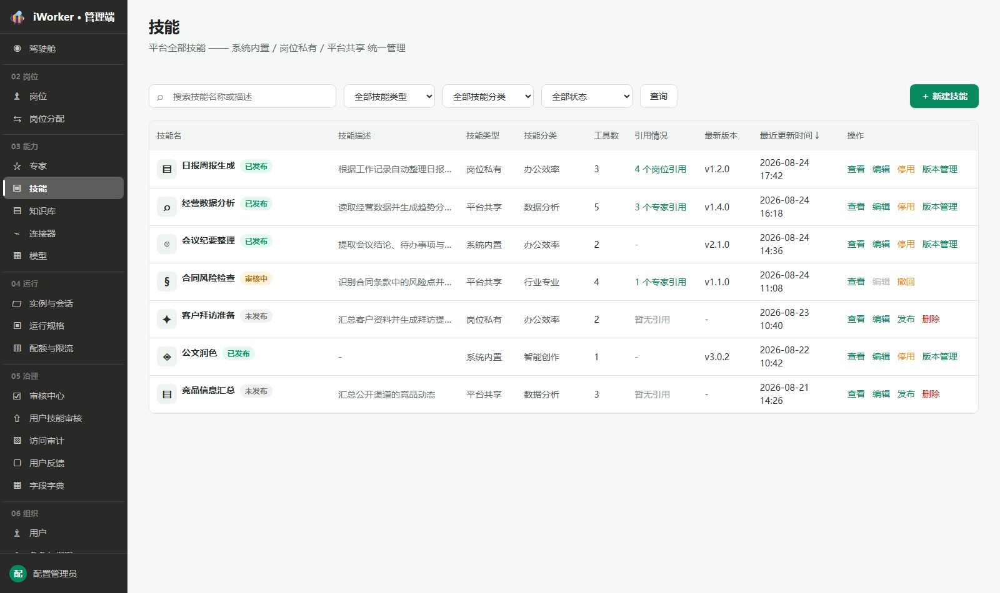
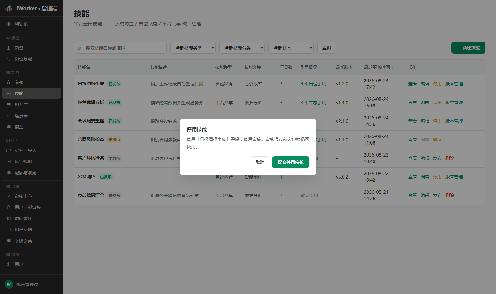
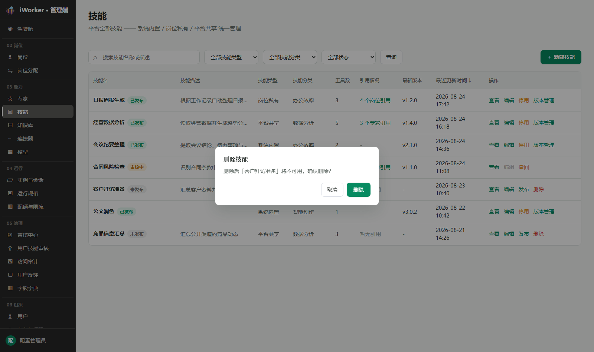
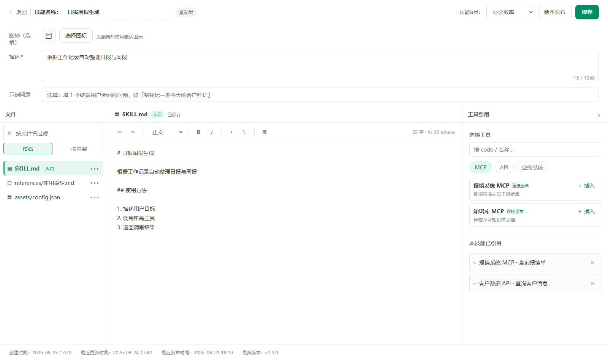
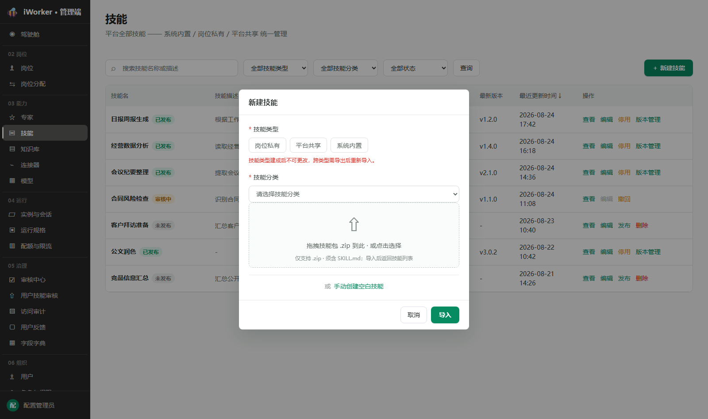
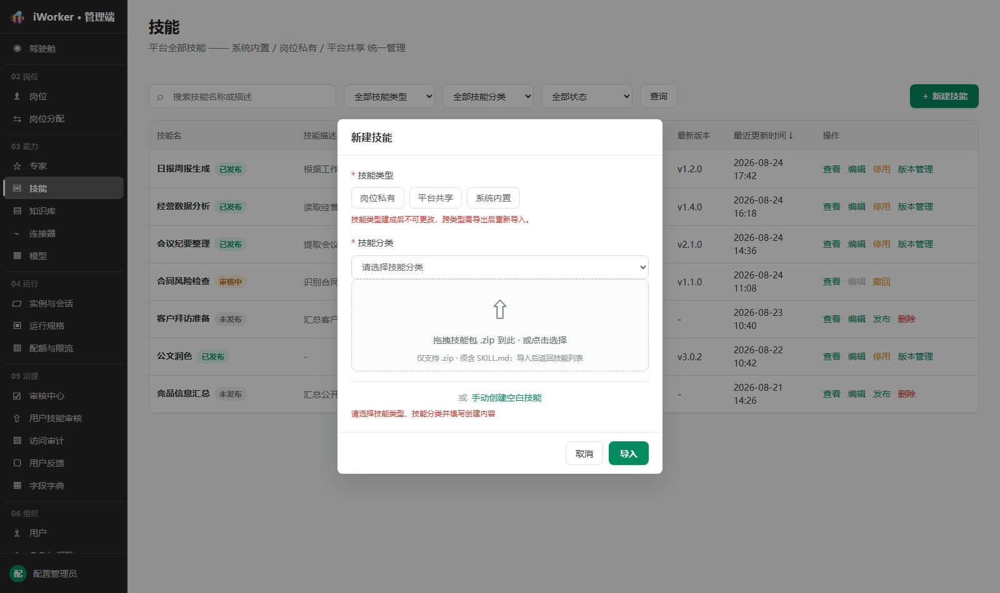
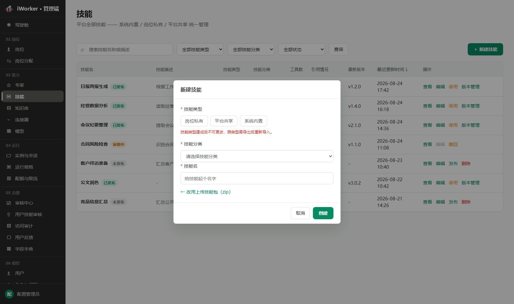
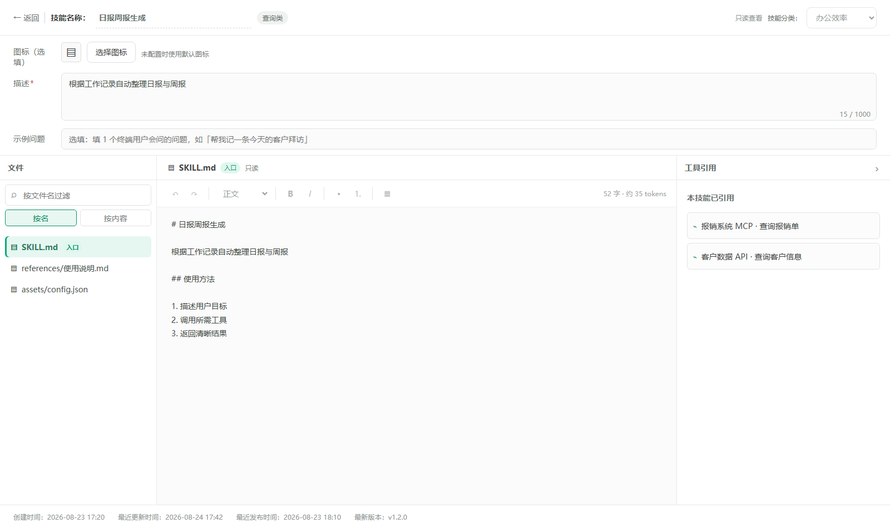
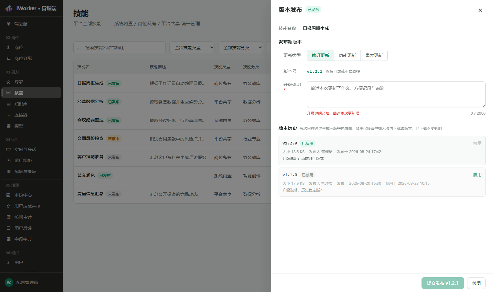
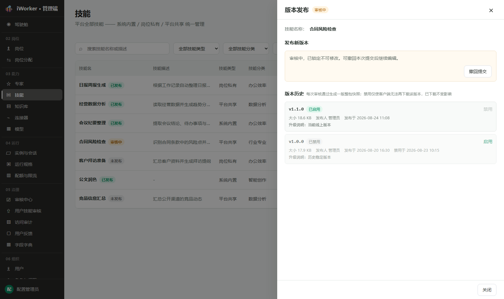

# 技能产品需求

## 一、导航栏

### 1. 功能说明

导航栏用于帮助管理员统一搜索和筛选"岗位私有、市场技能、通用技能"三类技能，并进入新建技能流程。

- **页面标题**：展示"技能"。
- **页面说明**：文案"平台全部技能 —— 通用技能 / 岗位私有 / 市场技能 统一管理"。
- **搜索框**：占位提示为"搜索技能名称或描述"，支持按技能名称或描述模糊搜索。
- **技能类型筛选**：默认"全部技能类型"，可选择"岗位私有、市场技能、通用技能"。
- **技能分类筛选**：默认"全部技能分类"，可选择"办公效率、智能创作、数据分析、开发编程、IT运维与安全、行业专业、知识与学习、其他"。
- **状态筛选**：默认"全部状态"，可选择"未发布、审核中、已发布"。
- **查询按钮**：按照当前搜索内容、类型、分类和状态刷新列表。
- **新建入口**：右侧展示【＋ 新建技能】，打开新建技能弹窗。
- 页面不使用 Tab 区分技能类型，三类技能在同一列表中统一展示。

### 2. 交互规则

- 搜索、类型、分类和状态筛选可组合使用。
- 搜索内容在点击【查询】后生效；清空后点击【查询】按剩余条件刷新。
- 切换或清空技能类型、技能分类、状态筛选后，列表立即按当前条件刷新。
- 点击【新建技能】保留列表当前筛选条件。
- 从列表点击【查看】或【编辑】后，进入整页技能编辑页；点击【← 返回】回到列表并刷新。

### 3. 页面状态与异常场景

- **加载中**：列表区域展示加载状态。
- **列表加载失败**：展示"加载失败"和【重试】，不误显示为无结果。
- **无查询结果**：展示"没有符合条件的技能"，保留当前条件。
- **无页面权限**：不展示技能入口，也不允许进入技能页面。

## 二、技能列表

### 1. 列表展示

技能列表集中展示平台全部技能。页面不分页，一次展示当前查询条件下的全部技能。

- **技能名**：展示图标、技能名称和状态标签【未发布】【审核中】【已发布】；名称超长换行完整展示，不设独立状态列。
- **技能描述**：单行缩略，悬停查看完整内容；无描述显示"—"。
- **技能类型**：展示"岗位私有、市场技能、通用技能"之一，普通文本样式。
- **技能分类**：展示 8 个固定分类之一；未设置显示"—"。
- **工具数**：展示当前引用的工具数量。
- **引用情况**：岗位私有有引用时展示"N 个岗位引用"，市场技能有引用时展示"N 个专家引用"，点击弹出引用清单（展示岗位名或专家名）；无引用展示"暂无引用"；通用技能显示"—"。
- **最新版本**：展示当前已发布版本号；尚无已发布版本时显示"—"。
- **最近更新时间**：展示最近一次保存的时间，精确到分钟；支持点击列头排序。
- **操作**：按状态展示【查看】【编辑】【发布】【撤回】【停用】【版本管理】【删除】。

### 2. 排序规则

- 默认按最近更新时间由近到远排列，点击列头切换升降序。
- 保存技能配置或提交审核操作后，按新的最近更新时间重新排列。

### 3. 操作

#### 3.1 操作按钮展示规则

- 【查看】和【编辑】为固定操作，所有状态展示；审核中【编辑】置灰并提示"审核中不可编辑"。
- 各状态按钮组合：
  - **未发布**：【查看】【编辑】【发布】【删除】，共 4 个按钮。【发布】悬停提示"发布将提交审核，审核通过后生成版本快照并上线"；【删除】悬停提示"删除前需二次确认"。
  - **审核中**：【查看】【编辑】（置灰）【撤回】，共 3 个按钮。
  - **已发布**：【查看】【编辑】【停用】【版本管理】，共 4 个按钮。
- 三类技能的按钮组合和流程规则完全一致，均走审核 + 版本管理流程。

> **状态与列表按钮对照**：列表仅展示"未发布、审核中、已发布"三态，审核中不细分发布审核 / 停用审核 / 新版审核，统一以"审核中"一个状态呈现；按钮按状态唯一决定——未发布可见【发布】【删除】，审核中可见【撤回】，已发布可见【停用】【版本管理】；存在审核中操作时仅展示【查看】和【撤回】，其他发布 / 停用 / 删除 / 版本管理入口均隐藏。

#### 3.2 查看 / 编辑

- 点击【查看】进入技能编辑页只读状态；点击【编辑】进入可编辑状态。
- 审核中的技能只能查看，不可编辑。

#### 3.3 发布（首发）

- 【发布】用于"未发布"的技能。满足全部发布前置条件后，点击从页面右侧打开发布弹窗；列表页与编辑页的【发布】含义和流程一致。
- 技能名称、技能类型、技能分类、图标、描述、示例问题或 `SKILL.md` 任一未完成时不执行发布，【发布】置灰并提示待补齐项。
- 在发布弹窗确认提交后进入审核：技能状态变为"审核中"，提示"已提交发布审核"。
- 审核通过后状态变为"已发布"，自动生成 v1.0.0 版本快照并上线；审核被拒绝后回到"未发布"。

#### 3.4 撤回

- 【撤回】仅在"审核中"展示。
- 点击后弹出确认窗口，说明撤回后恢复提交审核前的状态。
- 待审发布撤回后回到"未发布"；待审停用撤回后回到"已发布"；新版本审核撤回后保留当前线上版本。
- 撤回成功提示"已撤回"。
- **撤回时统一清理挂起状态**：撤回操作统一清理 `pendingAction`（挂起操作类型）、`pendingVersion`（挂起版本号）、`pendingReleaseNotes`（挂起升级说明），确保撤回后无残留挂起数据，页面不再展示"审核中"锁定态。
- **撤回后根据 version 字段判断恢复状态**：若 `version` 为空（无已发布版本），恢复为"未发布"；若 `version` 非空（存在已发布版本），恢复为"已发布"。即撤回始终回到"提交审核前的上一稳定状态"，而非一律回到"未发布"。

#### 3.5 停用

- 【停用】在"已发布"且无审核中操作时展示。
- 被岗位或专家引用时不执行停用，弹窗提示"该技能被 N 个岗位/专家引用（引用清单），需先解除引用后再停用"。
- 无引用时点击后弹出确认窗口，文案"停用「技能名」需提交停用审核。审核通过前客户端仍可使用。"，确认按钮【提交停用审核】。
- 确认后提交停用审核，状态变为"审核中"；审核通过后技能变为"未发布"，客户端停止提供；被拒绝或撤回后恢复"已发布"。

#### 3.6 删除

- 【删除】仅在"未发布"且无审核中操作时展示。
- 被岗位或专家引用时不执行删除，弹窗提示"该技能被 N 个岗位/专家引用（引用清单），需先解除引用后再删除"。
- 无引用时弹出二次确认"删除后「技能名」将不可用，确认删除？"。
- 删除成功提示"技能已删除"，技能从列表移除。

#### 3.7 版本管理

- 【版本管理】在"已发布"且无审核中操作时展示，三类技能均展示。
- 点击后从页面右侧打开版本管理弹窗，详见"四、版本管理弹窗"。

### 4. 状态规则

- 列表仅展示"未发布、审核中、已发布"三态，审核中不细分发布审核 / 停用审核 / 新版审核。
- 三类技能首次创建后均为"未发布"。
- 提交发布、停用或新版本后变为"审核中"；审核通过后按申请类型生效，被拒绝或撤回后恢复提交前状态。
- 已发布技能提交新版本：审核期间列表显示"审核中"，当前已发布版本继续可用；审核通过后新版本自动启用、原启用版本自动禁用。
- 存在审核中操作时，编辑页锁定，仅允许查看和撤回。
- 删除仅适用于未发布且不在审核中的技能；引用保护独立生效。

### 5. 列表异常场景

- **搜索或筛选无结果**：展示"没有符合条件的技能"，保留当前条件。
- **重复点击操作**：进行中的按钮展示进行中状态，不重复提交。
- **状态已变化**：操作不满足条件时提示具体原因，刷新后按最新状态重新生成按钮。
- **删除被引用技能**：不生效，弹出引用提示并引导先解除引用。
- **停用被引用技能**：不生效，弹出引用提示并引导先解除引用。
- **发布内容不完整**：未选分类时不生效，提示补充。
- **审核中重复提交**：不允许再次提交发布或停用；版本发布弹窗仅提供【撤回提交】。

## 三、技能编辑页

### 1. 页面状态与进入方式

技能编辑页采用覆盖视图布局：进入后保留左侧导航栏，编辑区域覆盖主内容区，不做全屏遮挡。由顶部技能信息、描述与示例问题区、下方"左侧文件目录 / 中间内容编辑区 / 右侧工具引用区"三栏组成。

- **进入方式**：通过列表点击【查看】进入只读态、点击【编辑】进入编辑态。手动创建空白技能成功后直接跳转至编辑页；zip 导入成功后返回列表。
- **可编辑状态**：所有类型技能在无审核中操作时可编辑。
- **审核锁定状态**：存在审核中操作时页面只读，顶部提示"技能审核中，已锁定不可修改"。
- **返回方式**：点击顶部【← 返回】回到技能列表并刷新。
- 加载失败展示"加载失败"、【重试】和【返回】。

### 2. 新建技能弹窗

- 弹窗标题"新建技能"，内容包括：
  - **技能类型**：必选单选"岗位私有 / 市场技能 / 通用技能"，下方提示"技能类型建成后不可更改，跨类型需导出后重新导入"。
  - **技能分类**：必选 8 个固定分类。
  - **上传方式**：点击【新建技能】后默认进入"上传技能包"方式，初始状态仅展示技能类型和技能包上传区，不展示技能分类。支持单次选择或拖入多个 .zip 技能包（仅支持 .zip、每个须含 SKILL.md）。技能包选中后，在每个技能包文件名后分别出现一个"技能分类"下拉框（8 个固定分类），每个包必须独立选择分类，不能用一个分类批量覆盖全部技能包；支持不同技能包配置不同分类。所有技能包均选择分类后【导入技能包】才可执行，任一技能包未选分类时保留弹窗并提示补齐。导入完成后统一返回技能列表，不自动进入编辑页。每次重新点击【新建技能】时，清空上一次未提交的技能包和分类选择，从初始上传状态开始。或切换"手动创建空白技能"填写技能名（必填，最多 64 字符），点击【创建】后直接跳转至编辑页。
- 未选择类型、分类或未填写创建内容时不可提交，提示"请选择技能类型、技能分类并填写创建内容"。

- **zip 导入**：确认按钮【导入】。成功后关闭弹窗并返回列表，仅通过一次性轻提示告知"已导入 N 个技能包，请从列表点击编辑继续配置"。提示自动消失，不展示常驻提示条。

- **手动创建**：确认按钮【创建】。成功后提示"技能已创建，已进入编辑页"，并直接进入技能编辑页。空白技能仅带入创建弹窗中已填写的技能类型、技能分类和技能名称，描述、示例问题与 `SKILL.md` 正文保持为空。

- 每次打开弹窗清空上次选择。

### 3. 顶部技能信息与操作

顶部单行展示：左侧依次为【← 返回】、分隔线、"技能名称："输入框、技能类别标签；右侧展示技能分类、保存状态和【保存】。

- **技能名称**：必填，可编辑状态下内嵌输入框；锁定状态纯文本展示，空值显示"未命名技能"。
- **技能类别标签**：只读展示"操作类 / 查询类"，由工具引用自动派生（引用业务系统等写类工具为操作类，否则为查询类），不可手动修改，悬停可查看派生规则。
- **技能分类**：可编辑状态下必选 8 个固定分类。
- **默认安装**：仅"市场技能"技能展示开关；打开后客户端初始化时默认安装该技能。
- **发布**：可编辑状态下展示；当技能名称、技能类型、技能分类、图标、描述、示例问题任一必填项未完成，或 `SKILL.md` 不存在 / 正文为空时，按钮置灰并通过 title 提示待补齐项；全部满足后方可点击并打开发布弹窗（见"四"）。
- **保存**：点击后保存名称、描述、示例问题、技能分类、默认安装及未自动保存的 SKILL.md 正文；成功提示"技能配置已保存"。**保存只保存当前配置，不生成版本快照**——版本快照仅在发布审核通过后生成（见"四、版本管理弹窗"）；保存仅刷新"最近更新时间"，不改变技能状态，也不触发审核。
- 只读态展示"只读查看"标记，不展示技能分类修改、默认安装、【发布】和【保存】。

### 4. 图标、描述与示例问题

- **图标**：必填。

> 图标配置统一规则（岗位、专家、技能、模型、MCP、API、业务系统一致）：
> - **图标库选择**：点击【从图标库选择】打开图标库弹窗；选中图标后即时更新预览，保存后用于列表、编辑页和客户端展示。
> - **上传图标**：点击【上传图标】调用本地文件选择器，支持 PNG、JPG/JPEG、WebP、GIF、SVG，单个文件不超过 5 MB。选择图片后进入方形裁剪界面，可拖动图片调整保留区域，通过缩放滑杆放大或缩小；点击【使用该区域】生成 256×256 的 PNG 图标并更新预览；点击【重新选择图片】可更换原始图片；点击【取消】不修改原图标。
> - **替换规则**：上传图片与图标库图标互斥。重新从图标库选择后清除已上传图片；重新上传并裁剪后使用新的图片图标。
> - **只读状态**：查看页展示当前图标，上传和图标库入口置灰不可点击。
> - **异常处理**：非图片文件提示"请选择图片文件"；文件超过 5 MB 提示"图片不能超过 5 MB"；读取失败时保留原图标并提示重新选择。
- **描述**：必填，多行输入，最多 2000 字符并显示字数统计；占位"描述这个技能能做什么、怎么用、适合什么场景"；用于列表和客户端展示。
- **示例问题**：必填，1 条，最多 60 字符；占位提示"填 1 个终端用户会问的问题"；用于向终端用户展示提问示例。示例问题输入框旁展示【AI 生成】按钮（使用常规字重，不使用加粗样式），点击后调用模型根据技能名称和描述自动生成示例问题，填入输入框；重复点击可重新生成，覆盖当前内容。

### 5. 文件目录（左栏）

- `SKILL.md` 固定展示在目录树首位并显示"入口"标签。手动创建空白技能时文件正文为空，须由用户补充；`SKILL.md` 不存在或正文为空时不可发布。
- **文件搜索**：支持"按名"（过滤名称命中的文件）和"按内容"（展示命中文件和内容片段，点击定位）两种方式；无结果分别提示。
- **文件操作**：通过目录项"•••"菜单操作，支持新建文件（如 references/ 下的参考文档）；`SKILL.md` 不可重命名、移动或删除。

### 6. 内容编辑区（中栏）

- 顶部展示当前文件名和保存状态；正文停止输入后自动保存，状态在"保存中… / 已保存"间切换。
- 文档编辑工具栏支持撤销、重做、段落样式、加粗、斜体、项目符号、编号列表和插入表格。
- 实时展示当前文件的字符数和 token 估算。

### 7. 工具引用区（右栏）

- 可整体收起 / 展开；上半区"选择工具"，下半区"本技能已引用"。
- 工具分类仅展示"MCP、API、业务系统"三个页签；支持按工具标识或名称搜索。
- 工具卡展示名称、连接状态和描述；点击【＋ 插入】在当前文档光标处插入 `@tool(工具名)` 引用，提示"已插入工具引用"。
- 当前分类无可用工具时展示"该类暂无工具，去连接器接入"，点击后跳转连接器页面。
- 已引用区展示引用名称；点击【×】移除引用。
- 只读态仅保留"本技能已引用"供查看，不提供插入和移除。

### 8. 时间信息

编辑页底部展示：创建时间、最近更新时间、最近发布时间、最新版本，均为只读。

## 四、版本管理弹窗

版本管理弹窗从页面右侧打开，标题"版本管理"，顶部展示技能名称和当前发布状态。未发布技能可从列表或编辑页的【发布】进入；已发布技能可从列表【版本管理】进入，弹窗内容和发布规则保持一致。提交审核前不生成版本快照；审核通过后才生成并启用不可变版本快照。

### 1. 发布新版本

- **首次发布**：版本号固定为 v1.0.0，不展示更新类型。
- **非首次发布**：选择更新类型，页面自动生成下一版本号，不可手动修改：
  - 修订更新：修订位递增（v1.2.0 → v1.2.1），用于修复问题或小幅调整。
  - 功能更新：次版本位递增、修订位归零（v1.2.0 → v1.3.0），用于新增功能。
  - 重大更新：主版本位递增、其余归零（v1.2.0 → v2.0.0），用于重大改动或不兼容变更。
- **升级说明**：必填，最多 2000 字符并显示字数统计；为空时提示"升级说明必填，简述本次更新项"，【提交发布】不可点击。
- 市场技能未选择分类时，弹窗展示拦截提示"该技能还未选择「技能分类」，按规则不可提交发布"，【提交发布】不可点击。
- 点击【提交发布 vX.Y.Z】后提交当前版本：提示"已提交发布 vX.Y.Z，进入审核"，列表状态变为"审核中"，编辑页锁定。
- 审核通过后，新版本自动成为唯一"已启用"版本，原启用版本同步变为"已禁用"。
- 提交失败时弹窗保持打开，保留填写内容并提示原因。

> **发布与版本管理规则**：发布均须经过审核，审核通过后才生成不可变版本快照并上线——不存在"直接发布即上线"的路径。审核期间当前已发布版本继续可用，列表统一显示"审核中"（不区分发布审核 / 停用审核 / 新版审核）。审核通过后：首发生成 v1.0.0 并启用；新版本启用同时原启用版本自动禁用；停用则使技能下线（回退为未发布）。被拒绝或撤回时不生成版本快照，技能恢复提交审核前的状态。版本号由系统按更新类型自动生成，不可手动修改；版本快照为整包不可变，仅可启用 / 禁用，不可编辑。

### 2. 审核中状态

- 存在审核中操作时，弹窗不展示发布表单，改为提示"审核中，已锁定不可修改。可撤回本次提交后继续编辑"，并展示【撤回提交】。
- 点击【撤回提交】弹出确认：首发审核撤回后回到未发布；已发布之上的新版本撤回后线上版本不受影响。确认后撤回，提示"已撤回提交"。

### 3. 版本历史

- 展示该技能已生成的版本快照；尚无版本时展示"暂无版本 · 发布后将在此生成不可变版本快照"。
- 每条版本展示：版本号、状态（已启用 / 已禁用）、文件大小、发布人、发布时间；存在禁用时间或升级说明时一并展示。
- 说明文案：每次审核通过生成一版整包快照；禁用仅使客户端无法再下载该版本，已下载用户不受影响。
- **同一技能同一时间最多只有一个"已启用"版本**；新版本审核通过启用时，原启用版本自动变为"已禁用"；允许所有版本均为"已禁用"（此时客户端无可用版本）。
- 已启用版本展示【禁用】，已禁用版本展示【启用】：
  - 点击【禁用】弹出确认；最后一个启用版本不可禁用，提示"当前版本是该技能最后一个启用版本。如需停止对外提供，请先整体下架技能"。
  - 点击【启用】弹出确认；已有其他启用版本时，原启用版本自动变为已禁用。
  - 切换失败时保持切换前状态并提示原因。
- 版本历史加载失败时展示原因和【重试】。
- 弹窗底部展示【提交发布 vX.Y.Z】（可提交时）和【关闭】。