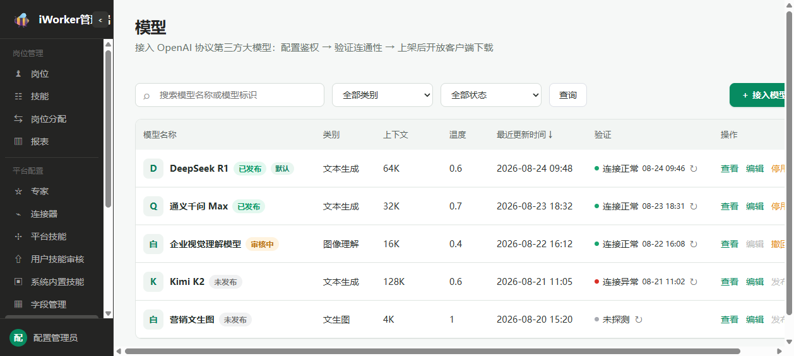
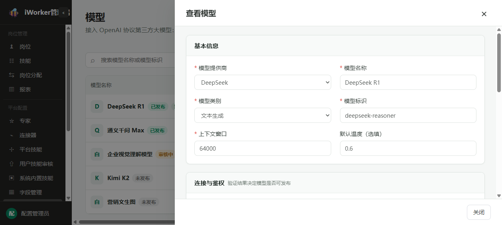
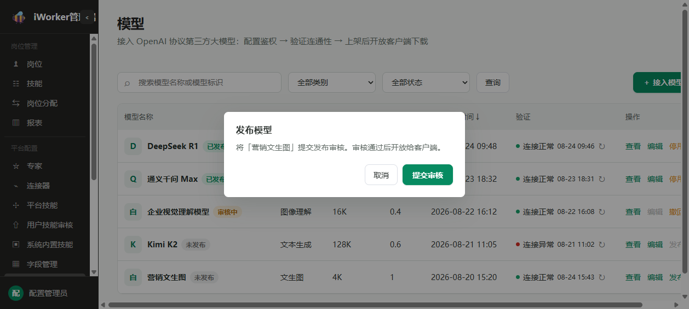
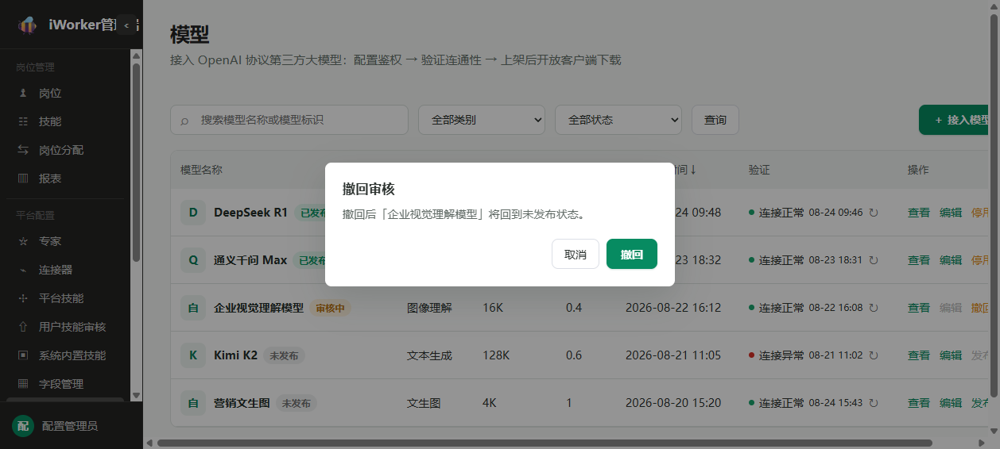
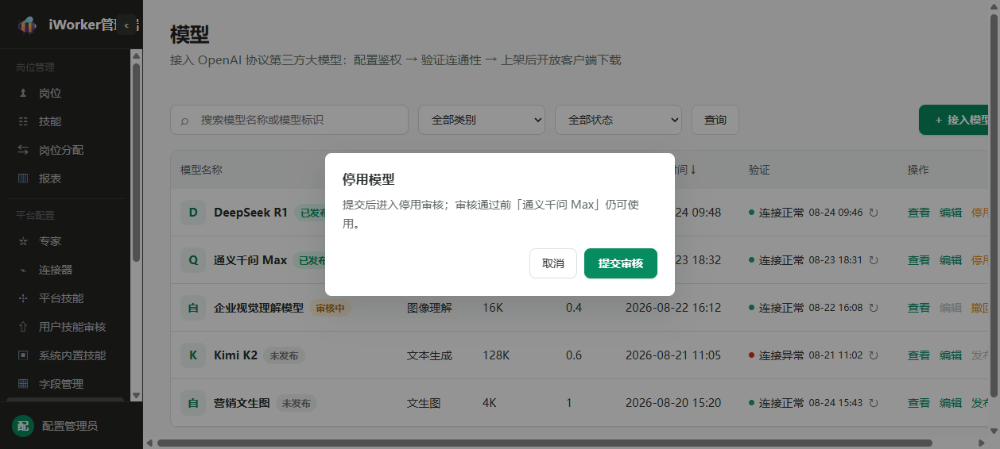
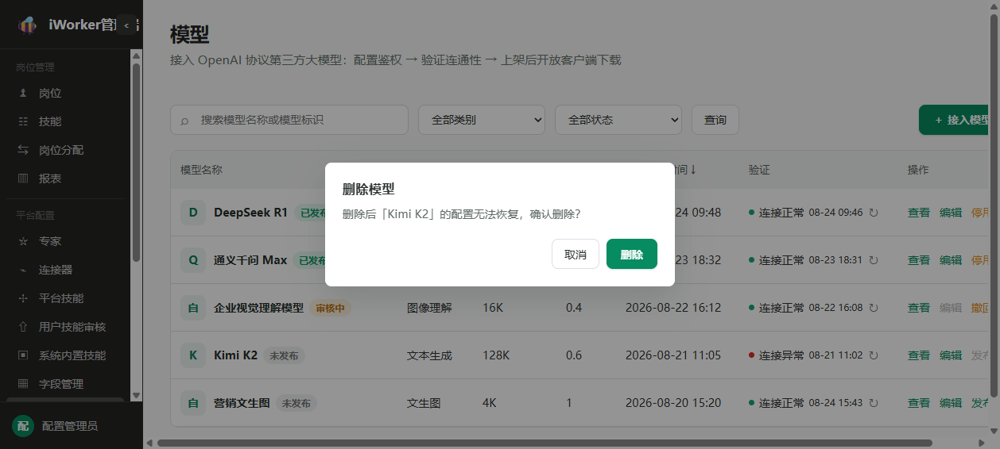
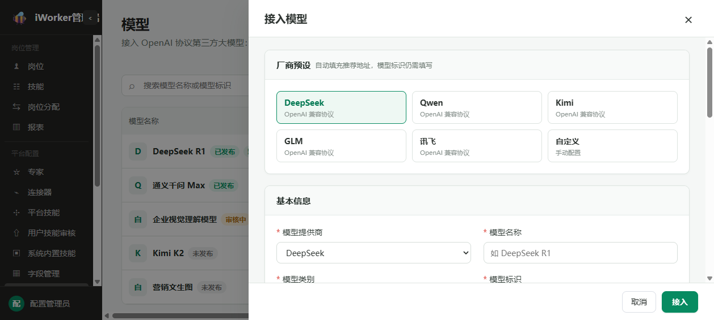
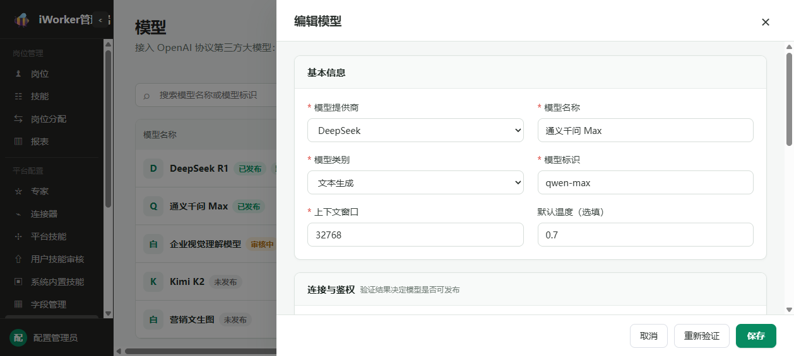
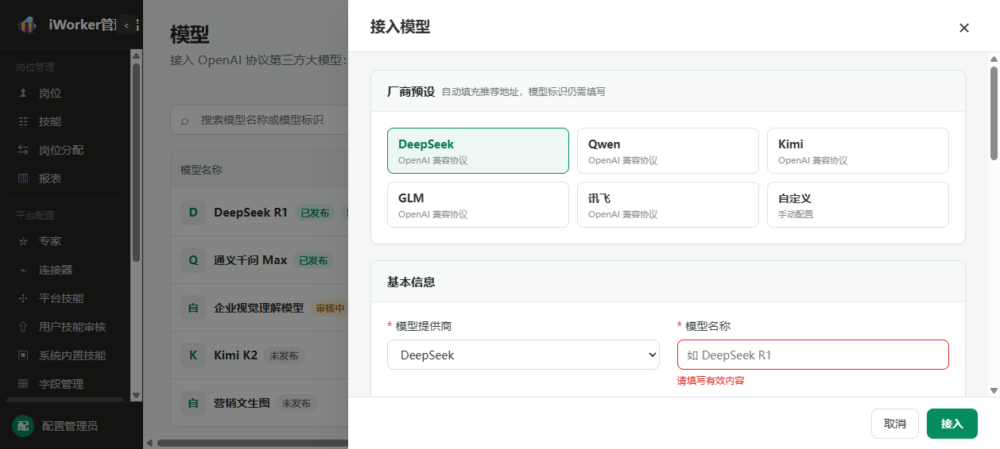

# 模型产品需求

## 一、导航栏

### 1. 功能说明

导航栏用于帮助管理员搜索模型、筛选模型类别和状态，并进入模型接入流程。

- **页面标题**：展示“模型”。
- **页面说明**：文案“接入 OpenAI 协议第三方大模型：配置鉴权 → 验证连通性 → 上架后开放客户端下载”。
- **搜索框**：占位提示为“搜索名称”，支持按模型名称或模型标识搜索。
- **类别筛选**：默认展示“全部类别”，支持选择“文本生成、图像理解、多模态、文生图”。
- **状态筛选**：默认展示“全部状态”，支持选择“未发布、审核中、已发布”。
- **查询按钮**：按照当前搜索内容、类别和状态查询模型。
- **接入入口**：点击【接入模型】，打开模型编辑页的新建状态。

### 2. 交互规则

- 搜索、类别筛选和状态筛选可组合使用。
- 在搜索框中按回车或点击【查询】后，列表展示符合当前条件的模型。
- 清空搜索内容后，列表自动按照剩余条件刷新。
- 切换或清空类别、状态筛选后，列表自动按照当前条件刷新。
- 【接入模型】始终显示在导航栏右侧。
- 点击【接入模型】后，模型编辑页从页面右侧打开。
- 打开或关闭模型编辑页时，保留列表当前的搜索和筛选条件。

### 3. 页面状态与异常场景

- **首次暂无数据**：展示“还没有接入模型 · 点「接入模型」配置第一个”。
- **无查询结果**：展示空结果状态，保留当前搜索和筛选条件。
- **列表加载失败**：展示“加载失败”和【重试】按钮。
- **重试加载**：点击【重试】后，按照当前查询条件重新加载列表。
- **无管理权限**：不展示模型管理入口，也不允许进入模型管理页面。

## 二、模型列表

### 1. 列表展示

模型列表用于集中查看和管理平台已接入的模型。页面不分页，一次展示当前查询条件下的全部模型。

- **模型名称**：列表只展示管理员设置的模型名称，不展示模型标识；名称旁展示发布状态标签【未发布】【审核中】或【已发布】，默认模型同时展示【默认】标签；不再设置独立状态列。
- **类别**：以标签形式展示“文本生成、图像理解、多模态、文生图”。
- **上下文**：展示模型的上下文窗口；常见容量使用简写形式，如 64K、128K、1M。
- **温度**：展示默认温度；未设置时显示“—”，鼠标悬停提示“未设置，调用时跟随厂商默认值”。
- **最近更新时间**：展示模型基本信息或配置最近一次保存成功的时间，精确到分钟；支持按照时间排序。
- **验证**：形式与 MCP 列表页统一，展示“连接正常、连接异常、未探测、停用”、最近验证时间和重新验证入口。
- **操作**：根据模型当前状态展示查看、编辑、发布、停用、撤回、设为默认或删除。

### 2. 排序规则

- 默认模型排列在非默认模型之前。
- 默认模型区域和非默认模型区域内部均按照最近更新时间由近到远排列。
- 编辑并保存模型基本信息或配置后，模型按照新的最近更新时间重新排序。
- 重新验证、发布、撤回、停用或设置默认模型时，不改变最近更新时间。

### 3. 操作

#### 3.1 操作按钮展示规则

- 操作列根据模型当前状态展示【查看】、【编辑】、【发布】、【停用】、【撤回】、【设为默认】或【删除】。
- 【查看】和【编辑】为固定操作，所有状态下均展示；审核中【编辑】仍展示但不可点击。
- 【发布】、【停用】和【撤回】占用同一个操作位置，三个按钮互相替换，同一时间只展示其中一个：
  - 模型为“未发布”且没有待审核操作时，展示【发布】。
  - 模型为“已发布”且没有待审核操作时，展示【停用】。
  - 模型存在待审核操作时，无论待审核的是发布还是停用，均展示【撤回】。
- 【删除】和【设为默认】不会同时展示，并根据模型状态进行替换：
  - 模型为“未发布”且没有待审核操作时，展示【删除】，不展示【设为默认】。
  - 模型为“已发布”、不是默认模型且没有待审核操作时，展示【设为默认】，不展示【删除】。
  - 模型为“已发布”且已经是默认模型时，不展示【设为默认】和【删除】。
  - 模型存在待审核操作时，不展示【设为默认】和【删除】。
- 各状态的按钮组合如下：
  - 未发布：展示【查看】【编辑】【发布】【删除】，共 4 个按钮。
  - 未发布但连通性尚未验证成功：仍展示【查看】【编辑】【发布】【删除】，共 4 个按钮，其中【发布】不可点击。
  - 已发布且不是默认模型：展示【查看】【编辑】【停用】【设为默认】，共 4 个按钮。
  - 已发布且已经是默认模型：展示【查看】【编辑】【停用】，共 3 个按钮。
  - 发布审核中：展示【查看】【编辑】【撤回】，共 3 个按钮，其中【编辑】不可点击。
  - 停用审核中：展示【查看】【编辑】【撤回】，共 3 个按钮，其中【编辑】不可点击。
- 状态发生变化后，页面按照新状态即时替换操作按钮：
  - 提交发布后，【发布】和【删除】替换为【撤回】。
  - 发布审核通过后，【撤回】替换为【停用】；非默认模型同时展示【设为默认】。
  - 提交停用后，【停用】和【设为默认】替换为【撤回】。
  - 停用审核通过后，【撤回】替换为【发布】和【删除】。
  - 撤回发布申请后，【撤回】替换为【发布】和【删除】。
  - 撤回停用申请后，【撤回】替换为【停用】；非默认模型同时展示【设为默认】。

#### 3.2 查看

- 点击【查看】，以只读方式打开模型编辑页。
- 查看状态下可查看模型配置、当前鉴权方式、鉴权信息是否已配置以及能力标签。
- 查看状态下全部内容不可修改，不提供重新验证和保存操作，底部仅显示【关闭】。

#### 3.3 编辑

- 点击【编辑】，进入模型编辑页的编辑状态，并展示模型已有内容。
- 未发布和已发布模型可以编辑。
- 审核中的模型不可编辑；【编辑】置灰，并提示“审核中不可编辑，如需修改请先撤回提交”。

#### 3.4 连通性验证

- 模型列表验证列的布局、状态标签、时间展示和刷新入口与 MCP 列表页保持一致。
- 连接状态统一展示“连接正常、连接异常、未探测、停用”。
- 新接入或编辑保存成功后，列表自动开始验证模型连通性。
- 从未验证过时显示“未探测”，不展示验证时间；鼠标悬停提示“尚未验证过，点击发起验证”。
- 已验证过时，状态旁展示最近验证时间，格式为“MM-DD HH:mm”。
- 连接正常或未探测时，鼠标悬停展示最近验证的完整时间；连接正常时可同时展示首响时间。
- 连接异常时，鼠标悬停展示最近验证时间、错误原因和错误码。
- 管理员点击验证列中的刷新图标，可主动发起验证或重新验证。
- 验证过程中保留上一次状态，时间位置显示“正在验证…”，刷新图标持续旋转且不可重复点击。
- 验证过程不阻塞列表操作，管理员可以继续查看或处理其他模型。
- 验证完成后，当前行的状态和最近验证时间立即更新。
- 连接正常时提示“检活完成 · 连接正常”；连接异常时提示“检活完成 · 连接异常”；未获得明确结果时提示“检活完成”。
- 验证失败时提示具体失败原因；没有具体原因时提示“检活失败，请稍后重试”。
- 验证成功后继续更新模型能力标签，未发布模型的【发布】变为可用。
#### 3.5 发布

- 仅未发布且没有待审核操作的模型显示【发布】。
- 只有连通性验证成功的模型可以提交发布。
- 尚未验证或验证失败时，【发布】不可点击，并提示“连通性验证通过后才可提交发布（改过连接配置需重新验证）”。
- 点击【发布】后弹出二次确认，说明提交后进入审核，审核通过后模型才会对客户端开放调用。
- 确认按钮显示【提交审核】。
- 提交成功后提示“已提交发布审核”，模型状态变为“审核中”。
- 发布审核期间，模型尚未向用户开放。
- 审核通过后，模型变为“已发布”并向用户开放。
- 审核未通过时，模型回到“未发布”，管理员可修改后重新提交。
- 审核通过前，如果模型的验证状态已经失效，则不能通过审核，需重新验证后再次提交。

#### 3.6 撤回

- 审核中的模型显示【撤回】。
- 点击【撤回】后弹出二次确认。
- 待审发布撤回时，提示模型将回到未发布状态，可修改后重新提交。
- 待审停用撤回时，提示模型将保持已发布并继续对客户端提供服务。
- 撤回成功后提示“已撤回”。
- 审核中的模型不展示发布、停用、设为默认或删除操作。

#### 3.7 停用

- 已发布且没有待审核操作的模型显示【停用】。
- 点击【停用】后弹出二次确认，说明审核通过前模型仍然可用，审核通过后才停止向用户开放。
- 确认按钮显示【提交审核】。
- 提交成功后提示“已提交停用审核”，模型在页面上显示“审核中”。
- 停用审核通过前，模型继续向用户开放。
- 停用审核通过后，模型变为“未发布”并停止向用户开放。
- 停用审核未通过时，模型保持“已发布”并继续向用户开放。
- 停用默认模型时，确认提示额外说明“停用生效后将同时取消其默认标记”。
- 停用默认模型审核期间继续保留默认标记，审核通过后再取消。

#### 3.8 设为默认

- 仅已发布、当前不是默认模型且没有待审核操作的模型显示【设为默认】。
- 每个模型类别最多有一个默认模型。
- 点击【设为默认】后弹出二次确认，说明同类别原默认模型将自动取消，不影响其他类别。
- 确认按钮显示【设为默认】。
- 设置成功后提示“已设为默认模型”。
- 设置成功的模型展示【默认】标签，并排列在非默认模型之前。

#### 3.9 删除

- 仅未发布且没有待审核操作的模型显示【删除】。
- 已发布模型不可直接删除，需先提交停用并等待审核通过。
- 审核中的模型不可删除。
- 点击【删除】后弹出二次确认，提示“删除后模型的配置与密钥将不可恢复”。
- 确认按钮显示【删除】。
- 用户取消确认时不执行删除。
- 删除成功后提示“已删除”，模型从列表中移除。

### 4. 状态规则

- 模型列表仅展示“未发布、审核中、已发布”三种状态。
- 未发布模型验证成功后可以提交发布。
- 发布提交后进入“审核中”；审核通过后变为“已发布”，驳回或撤回后变为“未发布”。
- 已发布模型可以提交停用。
- 停用提交后页面显示“审核中”，但审核通过前模型仍向用户开放。
- 停用审核通过后模型变为“未发布”；驳回或撤回后保持“已发布”。
- 模型不单独展示“已驳回”或“已下架”状态。
- 发布和停用均需经过审核，审核通过前不提前生效。
- 审核中的模型仅允许查看和撤回，不允许编辑、删除、重复发布、重复停用或设为默认。

### 5. 列表异常场景

- **连通配置不完整**：本行显示“异常”，提示管理员补充缺少的鉴权信息后重新验证。
- **鉴权失败**：本行显示“异常”，提示检查鉴权信息是否填写错误或已经失效。
- **地址或模型不存在**：本行显示“异常”，提示检查 base_url 和模型标识。
- **响应超时**：本行显示“异常”，提示稍后重试；持续超时时检查网络情况。
- **无法连接**：本行显示“异常”，提示检查服务地址和网络情况。
- **上游服务异常**：本行显示“异常”，提示稍后重试，并检查账户额度和使用频率。
- **响应格式不符**：本行显示“异常”，提示检查服务地址是否正确。
- **验证等待超时**：提示后台可能仍在验证，可稍后刷新列表查看；模型原验证状态不改变。
- **验证期间连接配置发生变化**：本次结果作废，提示按照最新配置重新验证。
- **验证请求未完成**：提示验证请求未能完成，模型原验证状态不改变，管理员可稍后重试。
- **未验证成功时发布**：【发布】不可点击，并提示先完成连通性验证。
- **审核中尝试编辑或删除**：禁止操作，并提示先撤回当前提交。
- **已发布模型尝试删除**：禁止删除，并提示先完成停用审核。
- **停用审核期间**：模型继续向用户开放，页面显示“审核中”。
- **离开页面时仍在验证**：当前页面停止等待；重新进入或刷新后可查看最终结果。

## 三、模型编辑页

### 1. 页面状态

模型编辑页以右侧抽屉形式展示，包含“接入、编辑、查看”三种状态。

- **接入**：通过导航栏【接入模型】进入，抽屉标题显示“接入模型”。
- **编辑**：通过模型列表【编辑】进入，抽屉标题显示“编辑模型”。
- **查看**：通过模型列表【查看】进入，抽屉标题显示“查看模型”，全部内容只读。
- 审核中的模型只能查看，不允许编辑。
- 点击抽屉外区域时不关闭抽屉，防止误操作导致已填写内容丢失。

### 2. 厂商预设

厂商预设为选填内容，仅在接入状态展示，用于自动填写常用配置。

- **DeepSeek（官方）**
- **通义千问（阿里云百炼）**
- **Kimi（月之暗面）**
- **智谱 GLM**
- **讯飞 MaaS**
- **自定义（私有网关/其它平台）**

交互规则：

- 选择厂商后，页面自动填写常用的服务地址、鉴权方式、上下文窗口和默认温度。
- 模型标识保持为空，由管理员按照服务商提供的信息填写。
- 自动填写的内容可以继续修改，不会被锁定。
- 选择“自定义”后，由管理员自行填写模型信息。

### 3. 基本信息

- **模型提供商**：必填，可选择 DeepSeek、智谱 GLM、月之暗面 Kimi、阿里 Qwen、MiniMax、阶跃星辰、小米 MiMo、其他。
- **模型名称**：必填，最多 64 字符；占位提示为“如 DeepSeek V3”。
- **图标**：必填。

> 图标配置统一规则（岗位、专家、技能、模型、MCP、API、业务系统一致）：
> - **图标库选择**：点击【从图标库选择】打开图标库弹窗；选中图标后即时更新预览，保存后用于列表、编辑页和客户端展示。
> - **上传图标**：点击【上传图标】调用本地文件选择器，支持 PNG、JPG/JPEG、WebP、GIF、SVG，单个文件不超过 5 MB。选择图片后进入方形裁剪界面，可拖动图片调整保留区域，通过缩放滑杆放大或缩小；点击【使用该区域】生成 256×256 的 PNG 图标并更新预览；点击【重新选择图片】可更换原始图片；点击【取消】不修改原图标。
> - **替换规则**：上传图片与图标库图标互斥。重新从图标库选择后清除已上传图片；重新上传并裁剪后使用新的图片图标。
> - **只读状态**：查看页展示当前图标，上传和图标库入口置灰不可点击。
> - **异常处理**：非图片文件提示"请选择图片文件"；文件超过 5 MB 提示"图片不能超过 5 MB"；读取失败时保留原图标并提示重新选择。
- **模型类别**：必填，可选择文本生成、图像理解、多模态、文生图。
- **base_url**：必填，最多 500 个字符；必须以 http:// 或 https:// 开头，不可包含空格、问号或井号。
- **模型标识**：必填，最多 200 个字符；占位提示为“填写平台文档里的模型调用标识，如 deepseek-chat”。
- **上下文窗口**：必填，可选择 8K、16K、32K、64K、128K、192K、198K、200K、256K、1M，也可输入具体 token 数；输入值需为不小于 1024 的整数，不可带 K 等单位。
- **默认温度**：选填，可设置 0 至 2，调整步长为 0.1；留空时使用厂商默认值。
- 每项主要配置均提供问号说明，鼠标悬停可查看用途和填写建议。

### 4. 鉴权方式与鉴权信息

- **鉴权方式**：提供“API Key”和“AppID / AppSecret”两种选项，默认选择“API Key”。
- 选择鉴权方式后，页面仅展示当前方式需要填写的鉴权信息。

#### 4.1 API Key

- **api_key**：新接入模型时必填，以密码形式输入。
- 编辑已有模型时不展示原内容；已经配置时提示“已配置 · 留空不修改”。
- 管理员留空保存时，继续保留原内容；重新填写后，以新内容为准。

#### 4.2 AppID / AppSecret

- **app_id**：必填，占位提示为“应用归属标识（不参与 HTTP 调用）”。
- **api_key**：新接入模型时必填，以密码形式输入；占位提示为“平台分配的 APIKey”。
- **app_secret**：新接入模型时必填，以密码形式输入；占位提示为“平台分配的 APISecret”。
- 编辑已有模型时，app_id 展示当前内容。
- 编辑已有模型时，api_key 和 app_secret 不展示原内容；已经配置时提示“已配置 · 留空不修改”。
- 管理员不重新填写 api_key 或 app_secret 时，继续保留原内容；重新填写后，以新内容为准。

#### 4.3 查看状态

- 展示当前选择的鉴权方式。
- app_id 正常展示。
- api_key 和 app_secret 不展示原内容，仅通过“已配置”提示说明配置状态。

### 5. 能力信息与重新验证

#### 5.1 能力信息

- 能力信息在接入、编辑和查看状态均展示；接入状态展示能力识别说明和额外参数，能力标签在验证成功后自动识别。
- 页面展示【能力标签】，管理员不可手动新增、删除或修改。
- 能力标签包括“流式、工具、JSON、推理”，以最近一次验证识别到的结果为准。
- 尚未验证时，展示“验证连通性后自动检测”。
- 已完成验证但未识别到支持的能力时，展示“未探测到已支持能力”。
- 能力标签旁提供问号说明，鼠标悬停可查看各能力含义。
- **额外参数**：选填，在“能力信息”区直接展示，不使用“高级配置”折叠；最多 2000 个字符，需填写合法的 JSON 对象，不清楚时可以留空。

#### 5.2 重新验证

- 【重新验证】仅在编辑状态展示；接入和查看状态不展示。
- 点击【重新验证】，使用当前已经保存的模型配置进行验证，不保存页面中尚未提交的修改。
- 验证期间，【重新验证】显示加载状态，【保存】同时不可操作。
- 页面展示“正在验证连通性并检测模型能力…（最长约 40 秒）”。

验证成功时：

- 提示“连通性验证成功”，并展示本次响应时间。
- 当返回测试问答内容时，展示测试提问和模型返回内容。
- 模型列表同步刷新本次验证结果。
- 重新打开编辑页或查看页后，展示最新能力标签。

验证失败时：

- 提示“连通性验证失败”，并展示具体失败原因。
- 模型列表同步刷新本次验证结果。
- 编辑页保持打开，管理员可检查已保存配置后再次验证。

### 6. 保存与关闭

- 接入状态下，底部显示【取消】【接入】。
- 编辑状态下，底部显示【取消】【重新验证】【保存】。
- 查看状态下，底部仅显示【关闭】。
- 点击【取消】，关闭抽屉并放弃未保存的修改。
- 点击【接入】或【保存】时，先检查必填内容和填写格式。
- 必填内容未填写或格式不正确时，不允许保存，并在对应位置说明原因。
- 保存成功后提示“已保存，正在验证连通性…”，关闭抽屉并刷新模型列表。
- 列表刷新后，自动对本次接入或编辑的模型发起连通性验证。

### 7. 配置变更影响

base_url、模型标识、鉴权方式、app_id、api_key、app_secret 和额外参数属于影响连接和使用的重要配置。

- 上述任意内容发生变化后，模型变为“未发布”。
- 原连通性验证结果和能力标签清空，管理员需重新验证。
- 验证成功后，管理员需重新提交发布并等待审核通过。
- 修改已发布模型的重要配置时，保存前弹出“连接信息变更”确认。
- 确认提示说明：修改后模型会立即下架，客户端将无法获取该模型的调用配置；保存后需重新验证并重新发布。
- 用户取消确认时，不保存本次修改。
- 仅修改模型提供商、模型名称、上下文窗口或默认温度等普通信息时，不清空原验证结果。
- 模型名称修改后仍需保持唯一。

当前模型为所在类别的默认模型时，修改类别需遵循以下规则：

- 保存前弹出“类别变更”确认。
- 确认提示说明：修改类别后模型将不再是原类别的默认模型。
- 保存成功后取消原默认标记。
- 如需将模型设为新类别的默认模型，管理员需返回列表重新设置。
- 用户取消确认时，不保存类别修改。

### 8. 时间信息

- 时间信息仅在已有模型的编辑或查看状态展示，新接入状态不展示。
- **创建时间**：展示模型首次接入平台的时间。
- **最近更新时间**：展示模型基本信息或配置最近一次保存成功的时间。
- **最近发布时间**：展示模型最近一次发布审核通过的时间；从未发布过时显示“—”。
- 重新验证、提交审核、撤回审核、停用或设置默认模型时，不改变最近更新时间。
- 时间信息均为只读内容，不允许管理员修改。

### 9. 编辑页异常场景

- **必填内容缺失**：阻止保存，并在对应位置提示需要补充的内容。
- **base_url 格式错误**：提示必须以 http:// 或 https:// 开头，且不能包含空格、问号或井号。
- **上下文窗口格式错误**：提示输入不小于 1024 的 token 数字，不可带 K 等单位。
- **额外参数格式错误**：提示填写合法的 JSON 对象。
- **模型名称重复**：提示名称已存在，并定位到模型名称位置。
- **鉴权信息不完整**：提示补充当前鉴权方式所需的信息。
- **保存失败**：展示失败原因，保留当前填写内容，管理员可修改后重试。
- **重新验证失败**：展示失败原因，保留编辑页和当前内容，管理员可再次验证。
- **已发布模型修改重要配置**：必须完成风险二次确认，未确认时不保存。
- **默认模型修改类别**：必须完成取消默认标记的二次确认，未确认时不保存。
- **审核中进入编辑**：【编辑】不可用，并提示先撤回当前申请。
- **鉴权信息未重新填写**：保留原内容，不因普通编辑而被清除。

