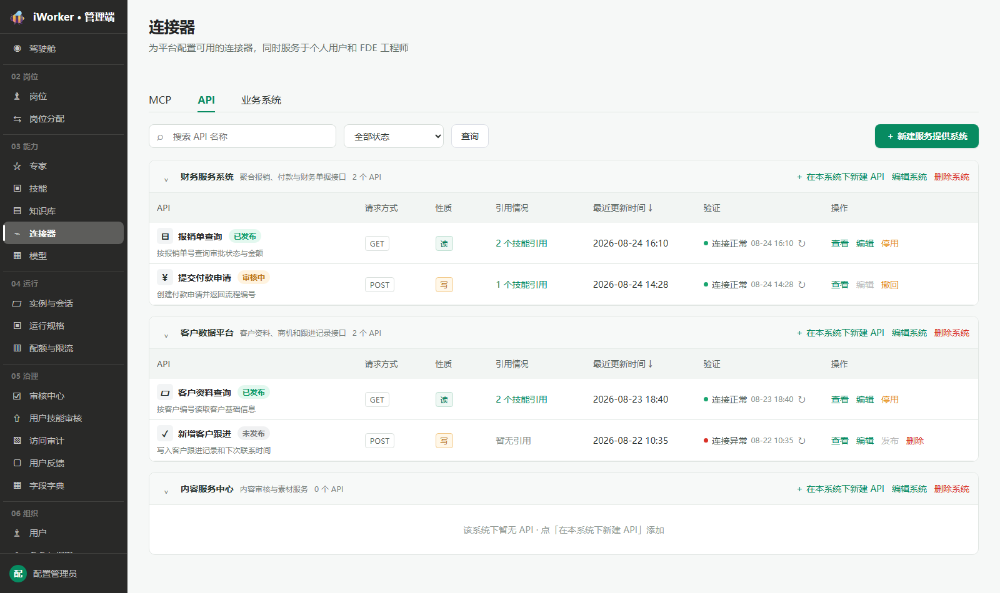
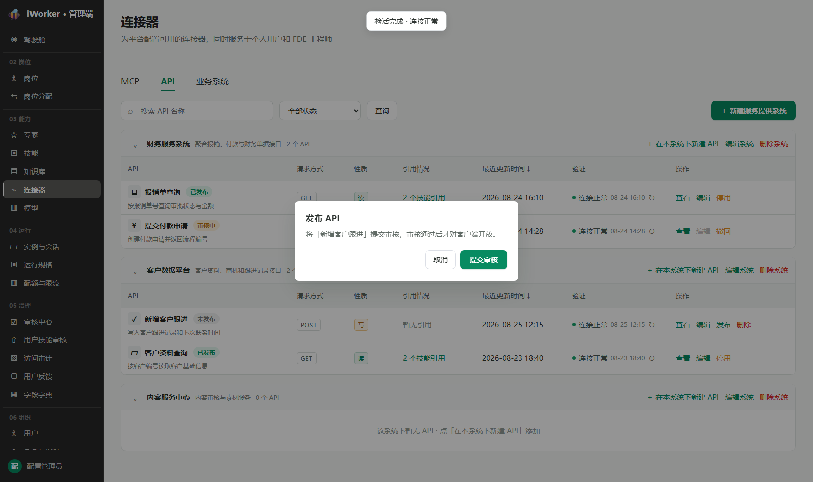
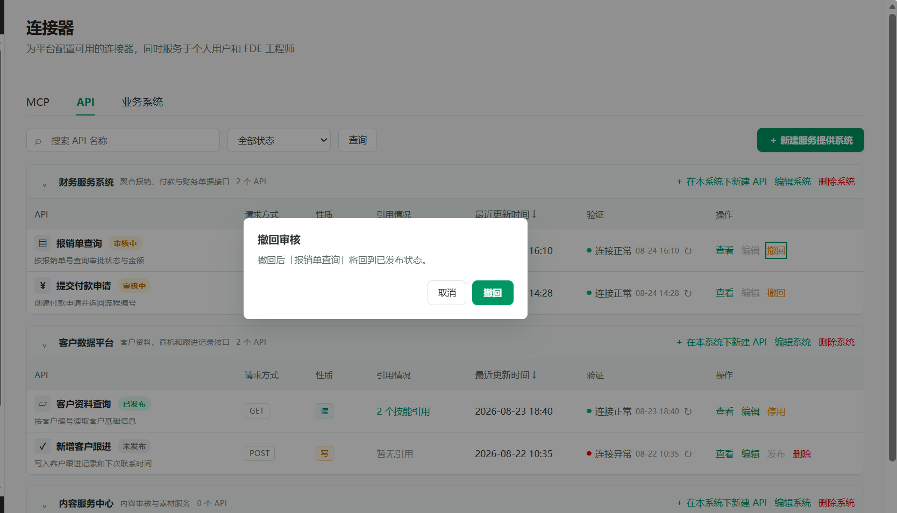
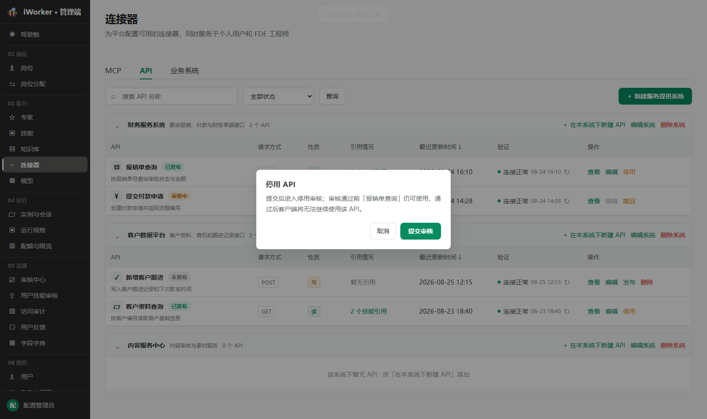
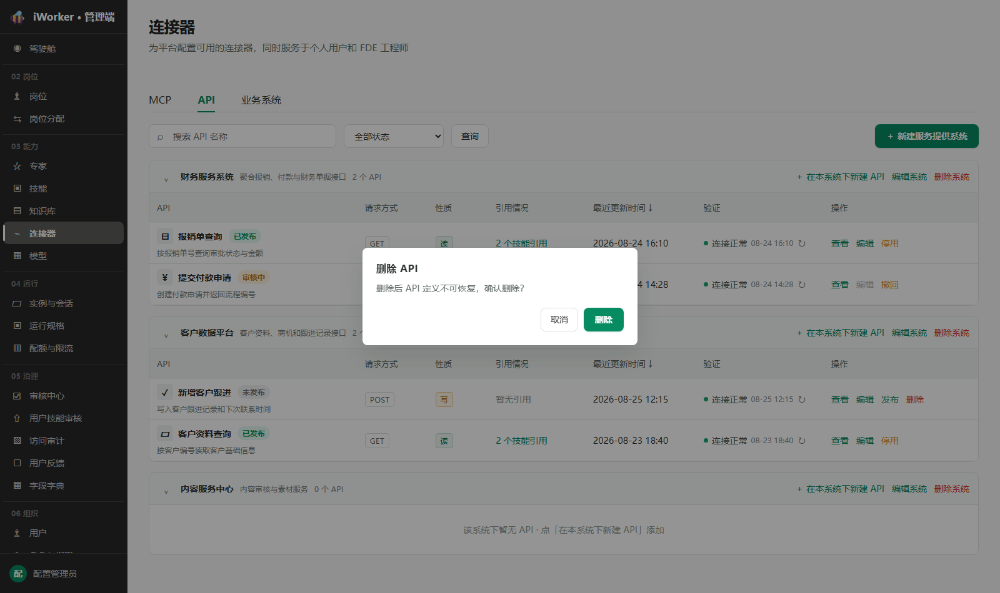
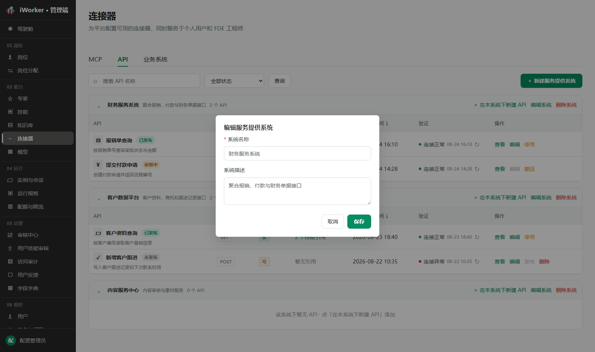
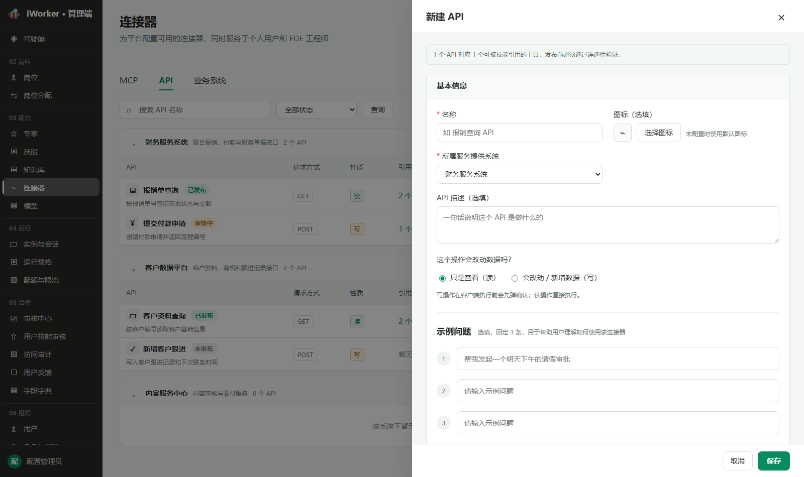
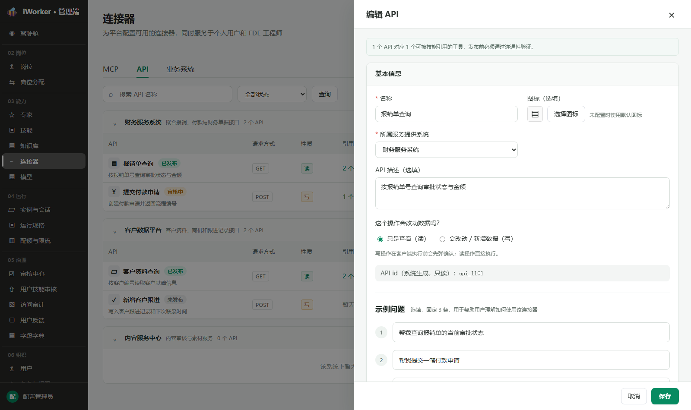
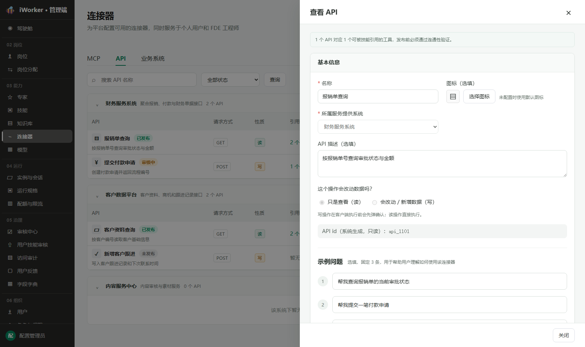
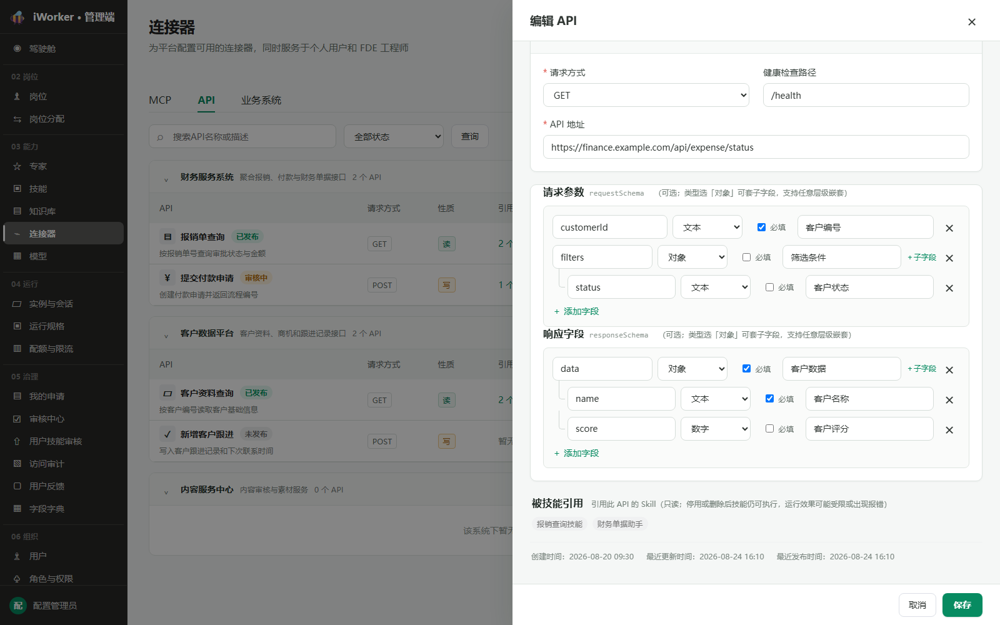

# API 连接器产品需求

## 一、导航栏

### 1. 功能说明

导航栏用于帮助管理员搜索 API、筛选状态，并维护服务提供系统分组。API 连接器把标准 HTTP 接口包装为技能可引用的工具。

- **页面入口**：侧边栏"03 能力 / 连接器 / API"。页面标题"连接器"，说明"为平台配置可用的连接器，同时服务于个人用户和 FDE 工程师"；顶部保留 MCP、API、业务系统三个页签，当前选中 API。
- **搜索框**：占位提示为"搜索 API 名称或描述"，支持按 API 名称模糊搜索。
- **状态筛选**：默认"全部状态"，可选择"未发布、审核中、已发布"。
- **查询按钮**：按照当前搜索内容和状态刷新列表。
- **新建服务提供系统**：右侧展示【＋ 新建服务提供系统】，打开服务提供系统弹窗。
- 无匹配结果时展示"没有匹配的 API"。

### 2. 交互规则

- 搜索和状态筛选可组合使用；点击【查询】后按当前条件刷新。
- 搜索或筛选后，只展示存在匹配 API 的分组；无筛选条件时展示全部分组（含空分组）。
- 切换 MCP、API、业务系统页签时保留各自的筛选条件。

## 二、API 列表

### 1. 列表展示

API 按服务提供系统分组展示

**分组头**展示：展开 / 折叠按钮、系统名称、系统描述、该系统下 API 总数，以及操作【＋ 在本系统下新建 API】【编辑系统】【删除系统】。

**组内 API 表格**按以下列展示：

- **API**：展示图标、API 名称和状态标签【未发布】【审核中】【已发布】，名称下方展示描述（缩略，悬停查看完整内容）。
- **请求方式**：展示 GET、POST、PUT、DELETE、PATCH 之一。
- **性质**：展示"读"或"写"标签。
- **引用情况**：有引用时展示"N 个技能引用"，点击弹出引用清单弹窗；无引用显示"暂无引用"。
- **最近更新时间**：展示最近一次保存时间，精确到分钟；支持点击排序。
- **验证**：展示连接状态（未探测 / 连接正常 / 连接异常）、最近验证时间和【↻ 重新验证】入口。
- **操作**：按状态展示【查看】【编辑】【发布】【撤回】【停用】【删除】。

分组内无 API 时展示"该系统下暂无 API · 点「在本系统下新建 API」添加"。

### 2. 操作按钮展示规则

- 【查看】和【编辑】固定展示；审核中【编辑】置灰并提示"审核中不可编辑，如需修改请先撤回"。
- 各状态按钮组合：
  - **未发布**：【查看】【编辑】【发布】【删除】；连通性验证未通过时【发布】置灰，提示"连通性验证通过后才可提交发布"。
  - **审核中**：【查看】【编辑】（置灰）【撤回】。
  - **已发布**：【查看】【编辑】【停用】。

### 3. 连通性验证

- 验证状态：未探测、验证中、连接正常、连接异常。
- 点击【↻】发起验证；验证中图标旋转且不可重复点击，验证期间不阻塞其他操作。
- 验证成功后本行状态和最近验证时间立即更新，提示"检活完成 · 连接正常"；失败展示"连接异常"并允许重试。
- 未验证或验证失败时不允许发布。
- 修改 API 地址、请求方式或鉴权配置后，原验证结果失效，需重新验证。

### 4. 发布 / 撤回 / 停用 / 删除

- **发布**：弹出确认窗口"将「API 名」提交审核，审核通过后才对客户端开放"，确认按钮【提交审核】；提交后状态变为"审核中"，审核通过后变为"已发布"。

- **撤回**：弹出确认窗口，按待审类型恢复：待审发布撤回后回到未发布；待审停用撤回后回到已发布。

- **停用**：弹出确认窗口“停用后技能仍可执行，但运行效果可能受限或出现报错。确认继续停用「API 名」？”，确认按钮【继续停用】；确认后提交停用审核，状态变为“审核中”，审核通过后变为“未发布”，被拒绝或撤回后恢复“已发布”。

- **删除**：无论是否存在技能引用，均弹出确认窗口“删除后技能仍可执行，但运行效果可能受限或出现报错。确认删除「API 名」？”，确认按钮【继续删除】；管理员确认后可继续删除，原技能引用按软引用保留。

### 5. 服务提供系统

- **新建 / 编辑**：弹窗展示系统名称（必填，最多 64 字符，平台内不可重复）和系统描述（必填，最多 2000 字符）；保存成功后关闭弹窗并刷新列表，不跳转页面。

- **删除**：系统下存在 API 时【删除系统】置灰，提示"该系统下有 N 个 API，需先迁移或删除后才能删除系统"；空系统删除前二次确认"删除后该 API 分组不可恢复，确认删除？"。
- 服务提供系统仅作聚合容器，不设启用 / 停用状态。

## 三、API 编辑页

### 1. 页面状态

API 编辑页以右侧抽屉形式展示，包含"新建、编辑、查看"三种状态。

- **新建**：通过分组头【＋ 在本系统下新建 API】进入（自动带入该系统），或从空分组提示引导创建；标题"新建 API"，底部【取消】【保存】。

- **编辑**：通过【编辑】进入，标题"编辑 API"，底部【取消】【保存】。

- **查看**：通过【查看】进入，标题"查看 API"，全部只读，底部仅【关闭】。

- 抽屉顶部提示："1 个 API 对应 1 个可被技能引用的工具，发布前必须通过连通性验证。"
- 点击抽屉遮罩不直接关闭，避免误丢失内容。

### 2. 基本信息

- **名称**：必填，API 的平台展示名称；占位"如 报销查询 API"。
- **图标**：必填。

> 图标配置统一规则（岗位、专家、技能、模型、MCP、API、业务系统一致）：
> - **图标库选择**：点击【从图标库选择】打开图标库弹窗；选中图标后即时更新预览，保存后用于列表、编辑页和客户端展示。
> - **上传图标**：点击【上传图标】调用本地文件选择器，支持 PNG、JPG/JPEG、WebP、GIF、SVG，单个文件不超过 5 MB。选择图片后进入方形裁剪界面，可拖动图片调整保留区域，通过缩放滑杆放大或缩小；点击【使用该区域】生成 256×256 的 PNG 图标并更新预览；点击【重新选择图片】可更换原始图片；点击【取消】不修改原图标。
> - **替换规则**：上传图片与图标库图标互斥。重新从图标库选择后清除已上传图片；重新上传并裁剪后使用新的图片图标。
> - **只读状态**：查看页展示当前图标，上传和图标库入口置灰不可点击。
> - **异常处理**：非图片文件提示"请选择图片文件"；文件超过 5 MB 提示"图片不能超过 5 MB"；读取失败时保留原图标并提示重新选择。
- **所属服务提供系统**：必选，从已创建的服务提供系统中选择。
- **API 描述**：必填，最多 2000 字符。
- **操作性质**：必选单选"只是查看（读）/ 会改动 / 新增数据（写）"；写操作在客户端实际执行前必须经用户确认，读操作直接执行。
- **API ID**：系统生成，编辑和查看态只读展示（如 api_1101）。
- **示例问题**：必填，固定 3 条输入行，位于基本信息卡片内；用于帮助用户理解如何使用该工具。每条输入行旁展示【AI 生成】按钮，使用常规字重，不使用加粗样式，点击后调用模型根据 API 名称和描述自动生成示例问题，填入输入行；重复点击可重新生成，覆盖当前内容。单条示例问题最多 60 字符。

### 3. 鉴权配置

- **鉴权类型**：可选择"不鉴权 / API_KEY"，默认不鉴权。
- 选择"不鉴权"时提示"当前服务不需要访问凭证"。
- 选择"API_KEY"时展示：
  - **参数名**：必填，如 `X-Api-Key`。
  - **参数位置**：必选 Header、Query、Body、Path 之一。
  - **参数值**：必填，按敏感信息处理，以密码形式输入；查看态不明文展示。API KEY 会静态附加到每次请求。

### 4. 请求配置

- **请求方式**：必选 GET、POST、PUT、DELETE、PATCH 之一，默认 GET。
- **健康检查路径**：选填，可填写相对路径（如 /health），用于连通性验证。
- **API 地址**：必填，须为合法的 HTTP 或 HTTPS URL。

### 5. 请求参数与响应字段

请求参数和响应字段用于描述 API 的结构化输入、输出约束，均为选填。未配置时显示“暂无字段，可不配置（留空表示不约束）”。

- **请求参数（requestSchema）**：描述调用 API 时可传入的参数结构。
- **响应字段（responseSchema）**：描述 API 返回结果的字段结构。
- 点击【＋ 添加字段】新增一级字段；字段行包含：字段名、字段类型、是否必填、字段说明和删除操作。
- 字段类型支持：文本（STRING）、数字（NUMBER）、布尔（BOOLEAN）、对象（OBJECT）、数组（ARRAY），默认“文本”。
- 类型选择“对象”或“数组”时展示【＋子字段】，支持继续添加下级字段和任意层级嵌套；切换为非对象、非数组类型时清空该字段已有子字段。
- **字段名**：新增字段后必填，用于生成结构约束；同一层级内应保持唯一。
- **是否必填**：字段级复选项，勾选后表示运行时必须提供或返回该字段。
- **字段说明**：选填，用于解释字段含义、格式或取值范围。
- 点击【×】删除字段前二次确认；删除父字段时同时删除其全部子字段。
- 查看态完整展示字段层级，但隐藏新增、删除、添加子字段等编辑入口。

### 6. 引用与时间信息

编辑和查看态底部展示：

- **被技能引用**：只读标签列表；无引用时显示"暂无技能引用"；存在引用时仍可在确认影响后删除。
- **创建时间、最近更新时间、最近发布时间**：均只读，精确到分钟。

### 7. 保存校验

- 名称不能为空；必须选择所属服务提供系统。
- API 地址必须为合法的 HTTP 或 HTTPS URL。
- 选择 API_KEY 时，参数名不能为空。
- 请求参数或响应字段新增字段行后，字段名不能为空；对象或数组的子字段按相同规则校验。
- 保存成功后关闭抽屉并刷新当前列表，不跳转页面；提示"API 已创建"或"API 已保存"。
- 保存失败时保留输入内容，提示具体原因。

## 四、异常与空状态

| 场景 | 页面处理 |
| --- | --- |
| 查询无结果 | 展示"没有匹配的 API"，保留当前条件 |
| 无服务提供系统 | 禁止新建 API，提示先创建服务提供系统 |
| 系统下无 API | 展示"该系统下暂无 API"和新建引导 |
| 验证失败 | 展示连接异常，不允许发布 |
| 保存失败 | 保留抽屉内容并显示错误提示 |
| 引用中 API 删除 | 采用软引用，提示影响范围后可继续删除 |
| 删除含 API 的系统 | 按钮置灰并通过 tooltip 说明原因 |

