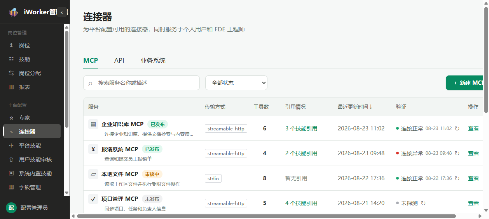
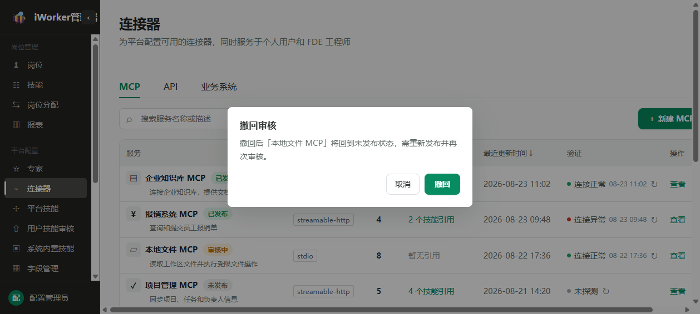
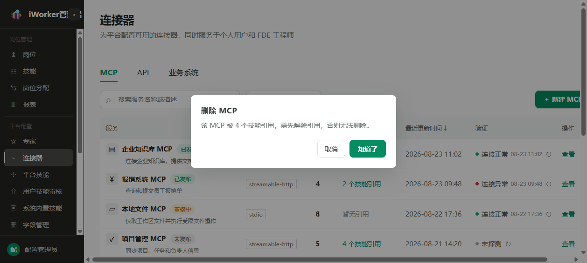
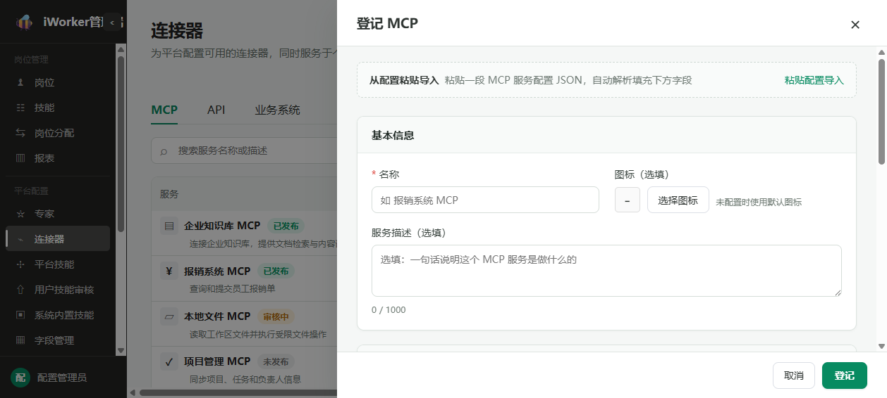
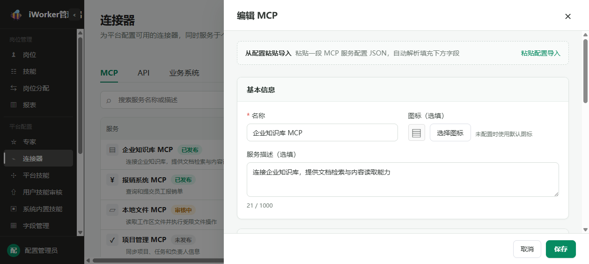
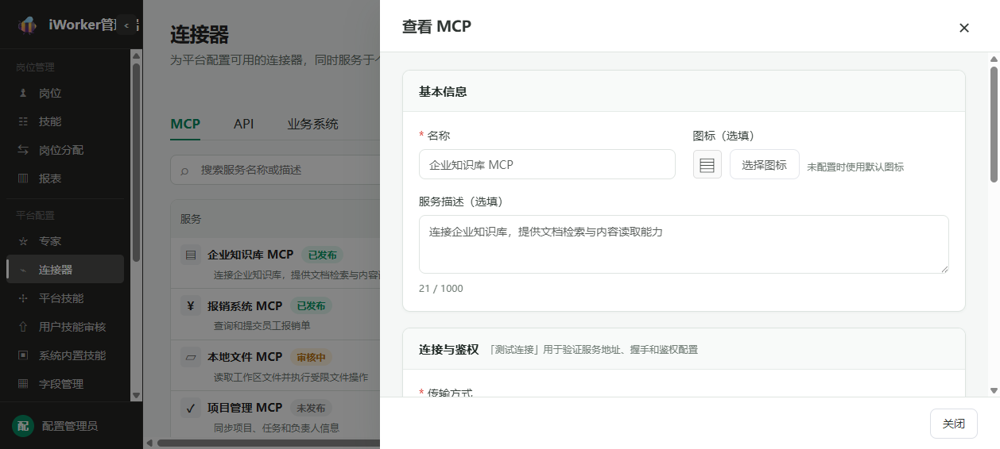
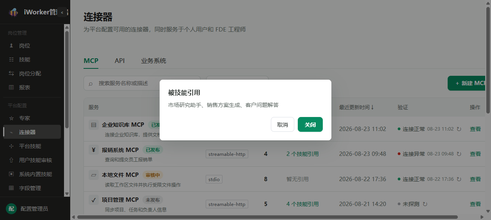
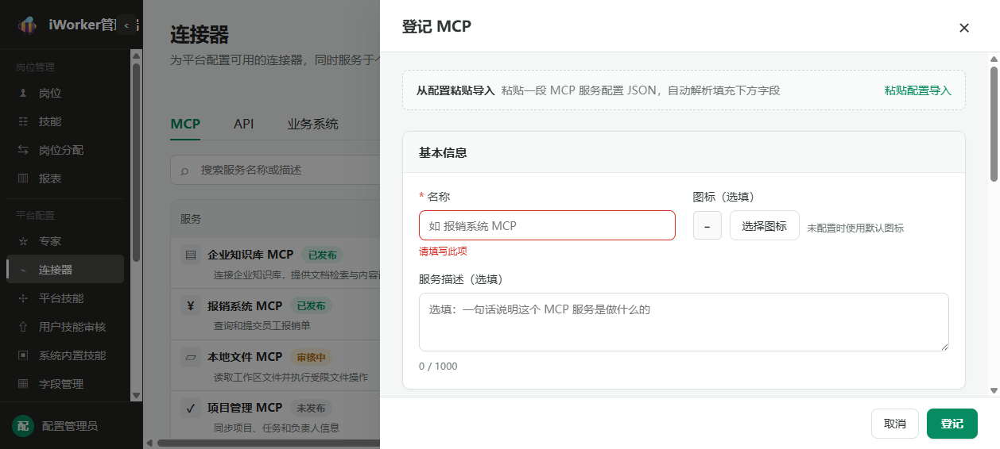

# MCP产品需求

## 一、导航栏

### 1. 功能说明

导航栏用于帮助管理员在连接器类型之间切换、搜索和筛选 MCP，并进入 MCP 登记流程。

- **页面标题**：展示“连接器”。
- **页面说明**：文案“为平台配置可用的连接器，同时服务于个人用户和 FDE 工程师”。
- **类型页签**：展示“MCP、API、业务系统”三个页签。
- **左侧索引**：管理端左侧索引支持折叠和展开；折叠后保留模块图标和当前选中状态。
- **搜索框**：占位提示为“搜索服务名称或描述”，支持按 MCP 名称或服务描述搜索
- **状态筛选**：默认展示“全部状态”，支持选择“已发布、审核中、未发布”。
- **新建入口**：点击【新建 MCP】，打开 MCP 编辑页的新建状态。

### 2. 交互规则

- 进入连接器页面时，默认打开“MCP”页签。
- 点击不同页签后，页面展示对应的管理内容。
- 切换页签后再返回，原页签中的列表、搜索和筛选状态保持不变。
- 刷新页面后，仍停留在刷新前所选的页签。
- 页面无法识别当前页签时，自动回到“MCP”页签。
- 输入或清除搜索内容后，页面短暂停顿并自动刷新结果，同时回到第 1 页。
- 切换或清空状态筛选后，页面按照当前条件刷新，同时回到第 1 页。
- 左侧索引的折叠或展开不清空当前页签、搜索、筛选和分页状态。
- 【新建 MCP】始终展示在导航栏右侧。
- 点击【新建 MCP】后，MCP 编辑页从页面右侧打开。

### 3. 页面状态与异常场景

- **首次暂无数据**：展示“还没有 MCP 服务 · 点「新建 MCP」登记第一个”。
- **无查询结果**：展示空结果状态，保留当前搜索和筛选条件。
- **列表加载失败**：展示“加载失败”和【重试】按钮。
- **重试加载**：点击【重试】后，按照当前查询条件重新加载列表。
- **无管理权限**：不展示连接器管理入口，也不允许进入连接器管理页面。

## 二、MCP 列表

### 1. 列表展示

MCP 列表用于集中查看和管理平台已经登记的 MCP 服务。

- **服务**：同一列主要展示 MCP 名称，名称使用加粗字重，辅助展示服务描述；已经设置图标时在名称前展示图标；名称旁展示发布状态标签【未发布】【审核中】或【已发布】，不再设置独立状态列。描述未填写时显示“—”，内容过长时缩略展示，鼠标悬停可查看完整内容。
- **传输方式**：作为独立列展示“stdio”或“streamable-http”；无内容时显示“—”。
- **工具数**：有工具时展示具体数量；无工具时显示“—”，鼠标悬停提示“尚未拉取到工具，请在编辑器内「拉取工具」”。
- **引用情况**：没有技能引用时展示“暂无引用”；存在引用时展示“N 个技能引用”，鼠标悬停可查看引用该 MCP 的技能名称。
- **最近更新时间**：展示 MCP 基本信息、连接配置或工具清单最近一次保存成功的时间，精确到分钟；支持按照时间排序。
- **验证**：采用单行展示，依次排列状态圆点、连接状态、最近验证时间和刷新入口；最近验证时间格式为“MM-DD HH:mm”。
- **操作**：根据 MCP 当前状态展示查看、编辑、发布、撤回、停用或删除。

### 2. 验证规则

- 连接状态展示“连接正常、连接异常、未探测、停用”。
- 从未验证过时，不展示验证时间；鼠标悬停提示“尚未验证过，点击发起验证”。
- 已验证过时，状态旁展示最近验证时间，格式为“MM-DD HH:mm”。
- 连接正常或未探测时，鼠标悬停展示最近验证的完整时间。
- 连接异常时，鼠标悬停展示最近验证时间、错误原因和错误码。
- 点击刷新图标后，立即发起验证。
- 验证过程中保留上一次状态，时间位置显示“正在验证…”，刷新图标持续旋转且不可重复点击。
- 验证完成后，当前行的状态和最近验证时间立即更新。
- 连接正常时提示“检活完成 · 连接正常”。
- 连接异常时提示“检活完成 · 连接异常”。
- 未获得明确结果时提示“检活完成”。
- 验证失败时提示具体失败原因；没有具体原因时提示“检活失败，请稍后重试”。

### 3. 操作

#### 3.1 操作按钮展示规则

- 操作列根据 MCP 当前状态展示【查看】【编辑】【发布】【撤回】【停用】或【删除】。
- 每行最多直接展示 4 个操作按钮，不使用“更多”菜单收起操作。
- 【查看】和【编辑】为固定操作，所有状态下均展示；审核中【编辑】仍展示但不可点击。
- 【发布】、【撤回】和【停用】占用同一个操作位置，三个按钮互相替换，同一时间只展示其中一个：
  - MCP 为“未发布”时，展示【发布】。
  - MCP 为“审核中”时，展示【撤回】。
  - MCP 为“已发布”时，展示【停用】。
- 【删除】仅在“未发布”状态展示；“审核中”和“已发布”状态不展示【删除】。
- 各状态的按钮组合如下：
  - 未发布：展示【查看】【编辑】【发布】【删除】，共 4 个按钮。
  - 未发布但连接尚未验证成功：仍展示【查看】【编辑】【发布】【删除】，共 4 个按钮，其中【发布】不可点击。
  - 审核中：展示【查看】【编辑】【撤回】，共 3 个按钮，其中【编辑】不可点击。
  - 已发布：展示【查看】【编辑】【停用】，共 3 个按钮。
- 状态发生变化后，页面按照新状态即时替换操作按钮：
  - 提交发布后，【发布】和【删除】替换为【撤回】。
  - 发布审核通过后，【撤回】替换为【停用】。
  - 撤回审核后，【撤回】替换为【发布】和【删除】。
  - 提交停用后，【停用】替换为【撤回】。
  - 停用审核通过后，【撤回】替换为【发布】和【删除】。

#### 3.2 查看

- 所有 MCP 均展示【查看】。
- 点击【查看】，以只读方式打开 MCP 编辑页。
- 查看状态下全部内容不可修改，【测试连接】和【拉取工具】不可点击，底部仅展示【关闭】。

#### 3.3 编辑

- 未发布和已发布 MCP 的【编辑】可以点击。
- 审核中的 MCP，【编辑】置灰，并提示“审核中不可编辑，如需修改请先撤回”。
- 点击【编辑】后，从页面右侧打开 MCP 编辑页的编辑状态。

#### 3.4 发布

- 未发布、已驳回或已停用的 MCP 显示【发布】。
- 连接状态不是“连接正常”时，【发布】不可点击，并提示“连通性验证通过后才可提交发布（改过连接配置需重新验证）”。
- 连接正常但工具数为 0 时，点击【发布】提示“该 MCP 服务下暂无可发布的工具，请先在编辑器内「拉取工具」”。
- 满足发布条件后点击【发布】，弹出“发布 MCP 服务”确认窗口。
- 确认窗口说明该 MCP 下全部工具将作为一个整体提交审核，审核通过后才对平台各项服务开放。
- 确认按钮显示【提交审核】。
- 提交成功后提示“已提交发布审核”，状态变为“审核中”。

#### 3.5 撤回

- 审核中的 MCP 显示【撤回】。
- 点击【撤回】后，弹出“撤回审核”确认窗口。
- 确认窗口说明撤回后 MCP 将回到“未发布”，后续需重新发布并再次审核。
- 确认按钮显示【撤回】。
- 撤回成功后提示“已撤回”，状态变为“未发布”。

#### 3.6 停用

- 已发布的 MCP 显示【停用】。
- 点击【停用】后，弹出“停用 MCP 服务”确认窗口。
- 确认窗口提示“停用后技能仍可执行，但运行效果可能受限或出现报错”，并询问是否继续停用。
- 确认后提交停用审核；采用软引用策略，不强制阻断已引用技能的执行，但技能运行效果可能受限或出现报错。
- 确认按钮显示【继续停用】。
- 提交成功后提示“已提交停用审核”，页面状态变为“审核中”。

#### 3.7 删除

- 仅未发布的 MCP 显示【删除】。
- 点击【删除】后，弹出“删除 MCP”确认窗口，确认按钮显示【继续删除】。
- 无论是否存在技能引用，均提示“删除后技能仍可执行，但运行效果可能受限或出现报错”，并询问是否继续删除。
- 已被技能引用时不再强制要求先解除引用；管理员确认影响后可以继续删除，引用关系按软引用处理。
- 管理员取消确认时不执行删除。
- 删除成功后提示“已删除”并刷新列表。
- 删除当前页最后一条数据且当前不是第 1 页时，自动返回上一页。
- 删除失败时保留当前数据，并提示具体失败原因；没有具体原因时提示“删除失败”。

### 4. 状态规则

- MCP 列表仅展示“未发布、审核中、已发布”三种状态。
- 已驳回、已停用及其他不再对外开放的情况统一展示为“未发布”。
- 未发布 MCP 连接验证成功且已经拉取到工具后，可以提交发布。
- 发布提交后进入“审核中”；审核通过后变为“已发布”，撤回后变为“未发布”。
- 已发布 MCP 可以提交停用。
- 停用提交后页面显示“审核中”，但审核通过前仍可使用。
- 停用审核通过后变为“未发布”。
- 审核中的 MCP 仅允许查看和撤回，不允许编辑、删除、重复发布或重复停用。

### 5. 分页与页面状态

- 列表默认按照最近更新时间由近到远排列。

- 每页固定展示 10 条数据。
- 数据总数不超过 10 条时不展示分页器。
- 数据总数超过 10 条时，分页器展示上一页、页码、下一页和数据总数。
- 翻页后加载所选页的数据。
- 搜索条件或筛选条件发生变化时，自动回到第 1 页。
- 首次加载时列表展示加载状态。
- 加载失败时展示“加载失败”和【重试】按钮。
- 列表为空时展示“还没有 MCP 服务 · 点「新建 MCP」登记第一个”。

### 6. 列表异常场景

- **连接异常**：本行显示“连接异常”，鼠标悬停可查看最近验证时间、错误原因和错误码。
- **从未验证**：本行显示“未探测”，提示管理员点击验证入口。
- **验证进行中**：保留上一次状态，不允许重复发起验证。
- **验证失败**：保留当前列表，提示具体失败原因或“检活失败，请稍后重试”。
- **未验证成功时发布**：【发布】不可点击，并提示先完成连接验证。
- **没有工具时发布**：不提交发布，并提示先进入编辑页拉取工具。
- **审核中尝试编辑**：【编辑】不可点击，并提示先撤回当前提交。
- **已发布 MCP 尝试删除**：不展示【删除】，需先完成停用审核。
- **删除被引用的 MCP**：采用软引用机制，提示"该 MCP 被 N 个技能引用（引用清单），停用或删除后技能仍可执行，但运行效果可能受限或出现报错"，确认后可继续删除。
- **停用审核期间**：MCP 继续向平台提供工具，页面显示“审核中”。

## 三、MCP 编辑页

### 1. 页面状态

MCP 编辑页以右侧抽屉形式展示，包含“登记、编辑、查看”三种状态。

- 抽屉内容按“基本信息、连接与鉴权、工具清单”等分区卡片展示，每个分区使用清晰标题栏。
- 内容较短且关联紧密的字段可以在同一行展示；长文本、服务地址和工具内容独占一行，避免信息拥挤。
- 基本信息第一行同行展示名称和图标，第二行展示服务描述；MCP code 不在登记、编辑或查看状态展示。连接与鉴权将传输方式前置、超时时间置于最后。

- **登记**：通过导航栏【新建 MCP】进入，抽屉标题显示“登记 MCP”，页面使用默认内容并允许填写，底部展示【取消】【登记】。
- **编辑**：通过 MCP 列表【编辑】进入，抽屉标题显示“编辑 MCP”，展示已有内容并允许修改，底部展示【取消】【保存】。
- **查看**：通过 MCP 列表【查看】进入，抽屉标题显示“查看 MCP”，全部内容只读，底部仅展示【关闭】。
- 审核中的 MCP 只能查看，不允许编辑。
- 点击抽屉外区域时不关闭抽屉，防止误操作导致已填写内容丢失。
- 加载已有 MCP 时展示内容骨架。
- 加载失败时展示“加载失败”和【重试】按钮。
- 点击抽屉右上角关闭按钮或底部【取消】【关闭】可退出抽屉。

### 2. 从配置粘贴导入

- 仅在登记和编辑状态展示该区块；查看状态不展示，不在页面顶部常驻。
- 区块标题显示“从配置粘贴导入”。
- 说明文案为“粘贴一段 MCP 服务配置 JSON，自动解析填充下方字段”。
- 点击【粘贴配置导入】展开输入区域，展开后按钮替换为【收起】。
- 输入区域默认展示 MCP 配置示例。
- 页面支持识别 stdio 配置中的 Command、Arguments、Environment，以及 http 配置中的地址。
- Environment 中存在空值时，管理员需手动补充后再保存。
- 未粘贴内容时，【解析并填充】和【清空】不可点击。
- 点击【解析并填充】后，页面自动切换传输方式并填充对应内容。
- 名称仅在当前为空时自动补充，不覆盖管理员已经填写的内容；配置中的 server key 只用于解析，不作为可见或可编辑的 MCP code。
- 填充完成后，页面自动收起输入区域并清空粘贴内容。
- 点击【清空】仅清空粘贴内容，不影响下方已经填写的内容。
- 无法识别配置时，提示具体原因，并保留当前表单内容。

### 3. 基本信息

- **名称**：必填，与图标在第一行同行展示；占位提示为“如 报销系统 MCP”，最多 64 字符。
- **图标**：必填，与名称在第一行同行展示。

> 图标配置统一规则（岗位、专家、技能、模型、MCP、API、业务系统一致）：
> - **图标库选择**：点击【从图标库选择】打开图标库弹窗；选中图标后即时更新预览，保存后用于列表、编辑页和客户端展示。
> - **上传图标**：点击【上传图标】调用本地文件选择器，支持 PNG、JPG/JPEG、WebP、GIF、SVG，单个文件不超过 5 MB。选择图片后进入方形裁剪界面，可拖动图片调整保留区域，通过缩放滑杆放大或缩小；点击【使用该区域】生成 256×256 的 PNG 图标并更新预览；点击【重新选择图片】可更换原始图片；点击【取消】不修改原图标。
> - **替换规则**：上传图片与图标库图标互斥。重新从图标库选择后清除已上传图片；重新上传并裁剪后使用新的图片图标。
> - **只读状态**：查看页展示当前图标，上传和图标库入口置灰不可点击。
> - **异常处理**：非图片文件提示”请选择图片文件"；文件超过 5 MB 提示"图片不能超过 5 MB"；读取失败时保留原图标并提示重新选择。
- **服务描述**：必填，第二行展示；占位提示为“一句话说明这个 MCP 服务是做什么的（如：对接报销系统，提供报销单查询与提交）”，最多 2000 字符并显示当前字数。
- **示例问题**：必填，固定 3 条输入行；用于帮助用户理解该连接器能做什么。每条输入行旁展示【AI 生成】按钮，使用常规字重不使用加粗样式，点击后调用模型根据 MCP 名称和服务描述自动生成示例问题，填入输入行；重复点击可重新生成，覆盖当前内容。单条示例问题最多 60 字符。
- **MCP code**：作为系统内部唯一标识，由系统在首次登记保存时自动生成；登记、编辑和查看状态均不展示，也不允许管理员填写或修改。
- 编辑页不展示 server 自报 ID，也不提供启用或停用控件；发布、撤回和停用统一在列表页操作。

#### 3.1 传输方式切换

- 选择“streamable-http”后，展示服务地址和鉴权相关内容，不展示 Command、Arguments、Environment。
- 选择“stdio”后，展示 Command、Arguments、Environment，不展示服务地址和鉴权相关内容。
- 切换传输方式时，清空另一种传输方式已填写的内容，避免两类内容混用。

### 4. 连接与鉴权

- **传输方式**：必填，作为本区块第一项展示；可选择“stdio”或“streamable-http”，新建时默认选择“streamable-http”。
- 服务地址或启动命令、鉴权方式和访问凭证属于主要配置，优先展示。
- 区块说明为“「测试连接」仅做握手探测连通性，不返回工具列表（拉工具见下方）”。
- 编辑或查看已有 MCP 时，连接状态、协议版本、Server 版本和最近探测时间以紧凑辅助信息展示；没有内容时显示“—”，不单独拆分为统计卡片。
- 管理端编辑页不展示调用次数、平均执行时间、纯调用平均时间和调用成功率。
- **超时时间**：必填，作为本区块最后一项展示；默认填入 10000 ms，可填写 1000～120000，调整步长为 1000。

#### 4.1 streamable-http

- **MCP 服务地址（Endpoint）**：必填，占位提示为“如 https://example.com/mcp（内网）”；需以 http:// 或 https:// 开头。
- **鉴权方式**：可选择“无鉴权、Bearer Token、API Key”；新建时默认选择“无鉴权”。
- 根据鉴权方式动态展示访问凭证：选择“无鉴权”时不展示凭证字段；选择“Bearer Token”时展示 Bearer Token；选择“API Key”时展示 Header 名和访问凭证。
- **Bearer Token**：新配置时必填，占位提示为“粘贴 Bearer Token（不含 Bearer 前缀）”。
- **Header 名**：选择 API Key 时必填，最多 128 个字符，仅允许字母、数字和连字符；占位提示为“如 X-Api-Key”。
- **访问凭证**：选择 API Key 时新配置必填，占位提示为“粘贴 API Key”。
- Bearer Token 和访问凭证以密码形式输入，支持显示或隐藏本次输入内容。
- 编辑已有 MCP 时，已经配置的访问凭证不展示原内容，仅提示“已配置（脱敏，不回显明文）”。
- 编辑时保持原鉴权方式且访问凭证留空，表示继续保留原内容；重新填写后，以新内容为准。
- 切换鉴权方式时，仅展示当前方式所需字段；切换为“无鉴权”后，清空本次填写的访问凭证。

#### 4.2 stdio

- **Command**：必填，占位提示为“npx”，仅填写命令名称。
- **Arguments**：选填，多行输入，每行填写一个参数，页面展示填写示例。
- **Environment**：选填，多行输入，每行填写一个名称和值，页面展示填写示例。
- Environment 的名称必须以字母或下划线开头，只能包含字母、数字和下划线，且不可重复。
- 编辑已有 MCP 时，已经配置的 Environment 仅展示名称，不展示原值。
- 每个已配置名称提供【改值】和【删除】。
- 点击【改值】后，在下方输入区域填写该名称的新值；保存后以新内容为准。
- 点击【删除】后，该名称显示“待删除”并提供【撤销】。
- 未修改的内容保存后继续保留原值。

### 5. 测试连接

- 页面提供【测试连接】，旁边提示“仅验证「连得上、能握手」，数秒内返回”。
- 查看状态下【测试连接】不可点击。
- 测试连接或拉取工具进行中时，不可重复点击【测试连接】。
- 点击【测试连接】后，先清除上一次测试结果，再展示进行中状态。
- 测试成功时展示绿色结果卡“握手成功”，并按照实际结果展示协议版本、Server 版本和延迟。
- 测试失败时展示红色结果卡，标题显示具体失败原因或“连接失败”，正文提示“握手未通过，请检查接入方式 / 地址 / 鉴权配置后重试”。
- 测试连接结果仅在当前抽屉内展示，不改变列表中的验证状态。

### 6. 工具清单

- 区块标题显示“工具清单”。
- 说明文案为“由「拉取工具」从 MCP server 同步（只读）；无工具可保存，但不可发布”。
- 区块右侧展示【拉取工具】。
- 工具清单内容默认收起；收起时保留区块标题、说明文案、【展开工具清单】和【拉取工具】。
- 点击【展开工具清单】后展示全部工具卡片，入口文案变为【收起工具清单】；再次点击后收起全部工具卡片。
- 工具清单的展开或收起不修改工具数据，也不改变单个工具入参的默认折叠规则。
- 拉取工具成功后，工具清单自动展开，方便管理员查看最新拉取结果。
- 查看状态下【拉取工具】不可点击。
- 测试连接或拉取工具进行中时，不可重复点击【拉取工具】。
- 无工具时展示“暂无工具，点击「拉取工具」从 MCP server 同步”。
- 拉取成功后提示“已拉取 N 个工具”，并刷新当前抽屉中的连接信息和工具清单。
- 拉取失败时展示具体失败原因，已经填写的其他内容保持不变。

#### 6.1 工具展示

- 工具卡片只保留工具名称和工具描述，不展示工具序号、读写性质、自动判断提示或平台引用全名等冗余信息。
- **工具名称**：存在展示名称时，主要展示名称，辅助展示工具标识；没有展示名称时仅展示工具标识。
- **工具描述**：展示 MCP 服务提供的描述；未提供时显示“（server 未提供描述）”。

#### 6.2 入参展开与收起

- 每个工具的入参默认折叠；折叠状态不展示入参数量，也不提示必填数量。
- 工具有入参时展示【查看入参】，不在入口文案中展示入参数量或必填数量。
- 点击【查看入参】后，在当前工具卡片内展开只读 `inputSchema`，入口文案变为【收起入参】；再次点击后收起。
- 各工具的展开状态相互独立，展开或收起一个工具不影响其他工具。
- 展开内容按照入参名称、类型、是否必填和说明展示，不允许直接修改 `inputSchema`。
- 工具没有入参时不展示入参入口。
- 重新进入 MCP 编辑页、查看页或重新拉取工具后，全部工具入参恢复为默认折叠状态。

### 7. 被技能引用

- 仅已有 MCP 展示“被技能引用”区块。
- 说明文案为“引用此 MCP 的 Skill（只读；停用或删除后技能仍可执行，运行效果可能受限或出现报错）”。
- 有引用时，以标签形式展示技能名称。
- 无引用时展示“暂无技能引用”。
- 该区块只读，不提供解除引用操作。
- “被技能引用”以普通信息区展示，不使用独立卡片，视觉层级低于基本信息、连接与鉴权和工具清单。

### 8. 保存与关闭

- 登记状态下，底部展示【取消】【登记】。
- 编辑状态下，底部展示【取消】【保存】。
- 查看状态下，底部仅展示【关闭】。
- 点击【登记】或【保存】时，先检查必填内容和填写格式。
- 校验未通过时，不允许保存，对应位置标红并提示“请先修正标红项”。
- 登记成功后提示“已登记”，关闭抽屉，返回列表第 1 页并刷新列表。
- 编辑成功后提示“已保存”，关闭抽屉，返回列表第 1 页并刷新列表。
- 点击【取消】关闭抽屉，未保存的修改不保留。
- 点击【关闭】退出查看状态。
- 保存失败时抽屉保持打开；能够定位到具体内容时，对应位置标红并展示原因；无法定位时提示具体失败原因或“保存失败”。
- MCP 可以在没有工具的情况下登记或保存，但无法发布。

### 9. 时间信息

- 时间信息仅在已有 MCP 的编辑或查看状态展示，登记状态不展示。
- 时间信息不使用独立卡片，统一在页面内容底部以弱化的小字号辅助文字展示。
- **创建时间**：展示 MCP 首次登记到平台的时间。
- **最近更新时间**：展示 MCP 基本信息、连接配置或工具清单最近一次保存成功的时间。
- **最近发布时间**：展示 MCP 最近一次发布审核通过的时间；从未发布过时显示“—”。
- 测试连接、列表验证、提交审核、撤回审核或停用时，不改变最近更新时间。
- 时间信息均为只读内容，不允许管理员修改。

### 10. 编辑页异常场景

- **已有内容加载失败**：展示“加载失败”和【重试】，抽屉保持打开。
- **配置无法识别**：保留当前表单内容，提示具体原因。
- **必填内容缺失或格式错误**：不允许登记或保存，在对应位置展示原因。
- **测试连接失败**：展示失败结果，保留当前填写内容，管理员可修改后重试。
- **拉取工具失败**：展示具体原因，保留当前填写内容和已有工具清单。
- **访问凭证未重新填写**：编辑时继续保留已经配置的内容，不因留空而清除。
- **保存失败**：抽屉保持打开，保留当前填写内容，管理员可修改后再次保存。

