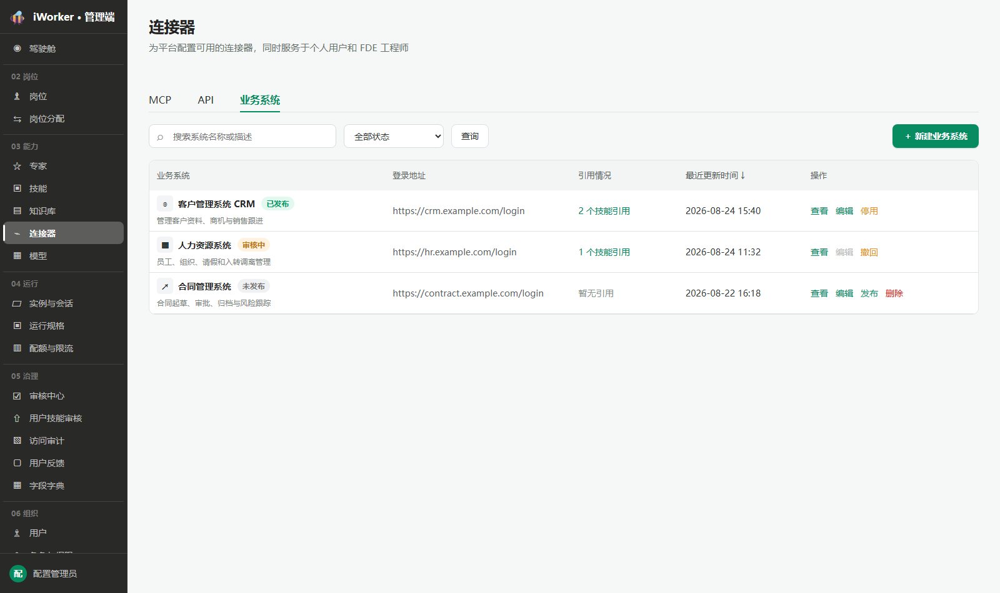
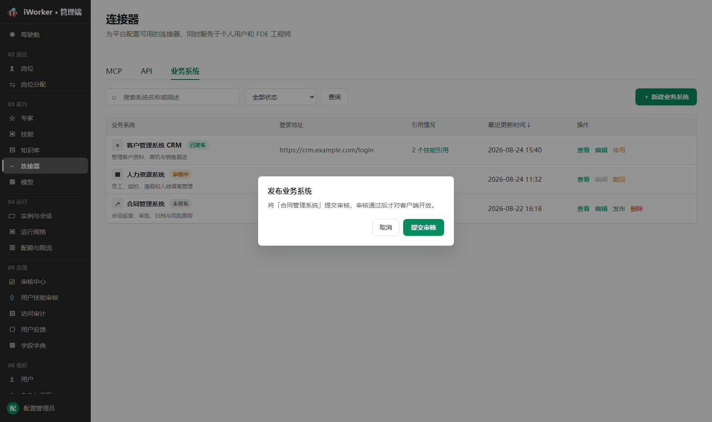
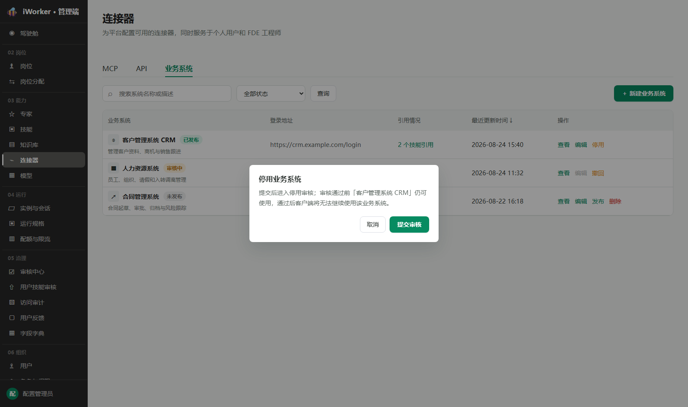
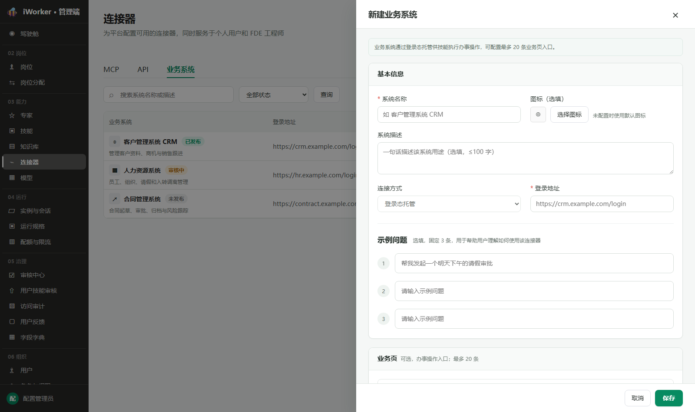
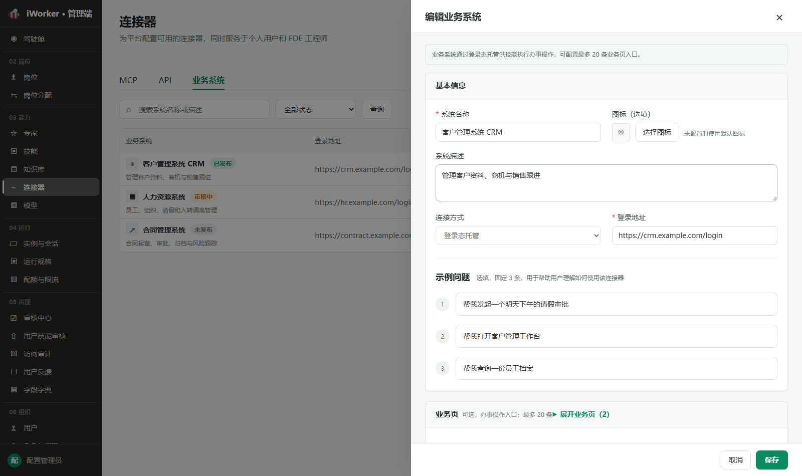
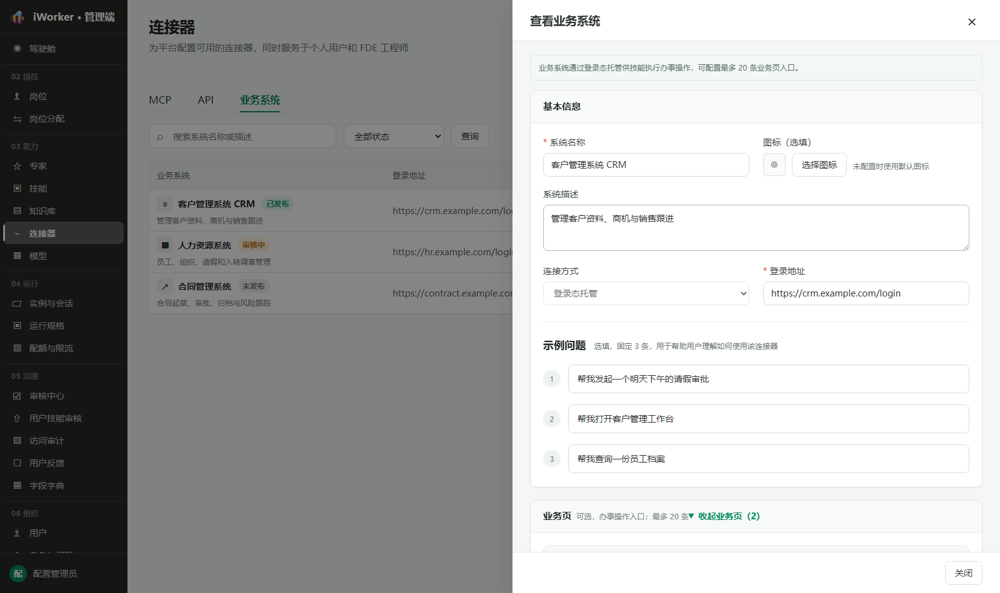

# 业务系统连接器产品需求

## 一、导航栏

### 1. 功能说明

导航栏用于帮助管理员搜索业务系统、筛选状态，并进入新建业务系统流程。业务系统用于配置无法只通过标准 API 完成、需要登录态托管和页面操作的办事系统；技能引用业务系统后，可在受控登录态下进入已配置的业务页执行操作。

- **页面入口**：侧边栏"03 能力 / 连接器 / 业务系统"。页面标题"连接器"，说明"为平台配置可用的连接器，同时服务于个人用户和 FDE 工程师"；顶部保留 MCP、API、业务系统三个页签，当前选中业务系统。
- **搜索框**：占位提示为"搜索系统名称或描述"，支持按系统名称或描述模糊搜索。
- **状态筛选**：默认"全部状态"，可选择"未发布、审核中、已发布"。
- **查询按钮**：按照当前搜索内容和状态刷新列表。
- **新建入口**：右侧展示【＋ 新建业务系统】，从页面右侧打开新建抽屉。
- 无匹配结果时展示"没有匹配的业务系统"。

### 2. 交互规则

- 搜索和状态筛选可组合使用；点击【查询】后按当前条件刷新。
- 切换 MCP、API、业务系统页签时保留各自的筛选条件。

## 二、业务系统列表

### 1. 列表展示

业务系统以平铺列表展示

- **业务系统**：展示系统名称、状态标签【未发布】【审核中】【已发布】和系统描述（缩略，悬停查看完整内容）；不设独立状态列。
- **登录地址**：单行超长省略，悬停展示完整地址。
- **引用情况**：有引用时展示"N 个技能引用"，点击弹出引用清单弹窗；无引用显示"暂无引用"。
- **最近更新时间**：展示最近一次保存时间，精确到分钟；支持点击排序。
- **操作**：按状态展示【查看】【编辑】【发布】【撤回】【停用】【删除】。

### 2. 操作按钮展示规则

- 【查看】和【编辑】固定展示；审核中【编辑】置灰并提示"审核中不可编辑，如需修改请先撤回"。
- 各状态按钮组合：
  - **未发布**：【查看】【编辑】【发布】【删除】，共 4 个按钮。
  - **审核中**：【查看】【编辑】（置灰）【撤回】，共 3 个按钮。
  - **已发布**：【查看】【编辑】【停用】，共 3 个按钮。

### 3. 发布 / 撤回 / 停用 / 删除

- **发布**：弹出确认窗口"将「系统名」提交审核，审核通过后才对客户端开放"，确认按钮【提交审核】；提交后状态变为"审核中"，审核通过后变为"已发布"。

- **撤回**：弹出确认窗口，按待审类型恢复：待审发布撤回后回到未发布；待审停用撤回后回到已发布。
- **停用**：弹出确认窗口“停用后技能仍可执行，但运行效果可能受限或出现报错。确认继续停用「系统名」？”，确认按钮【继续停用】；确认后提交停用审核，状态变为“审核中”，审核通过后变为“未发布”，被拒绝或撤回后恢复“已发布”。

- **删除**：无论是否存在技能引用，均弹出确认窗口“删除后技能仍可执行，但运行效果可能受限或出现报错。确认删除「系统名」？”，确认按钮【继续删除】；管理员确认后可继续删除，原技能引用按软引用保留。

### 4. 状态规则

- 列表仅展示"未发布、审核中、已发布"三态。
- 发布和停用均需经过审核，审核通过前不提前生效。
- 审核中的业务系统仅允许查看和撤回。

## 三、业务系统编辑页

### 1. 页面状态

业务系统编辑页以右侧抽屉形式展示，包含"新建、编辑、查看"三种状态。

- **新建**：通过【＋ 新建业务系统】进入，标题"新建业务系统"，底部【取消】【保存】。

- **编辑**：通过【编辑】进入，标题"编辑业务系统"，底部【取消】【保存】。

- **查看**：通过【查看】进入，标题"查看业务系统"，全部只读，底部仅【关闭】。

- 抽屉顶部提示："业务系统通过登录态托管供技能执行办事操作，可配置最多 20 条业务页入口。"
- 点击抽屉遮罩不直接关闭，避免误丢失内容。
- 必填字段使用红色星号。

### 2. 基本信息

- **系统名称**：必填，平台内不可重复；占位"如 客户管理系统 CRM"。
- **图标**：必填。

> 图标配置统一规则（岗位、专家、技能、模型、MCP、API、业务系统一致）：
> - **图标库选择**：点击【从图标库选择】打开图标库弹窗；选中图标后即时更新预览，保存后用于列表、编辑页和客户端展示。
> - **上传图标**：点击【上传图标】调用本地文件选择器，支持 PNG、JPG/JPEG、WebP、GIF、SVG，单个文件不超过 5 MB。选择图片后进入方形裁剪界面，可拖动图片调整保留区域，通过缩放滑杆放大或缩小；点击【使用该区域】生成 256×256 的 PNG 图标并更新预览；点击【重新选择图片】可更换原始图片；点击【取消】不修改原图标。
> - **替换规则**：上传图片与图标库图标互斥。重新从图标库选择后清除已上传图片；重新上传并裁剪后使用新的图片图标。
> - **只读状态**：查看页展示当前图标，上传和图标库入口置灰不可点击。
> - **异常处理**：非图片文件提示"请选择图片文件"；文件超过 5 MB 提示"图片不能超过 5 MB"；读取失败时保留原图标并提示重新选择。
- **系统描述**：必填，最多 2000 字符。
- **连接方式**：固定展示"登录态托管"，只读。
- **登录地址**：必填，须为合法的 HTTP 或 HTTPS URL。
- **示例问题**：必填，固定 3 条输入行，位于基本信息卡片内；用于帮助用户理解如何使用该连接器。每条输入行旁展示【AI 生成】按钮，使用常规字重，不使用加粗样式，点击后调用模型根据系统名称和描述自动生成示例问题，填入输入行；重复点击可重新生成，覆盖当前内容。单条示例问题最多 60 字符。
- 登录凭证按敏感信息管理，不在列表或查看态明文展示。

### 3. 业务页

业务页是业务系统内的办事操作入口，可选项；不配置表示不限制具体业务入口。

- 区域默认收起；标题右侧展示【展开业务页（N）】按钮，N 为已配置条数（无业务页时不展示计数）；点击展开，按钮变为【收起业务页（N）】，再次点击收起。
- 点击【＋ 添加业务页】新增一行并自动展开区域；最多 20 条，达到上限后按钮置灰。
- 以表格行形式编辑，每条包含：URL（必填，合法 HTTP/HTTPS 地址）、名称（必填，如"工作台""报销申请"）、描述（选填）。
- 删除单条业务页必须二次确认；删除后立即更新抽屉内列表，计数同步刷新。
- 无业务页时展开后展示"暂无业务页，可不配置（留空表示不约束）"。
- 查看态同样支持展开/收起，但不展示添加和删除按钮。
- 任一字段已填写时，URL 和名称必须完整填写。

### 4. 引用与时间信息

编辑和查看态展示：

- **被技能引用**：只读标签列表；无引用时显示"暂无技能引用"；存在引用时仍可在确认影响后删除。
- **创建时间、最近更新时间、最近发布时间**：均只读，精确到分钟。

### 5. 保存校验

- 系统名称不能为空且平台内不可重复。
- 登录地址必须为合法的 HTTP 或 HTTPS URL。
- 业务页数量不超过 20 条；填写任一字段后，URL 和名称必须完整填写，URL 必须合法。
- 保存成功后关闭抽屉并刷新当前列表，不跳转页面；提示"业务系统已创建"或"业务系统已保存"。
- 保存失败时保留输入内容，在对应字段附近显示错误原因。

## 四、异常与空状态

| 场景 | 页面处理 |
| --- | --- |
| 查询无结果 | 展示"没有匹配的业务系统"，保留当前条件 |
| 无业务页 | 展示"暂无业务页，可不配置" |
| 无技能引用 | 展示"暂无技能引用" |
| 保存失败 | 保留抽屉内容并显示错误提示 |
| 引用中业务系统删除 | 采用软引用，提示影响范围后可继续删除 |
| 业务页达到 20 条 | 添加按钮置灰 |
| 业务系统停用或下架后 | 采用软引用，技能仍可执行不强制阻断，运行效果可能受限或出现报错 |

