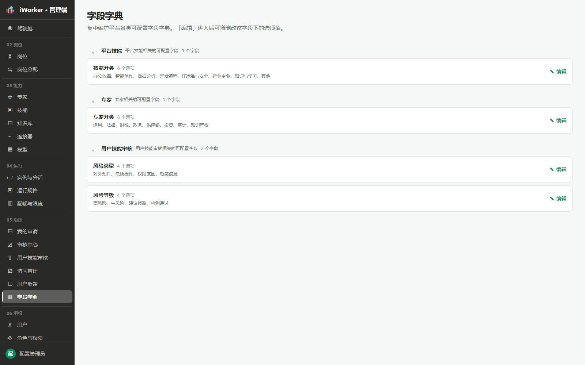
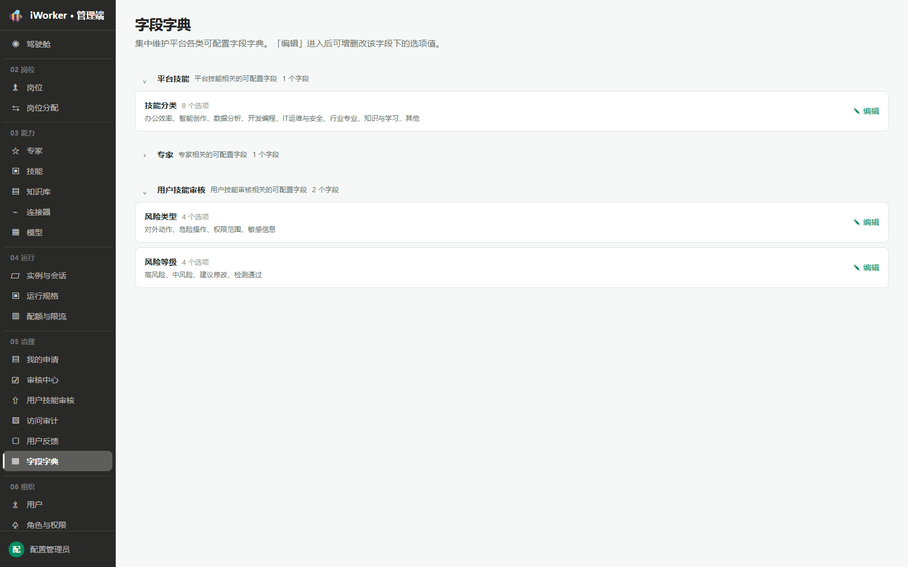
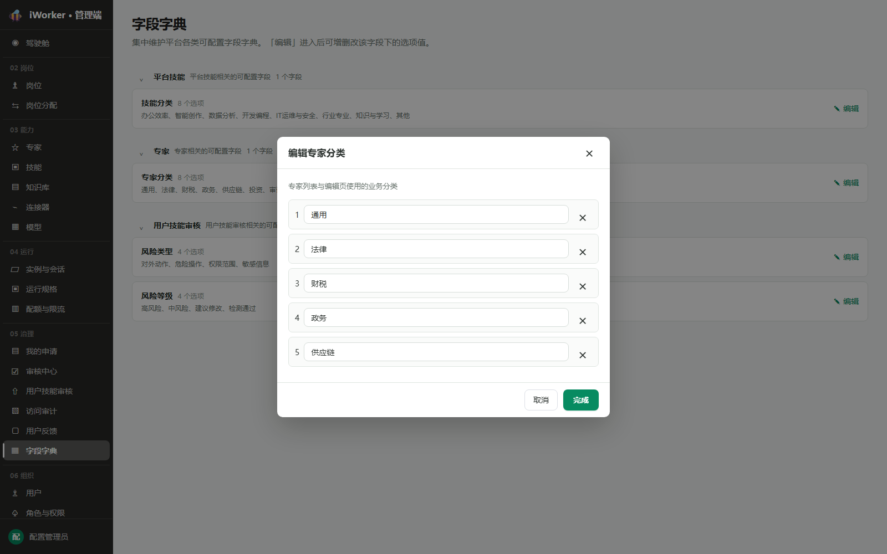

# 字段字典产品需求

## 一、产品目标与入口

字段字典用于集中维护平台可配置枚举字段，作为专家、技能和用户技能审核等模块的统一选项来源。

- **页面入口**：侧边栏“05 治理 / 字段字典”。
- **页面说明**：集中维护平台各类可配置字段字典。“编辑”进入后可增删改该字段下的选项值。
- 页面不提供搜索和筛选，进入后直接展示全部分组。

## 二、字段分组列表

字段按业务域分组。分组头展示：展开 / 折叠按钮、分组名称、分组说明和字段数量。

字段卡片展示：

- 字段名称。
- 当前选项数量。
- 选项值预览；无选项时显示“暂无选项”。
- 操作【编辑】。

### 2.1 展开与折叠

分组默认展开。点击分组头部箭头后收起该分组的字段卡片，再次点击恢复展开；其他分组状态不受影响。

### 2.2 当前字段范围

| 分组 | 字段 | 选项 |
| --- | --- | --- |
| 平台技能 | 技能分类 | 办公效率、智能创作、数据分析、开发编程、IT运维与安全、行业专业、知识与学习、其他 |
| 专家 | 专家分类 | 通用、法律、财税、政务、供应链、投资、审计、知识产权 |
| 用户技能审核 | 风险类型 | 对外动作、危险操作、权限范围、敏感信息 |
| 用户技能审核 | 风险等级 | 高风险、中风险、建议修改、检测通过 |

## 三、编辑字段选项

点击【编辑】打开“编辑字段名”弹窗。

弹窗规则：

- 顶部展示字段说明。
- 每个选项一行，包含序号、选项输入框和删除按钮。
- 点击【添加选项】新增一行并聚焦输入框。
- 点击删除按钮仅从当前编辑草稿中移除；点击【完成】后统一保存。
- 选项值不能为空，同一字段内不能重复。
- 点击【取消】或关闭弹窗，放弃本次未保存修改。

## 四、数据规则

- 字段字典是相关业务模块下拉选项和标签的唯一配置来源。
- 同一字段内选项值唯一，展示顺序与编辑列表顺序一致。
- 保存后相关模块读取最新选项。
- 删除选项不自动替换历史数据；历史值仍保留原始文本。
- 删除技能分类后，使用该分类的存量技能显示为“未分类”。
- 用户技能审核相关字段仅在字段字典中维护，本次不修改用户技能审核模块 PRD。

## 五、异常与空状态

| 场景 | 页面处理 |
| --- | --- |
| 选项为空 | 阻止保存并提示“选项值不能为空” |
| 选项重复 | 阻止保存并提示“选项值不能重复” |
| 字段无选项 | 列表显示“暂无选项” |
| 保存失败 | 弹窗保持打开并展示失败原因 |