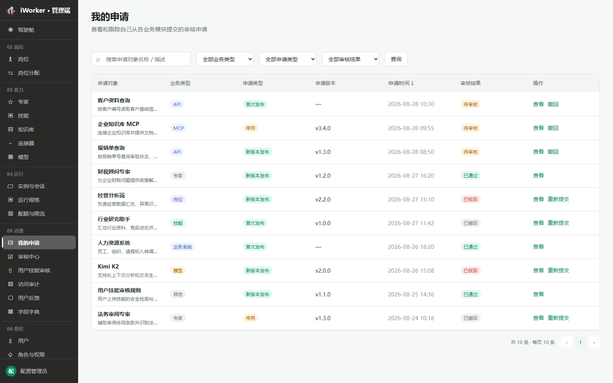
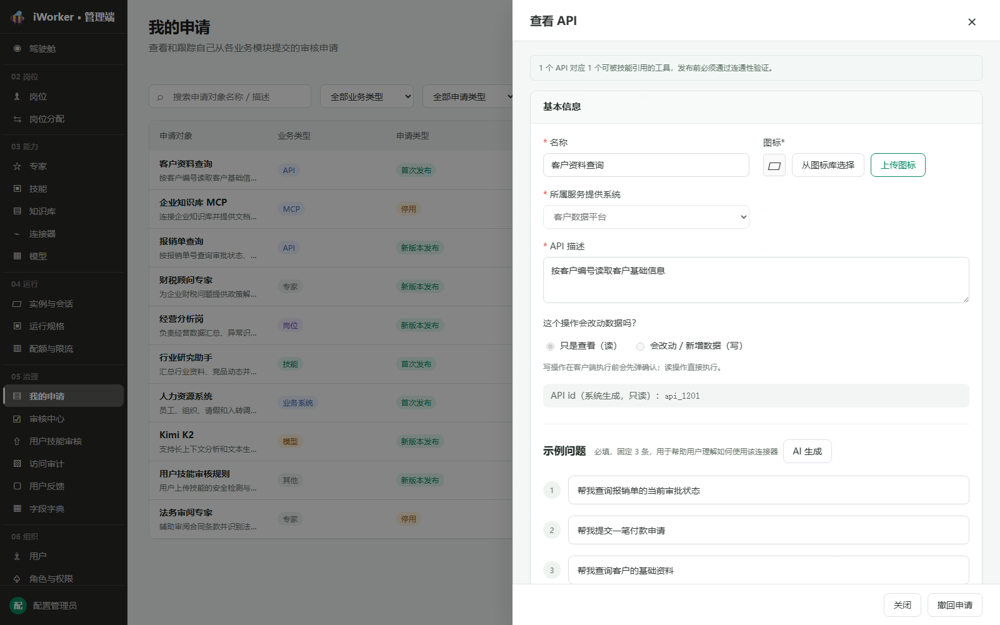
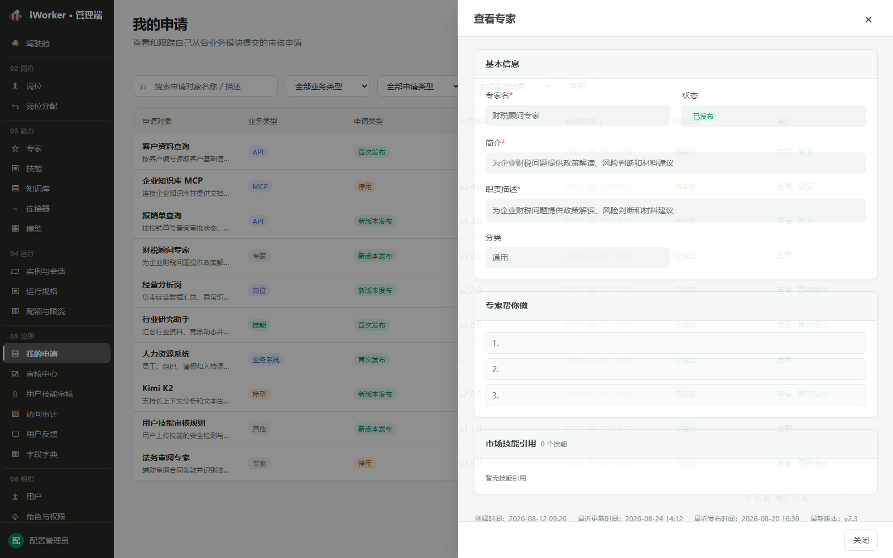
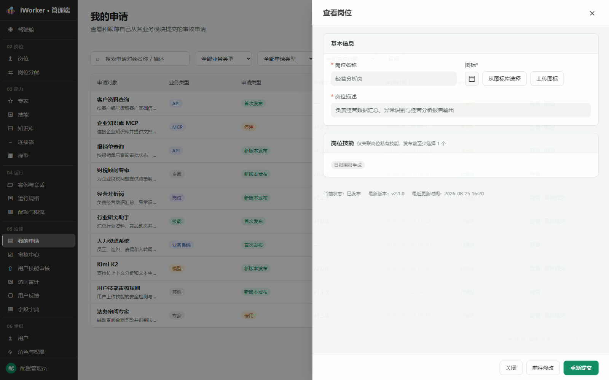
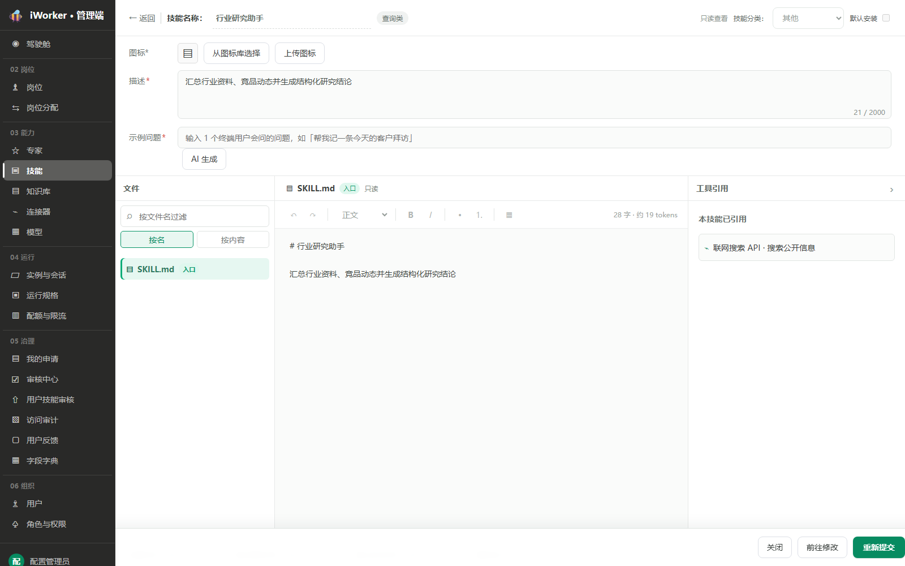

# 我的申请产品需求

## 一、产品目标与入口

“我的申请”面向申请提交人，集中展示当前账号从岗位、专家、技能、连接器和模型等业务模块提交的审核申请，并提供查看、撤回、修改和重新提交入口。

- **页面入口**：侧边栏“05 治理 / 我的申请”，位于审核中心之前。
- **页面说明**：查看和跟踪自己从各业务模块提交的审核申请。
- 仅展示当前登录用户提交的申请，不展示其他用户数据。

## 二、查询区

查询区从左到右展示：

1. **搜索框**：占位“搜索申请对象名称 / 描述”。
2. **业务类型**：全部业务类型、专家、岗位、技能、MCP、API、业务系统、模型。
3. **申请类型**：全部申请类型、首次发布、新版本发布、停用。
4. **审核结果**：全部审核结果、待审核、已通过、已驳回、已撤回。
5. **查询按钮**：按当前条件刷新列表并回到第 1 页。

查询区不提供提交时间筛选。搜索、业务类型、申请类型和审核结果可以组合使用。

## 三、申请列表

### 3.1 展示字段

| 字段 | 展示规则 |
| --- | --- |
| 申请对象 | 展示对象名称，下一行展示对象描述 |
| 业务类型 | 专家、岗位、技能、MCP、API、业务系统、模型 |
| 申请类型 | 首次发布、新版本发布、停用 |
| 申请版本 | 有版本时展示如 v1.2.0；无版本展示“—” |
| 申请时间 | 精确到分钟，支持正序 / 倒序排序，箭头为“↓ / ↑” |
| 审核结果 | 待审核、已通过、已驳回、已撤回；驳回状态可提示驳回原因 |
| 操作 | 固定提供【查看】；待审核追加【撤回】；已驳回、已撤回追加【重新提交】 |

列表根据页面高度动态分页。

## 四、查看申请详情

点击【查看】后复用申请对象所属业务模块的原生详情视图，详情主体字段、布局、只读样式与业务模块保持一致，仅底部操作按钮不同。

- **专家、岗位、MCP、API、业务系统、模型**：打开右侧只读详情抽屉。
- **技能**：打开技能完整只读详情页面。
- 对应业务详情不存在时，使用申请提交时保存的版本快照生成只读预览。

### 4.1 待审核

底部展示【关闭】【撤回申请】。撤回前二次确认，成功后审核结果更新为“已撤回”。

### 4.2 已通过

详情主体继续复用业务模块查看态，底部仅展示【关闭】。

### 4.3 已驳回

底部展示【关闭】【前往修改】【重新提交】。

- 【前往修改】打开对应业务模块编辑页面或编辑抽屉。
- 【重新提交】重新生成待审核申请，更新申请时间并清空原审核人、审核时间和驳回原因。

### 4.4 已撤回

底部展示【关闭】【前往修改】【重新提交】。技能详情保持整页展示，不转换为抽屉。

## 五、状态流转

| 当前状态 | 可执行操作 | 操作后状态 |
| --- | --- | --- |
| 待审核 | 查看、撤回 | 撤回后变为已撤回 |
| 已通过 | 查看 | 状态不变 |
| 已驳回 | 查看、前往修改、重新提交 | 重新提交后变为待审核 |
| 已撤回 | 查看、前往修改、重新提交 | 重新提交后变为待审核 |

## 六、数据规则

- 每条申请保存：申请对象名称、描述、业务类型、申请类型、申请版本、版本说明、提交人、申请时间、审核结果、审核人、审核时间和驳回原因。
- 列表展示申请对象描述，详情主体展示对应业务对象的配置快照。
- 同一对象在存在待审核申请时不允许重复提交同类型申请。
- 申请时间排序只改变展示顺序，不改变业务状态。
- “其他需要审核的业务对象”可以保留在数据模型中；没有对应业务模块时展示通用申请信息。

## 七、异常与空状态

| 场景 | 页面处理 |
| --- | --- |
| 查询无结果 | 展示“暂无申请记录”，保留查询条件 |
| 对象已被删除 | 使用申请快照展示只读详情 |
| 撤回时申请已被审核 | 阻止撤回并刷新最新审核结果 |
| 重新提交失败 | 保留当前状态并提示具体原因 |
| 无业务编辑权限 | 【前往修改】置灰并提示权限不足 |