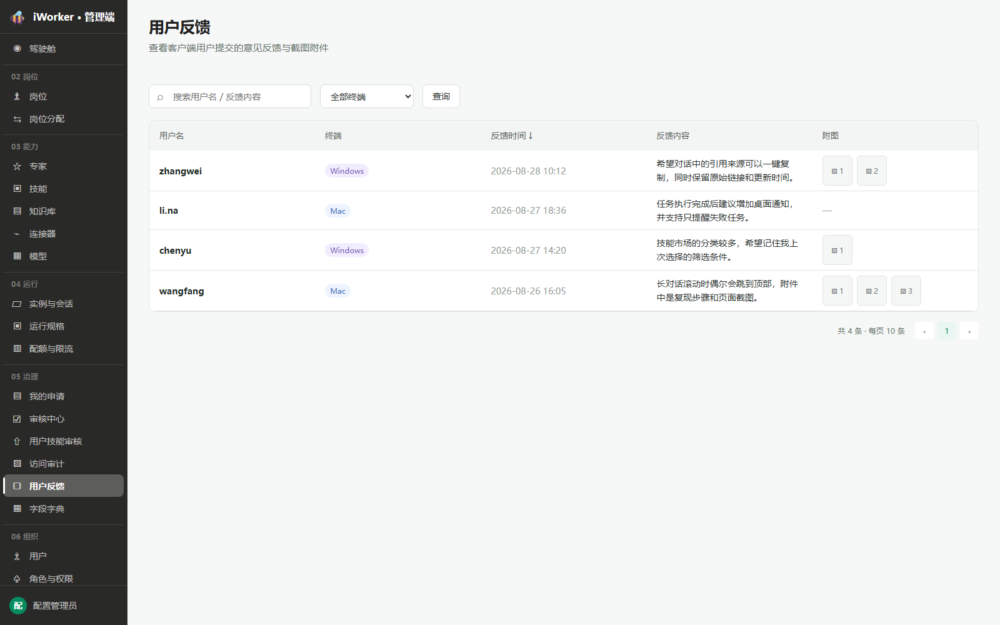
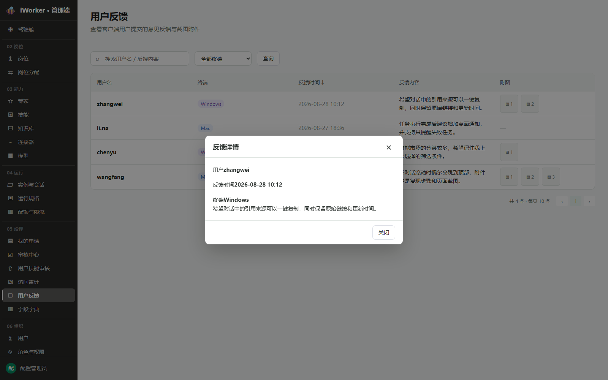
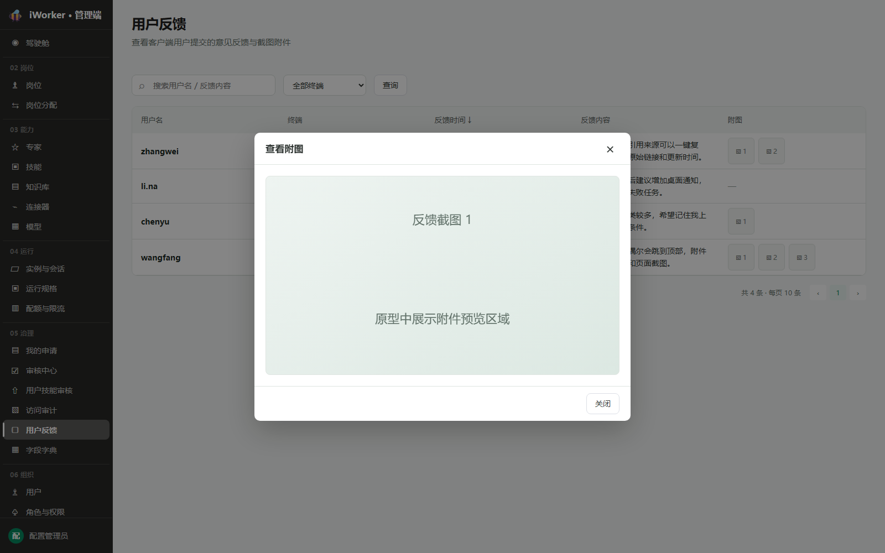

# 用户反馈产品需求

## 一、产品目标与入口

用户反馈用于集中查看客户端用户提交的意见、问题描述和截图附件，当前管理端仅提供只读查看能力。

- **页面入口**：侧边栏“05 治理 / 用户反馈”。
- **页面说明**：查看客户端用户提交的意见反馈与截图附件。
- 本期不提供回复、删除、标记处理或状态流转。

## 二、查询区

查询区从左到右展示：

1. **搜索框**：占位“搜索用户名 / 反馈内容”，支持用户名和反馈正文模糊搜索。
2. **终端筛选**：全部终端、Mac、Windows。
3. **查询按钮**：点击后刷新列表并回到第 1 页。

搜索框位于终端筛选之前，搜索和终端条件可以组合使用。

## 三、反馈列表

| 字段 | 展示规则 |
| --- | --- |
| 用户名 | 展示提交反馈的用户名 |
| 终端 | Mac 使用蓝色标签，Windows 使用紫色标签 |
| 反馈时间 | 精确到分钟，支持正序 / 倒序切换，箭头为“↓ / ↑” |
| 反馈内容 | 最多两行缩略；点击打开完整反馈弹窗 |
| 附图 | 有附件时展示编号缩略按钮，无附件显示“—” |

列表默认按反馈时间倒序，根据页面高度动态分页。

## 四、查看反馈详情

点击反馈内容打开“反馈详情”弹窗，展示：用户名、反馈时间、终端和完整反馈内容。底部仅展示【关闭】。

## 五、查看附图

点击附图编号打开“查看附图”弹窗。弹窗展示当前附件的大图预览区域，并标识附件序号；底部仅展示【关闭】。

## 六、数据规则

- 反馈由客户端提交，管理端数据只读。
- 终端枚举为 Mac、Windows。
- 一条反馈可包含 0～N 张图片，列表按附件顺序编号。
- 反馈内容在列表中缩略展示，详情弹窗展示完整原文。
- 排序只改变当前查询结果的展示顺序，不修改原始提交时间。

## 七、异常与空状态

| 场景 | 页面处理 |
| --- | --- |
| 搜索或筛选无结果 | 展示“暂无用户反馈”，保留条件 |
| 附图加载失败 | 弹窗内展示加载失败提示 |
| 反馈正文为空 | 列表显示“—”并允许查看其他元数据 |
| 数据加载失败 | 展示失败提示和【重试】 |