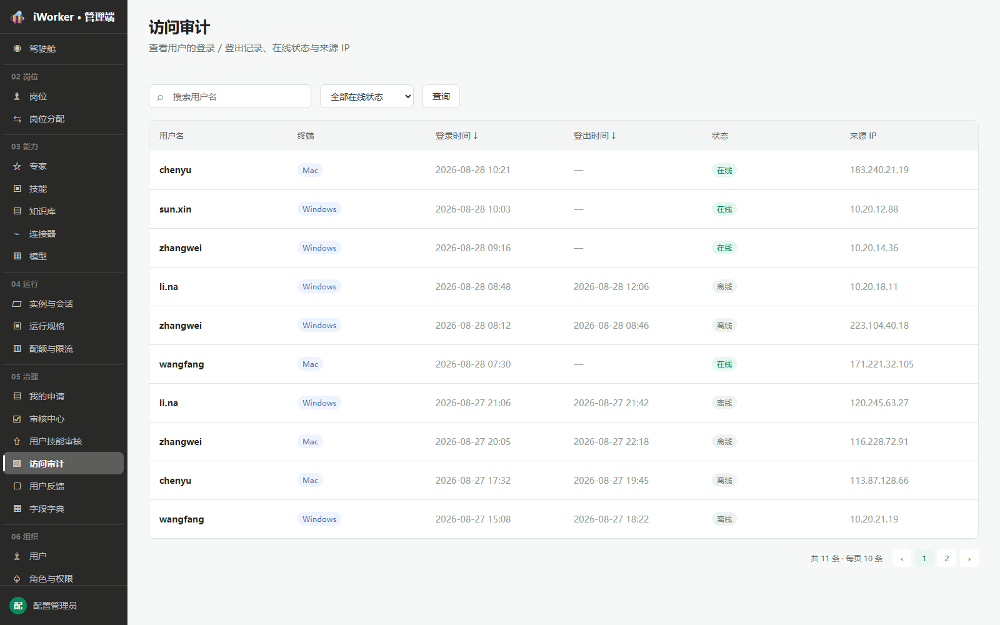
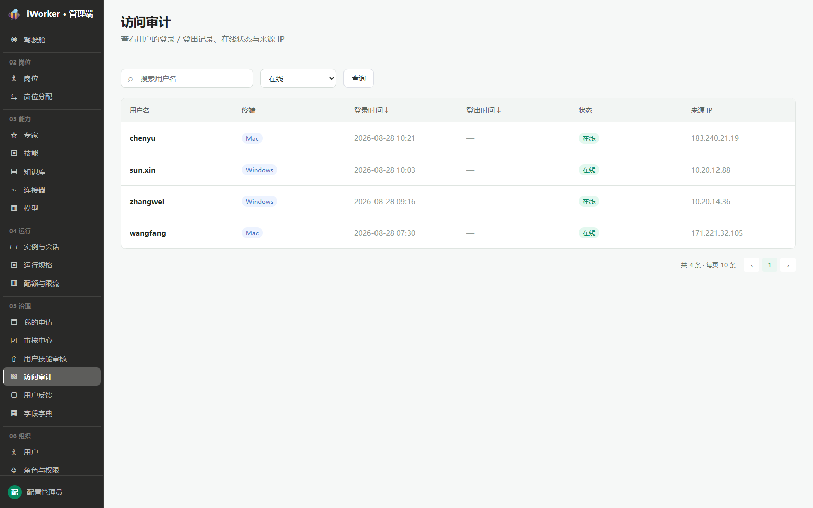
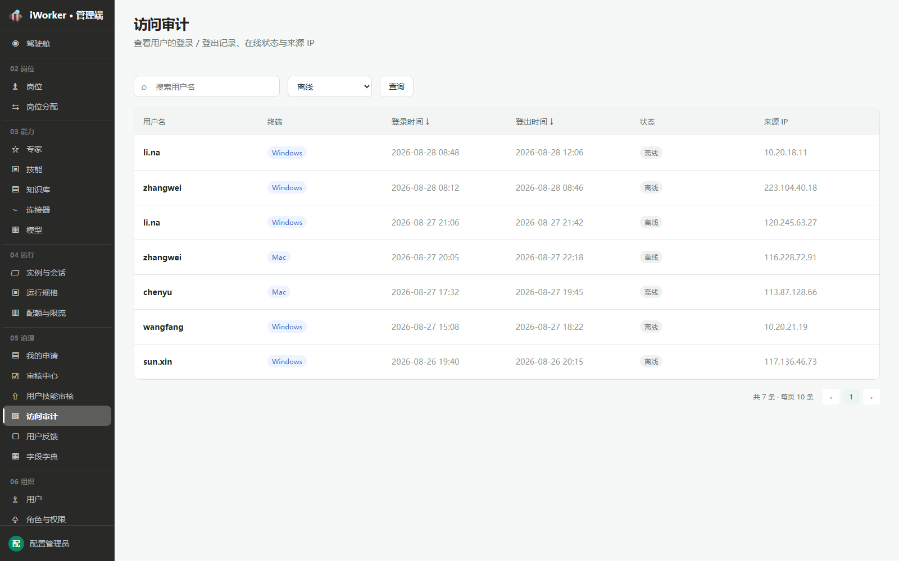

# 访问审计产品需求

## 一、产品目标与入口

访问审计用于查看用户登录、登出、终端、在线状态和来源 IP。每次登录行为形成一条独立记录，同一账号在不同终端、不同 IP 或不同时间登录时保留多条日志。

- **页面入口**：侧边栏“05 治理 / 访问审计”。
- **页面说明**：查看用户的登录 / 登出记录、在线状态与来源 IP。
- 页面只读，不提供修改或删除操作。

## 二、查询区

查询区从左到右展示：

1. **搜索框**：占位“搜索用户名”，按用户名模糊搜索。
2. **在线状态筛选**：全部在线状态、在线、离线。
3. **查询按钮**：按当前条件刷新列表并回到第 1 页。

搜索与在线状态可以组合使用。

## 三、访问日志列表

### 3.1 展示字段

| 字段 | 展示规则 |
| --- | --- |
| 用户名 | 展示账号用户名 |
| 终端 | 仅展示 Windows、Mac 两类标签 |
| 登录时间 | 精确到分钟，支持正序 / 倒序切换，箭头样式为“↓ / ↑” |
| 登出时间 | 在线记录显示“—”；离线记录显示实际时间，支持正序 / 倒序切换 |
| 状态 | 在线为绿色标签，离线为灰色标签 |
| 来源 IP | 展示本次登录来源 IP |

列表根据页面高度动态分页，默认按登录时间倒序展示。

### 3.2 在线状态

在线记录没有登出时间。同一用户可以同时存在多条在线记录，例如分别从 Windows 和 Mac 登录。

### 3.3 离线状态

离线记录同时展示登录时间与登出时间，用于还原一次完整访问周期。

## 四、数据规则

- 每条记录对应一次独立登录会话，不按用户名合并。
- 同一账号在不同终端、不同 IP 或不同时间登录时，系统分别记录多条日志。
- 终端枚举仅为 Windows、Mac。
- 当前在线记录的 `logoutAt` 为空；退出后补充登出时间并将状态更新为离线。
- 登录时间和登出时间分别保存，两个字段均可排序。
- 日志数据只读，普通管理员不可修改或删除。
- 页面不展示登录地点字段。

## 五、异常与空状态

| 场景 | 页面处理 |
| --- | --- |
| 查询无结果 | 展示空状态，保留搜索和筛选条件 |
| 日志加载失败 | 展示“加载失败”和【重试】 |
| 登出时间为空 | 展示“—”，不视为异常 |
| 未识别终端 | 数据接入层映射为 Windows 或 Mac 后再展示 |