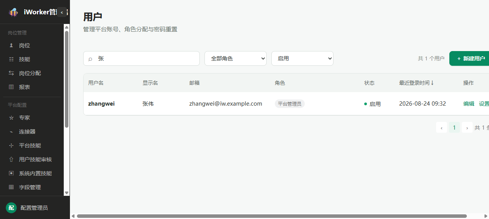
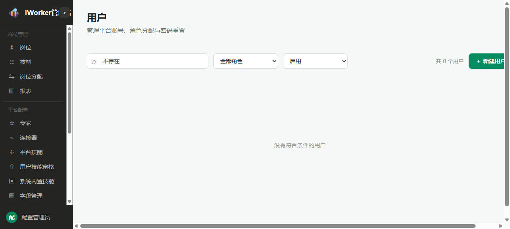
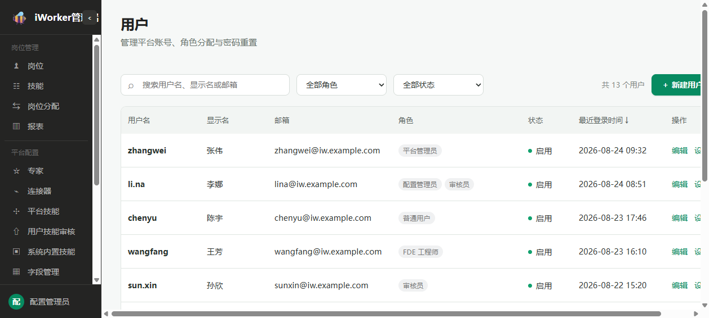
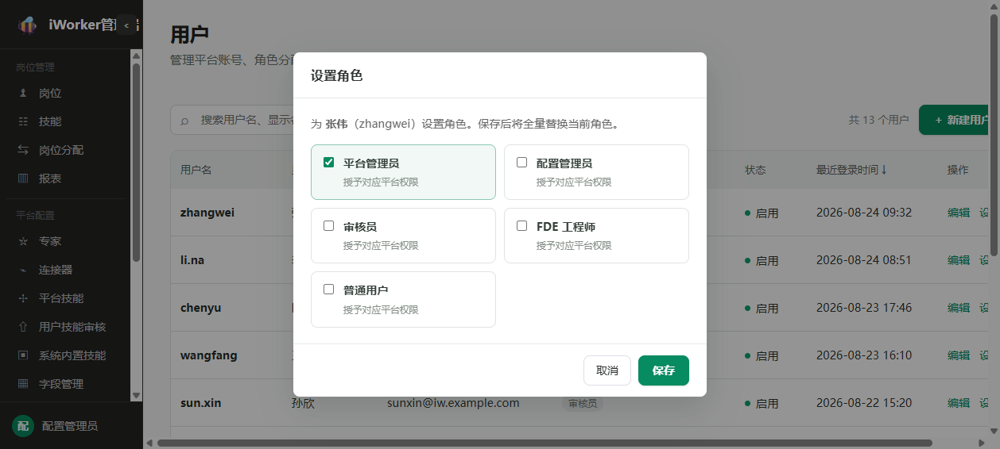
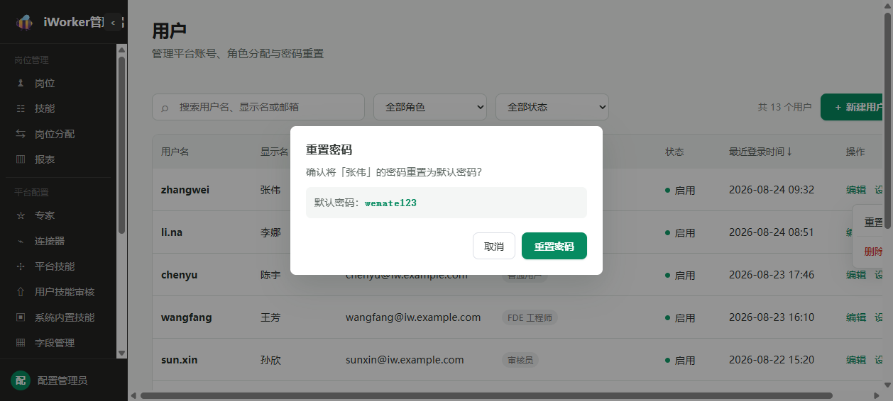
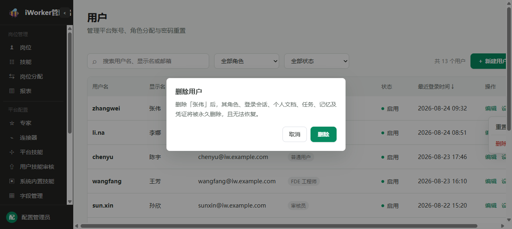
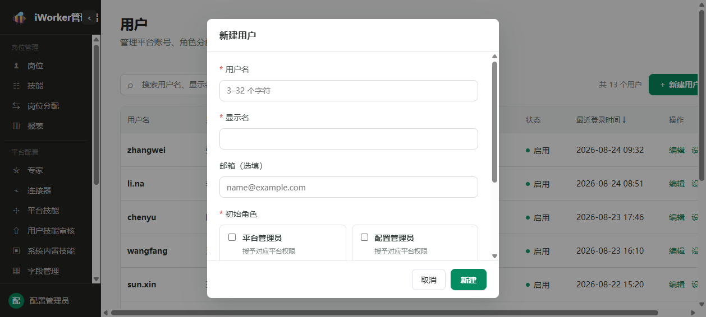
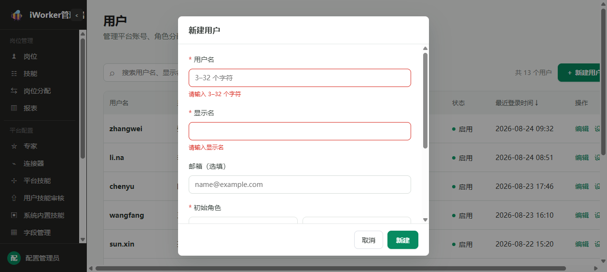
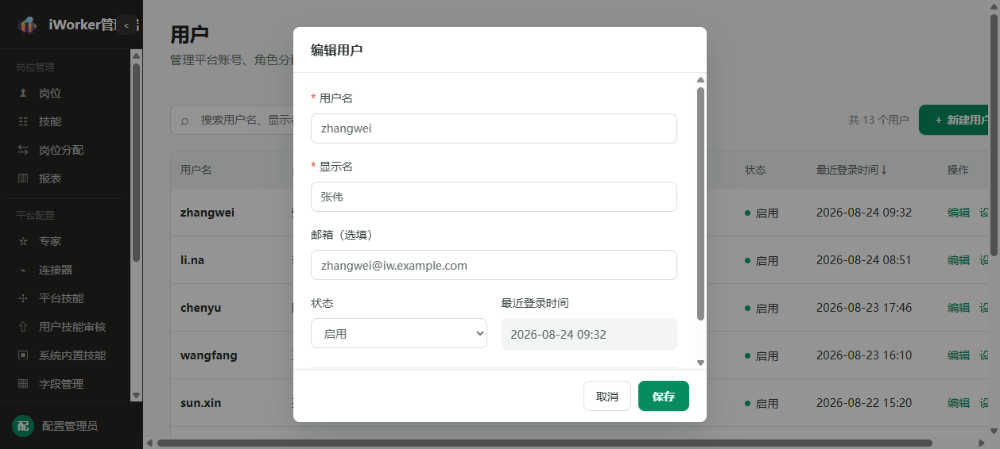

# 用户产品需求

## 一、导航栏

### 1. 功能说明

导航栏用于帮助管理员搜索和筛选用户，并进入新建用户流程。

- **页面标题**：展示“用户”。
- **页面说明**：文案“管理平台账号、角色分配与密码重置”。
- **搜索框**：占位提示为“搜索用户名 / 显示名 / 邮箱”，支持按用户名、显示名或邮箱搜索。
- **角色筛选**：默认展示“全部角色”，选项展示当前可选的角色名称。
- **状态筛选**：默认展示“全部状态”，支持选择“启用、停用”。
- **新建入口**：点击【新建用户】，打开用户编辑页的新建状态。

### 2. 交互规则

- 搜索、角色筛选和状态筛选可组合使用。
- 输入或清除搜索内容后，页面短暂停顿并自动刷新结果，同时回到第 1 页。
- 切换或清空角色、状态筛选后，页面立即按照当前条件刷新，同时回到第 1 页。
- 【新建用户】始终展示在导航栏右侧。
- 点击【新建用户】后，打开“新建用户”窗口。

### 3. 页面状态与异常场景

- **角色选项正常**：角色筛选展示角色名称。
- **角色名称缺失**：使用角色原有标识作为选项名称。
- **角色选项加载失败**：角色筛选不展示可选项，不影响用户列表继续加载；页面不单独展示失败提示或重试入口。
- **搜索或筛选无结果**：展示“还没有用户 · 点「新建用户」创建第一个”，不单独区分“无匹配结果”和“尚无用户”。
- **无管理权限**：不展示用户管理入口，也不允许进入用户管理页面。

## 二、用户列表

### 1. 列表展示

用户列表用于集中查看和管理平台用户。

- **用户名**：展示登录用户名；内容过长时缩略展示，鼠标悬停可查看完整内容。
- **显示名**：展示用户显示名；内容过长时缩略展示，鼠标悬停可查看完整内容。
- **邮箱**：未填写时显示“—”；内容过长时缩略展示，鼠标悬停可查看完整内容。
- **角色**：每个角色分别展示为标签；没有角色时显示“—”。
- **状态**：启用状态显示“启用”，其他状态统一显示“停用”。
- **最近登录时间**：展示用户最近一次成功登录平台的时间；从未登录过时显示“从未登录”；点击列标题可在正序和倒序之间切换，默认按最近登录时间倒序排列，从未登录的用户排在最后。
- **操作**：固定展示【编辑】【设置角色】【更多】。

### 2. 操作

#### 2.1 操作按钮展示规则

- 每行固定直接展示【编辑】【设置角色】【更多】3 个操作按钮。
- 用户处于“启用”或“停用”状态时，按钮组合保持不变。
- 【编辑】和【设置角色】直接展示在操作列中。
- 【重置密码】和【删除用户】收起在【更多】菜单中，不单独占用操作列位置。
- 点击【更多】后，菜单向下展开；【重置密码】展示在上方，【删除用户】展示在分隔线下方并使用危险操作样式。
- 重置密码进行期间，当前用户的【重置密码】不可重复点击。
- 删除进行期间，当前用户的【删除】不可重复点击。

#### 2.2 编辑

- 点击【编辑】后，打开用户编辑页的编辑状态。
- 编辑页展示当前用户的用户名、显示名、邮箱和状态。
- 用户名不可修改。
- 保存成功后关闭窗口，用户列表回到第 1 页并刷新。

#### 2.3 设置角色

- 点击【设置角色】后，打开“设置角色”窗口。
- 窗口展示“为「用户显示名」分配角色（全量替换当前角色）”；显示名为空时展示用户名。
- 当前角色默认处于选中状态。
- 管理员可选择一个或多个角色。
- 点击【保存】后，以当前选中结果替换原有角色。
- 保存成功后提示“角色已更新”，关闭窗口并刷新当前页。
- 未选择任何角色时不保存，并提示“请至少选择一个角色”。

#### 2.4 更多

- 点击【更多】后，向下展开【重置密码】和【删除用户】。
- 点击菜单外区域或按 Esc 键后，菜单关闭，不执行任何操作。
- 选择具体操作后，菜单关闭并进入对应确认流程。

#### 2.5 重置密码

- 点击【重置密码】后，弹出标题为“重置密码”的确认窗口。
- 确认内容为“确认将「用户显示名」的密码重置为默认密码？”，并展示默认密码 wemate123；显示名为空时使用用户名。
- 确认按钮显示【重置密码】。
- 管理员取消或关闭确认窗口时，不执行重置，也不展示失败提示。
- 重置成功后提示“密码已重置为 wemate123”，并停留在当前用户列表。
- 重置失败时优先展示具体原因；没有具体原因时提示“重置失败”。

#### 2.6 删除

- 点击【删除用户】后，弹出标题为“删除用户”的警告窗口。
- 确认内容为“将永久删除用户「用户显示名」，并同时清除其角色、会话、个人文档、定时任务、个人记忆、业务系统凭据等全部数据，且不可恢复。确认删除？”；显示名为空时使用用户名。
- 确认按钮显示【删除】，并使用危险操作样式。
- 管理员取消或关闭确认窗口时，不执行删除，也不展示失败提示。
- 删除成功后提示“已删除”并刷新列表。
- 若当前页仅有一条记录且当前页不是第 1 页，删除成功后返回上一页。
- 删除失败时优先展示具体原因；没有具体原因时提示“删除失败”。

### 3. 分页规则

- 每页固定展示 10 条用户记录。
- 分页区域支持上一页、下一页和页码切换，并展示用户总数。
- 切换页码后，加载所选页的数据。
- 搜索条件或筛选条件发生变化时，自动回到第 1 页。

### 4. 列表状态与异常场景

- **加载中**：列表区域展示加载状态。
- **加载失败**：展示“加载失败”和【重试】按钮；点击【重试】后重新加载当前页。
- **暂无用户**：展示“还没有用户 · 点「新建用户」创建第一个”。
- **角色名称无法匹配**：角色标签直接展示角色原有标识。
- **角色选项加载失败**：角色筛选、新建用户角色选项和设置角色选项均为空，但用户列表仍可查看。
- **删除后当前页为空**：仅当删除前当前页只有一条记录且当前页不是第 1 页时，自动返回上一页。
- **单项操作失败**：保留当前页面和目标用户记录，并展示具体原因或默认失败提示。

## 三、用户编辑页

### 1. 页面状态

用户编辑页以窗口形式展示，包含“新建用户”和“编辑用户”两种状态。

- **新建用户**：通过导航栏【新建用户】进入，窗口标题显示“新建用户”。
- **编辑用户**：通过用户列表【编辑】进入，窗口标题显示“编辑用户”，并展示用户当前信息。
- 两种状态底部均展示【取消】和【保存】。
- 保存期间，【保存】显示进行中状态，不允许重复保存。
- 每次打开窗口时，重新展示当前操作对应的内容，并清除上一次的校验提示。

### 2. 新建用户

- **用户名**：必填，提示文字为“登录用户名”；长度为 3～32 位。
- **显示名**：必填，提示文字为“用于展示的姓名”。
- **邮箱**：选填，提示文字为“选填”，支持一键清除。
- **角色**：必填，支持选择一个或多个角色，提示文字为“选择一个或多个角色”。
- **初始密码提示**：展示“初始密码为 wemate123，用户首次登录后可修改密码。”

### 3. 新建校验

- 用户名为空时提示“请输入用户名”。
- 用户名少于 3 位或超过 32 位时提示“用户名 3–32 位”。
- 当前页面仅校验用户名是否填写及长度，不限制字符类型。
- 显示名为空时提示“请输入显示名”。
- 邮箱格式不正确时提示“邮箱格式不正确”。
- 未选择角色时提示“请至少选择一个角色”。
- 存在校验问题时不保存，窗口保持打开，并在对应位置展示原因。

### 4. 编辑用户

- **用户名**：展示当前用户名，不可修改。
- **显示名**：展示当前显示名，可修改。
- **邮箱**：展示当前邮箱，可修改或清除。
- **状态**：通过下拉选择在“启用”和“停用”之间切换。
- **创建时间**：只读展示用户首次创建的时间。
- **最近更新时间**：只读展示用户基本信息或状态最近一次保存成功的时间。
- **最近登录时间**：只读展示用户最近一次成功登录平台的时间；从未登录过时显示“从未登录”。
- 编辑状态不展示角色选择和初始密码提示。
- 角色需返回用户列表，通过【设置角色】单独修改。

### 5. 编辑校验

- 显示名为空时提示“请输入显示名”。
- 邮箱格式不正确时提示“邮箱格式不正确”。
- 用户名不可修改，不重复校验长度。
- 状态只能通过页面下拉框选择“启用”或“停用”。
- 存在校验问题时不保存，窗口保持打开，并在对应位置展示原因。

### 6. 保存与关闭

- 点击【取消】后关闭窗口，不保存当前修改。
- 点击【保存】后，先检查当前页面的必填内容和填写格式。
- 新建或编辑成功后提示“已保存”，关闭窗口，用户列表回到第 1 页并刷新。
- 保存失败时优先展示具体原因；没有具体原因时提示“保存失败，请重试”。
- 保存失败后窗口保持打开，保留当前填写内容，管理员可修改后再次保存。

### 7. 编辑页异常场景

- **角色选项为空**：新建状态下无法选择角色，因此无法通过角色必选检查；页面不单独展示角色加载失败提示。
- **校验未通过**：在对应位置展示提示，窗口保持打开。
- **保存失败**：保留当前填写内容，展示具体原因或“保存失败，请重试”。
- **关闭后重新打开**：重新展示当前用户信息或空白新建内容，不保留上一次未保存的填写结果。

