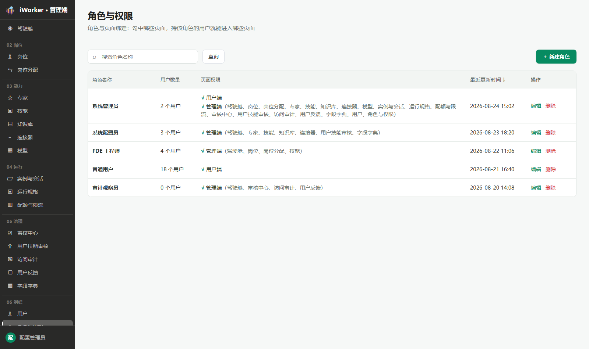
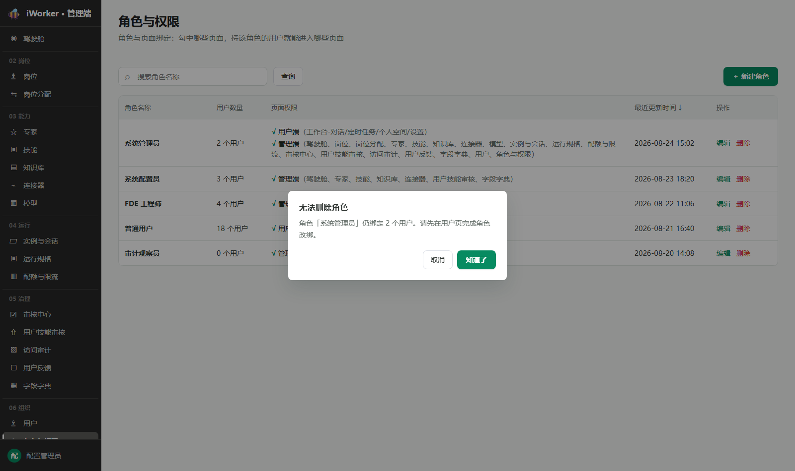
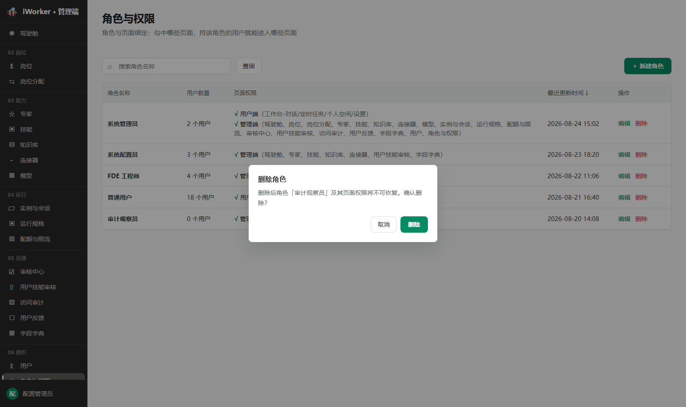
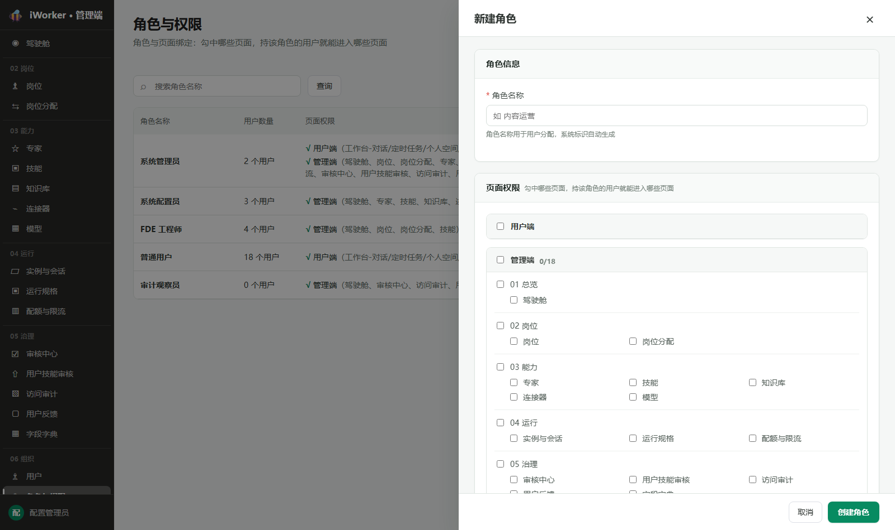
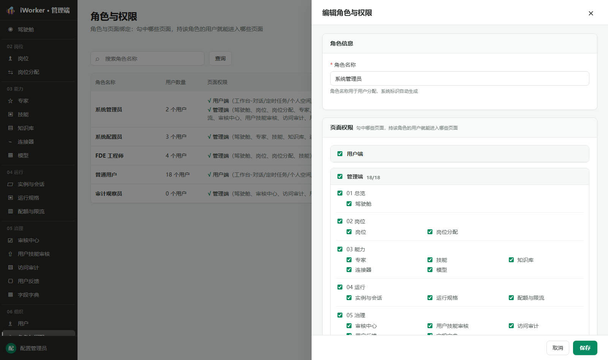

# 角色与权限产品需求

## 一、导航栏

### 1. 功能说明

导航栏用于说明角色与页面权限的关系，并进入新建角色流程。

- **页面标题**：展示"角色与权限"。
- **页面说明**：文案"角色与页面绑定：勾中哪些页面，持该角色的用户就能进入哪些页面"。
- **搜索框**：占位提示为"搜索角色名称"，支持按角色名称模糊搜索。
- **查询按钮**：按照当前搜索内容刷新列表。
- **新建入口**：右侧展示【＋ 新建角色】，点击后从页面右侧打开角色编辑页的新建状态。
- **访问条件**：仅管理员可看到"角色与权限"入口并进入页面；其他用户不展示入口，也不允许进入页面。
- 页面不提供状态筛选、分页和页面切换操作。
![[角色导航栏.png]]
### 2. 交互规则

- 页面进入后直接加载全部角色。
- 搜索内容在点击【查询】或按回车后生效；清空后点击【查询】展示全部角色。
- 页面不提供手动刷新入口；新建、编辑或删除成功后自动刷新角色列表。
- 点击【新建角色】后打开"新建角色"编辑页。
- 打开或关闭角色编辑页时，角色列表保持当前浏览位置。

### 3. 页面状态与异常场景

- **加载中**：角色列表区域展示加载状态。
- **暂无数据**：展示"还没有角色，点击「新建角色」创建第一个"。
- **加载失败**：展示"加载失败"和【重试】；点击【重试】后重新加载角色列表。失败状态优先于空状态展示。
- **无查询结果**：展示同一空状态文案，保留当前搜索条件。
- **页面权限选项加载失败**：角色列表仍可查看；页面权限列统一显示"未开通任何页面"，新建或编辑页展示权限树加载失败状态。

## 二、角色列表

### 1. 列表展示

角色列表用于集中查看角色、绑定用户数及已开通的页面权限。页面不分页，一次展示全部角色。

- **角色名称**：展示角色名称；内容过长时缩略展示，鼠标悬停可查看完整内容。
- **用户数量**：展示当前绑定该角色的用户数，格式"N 个用户"。
- **页面权限**：仅展示当前角色已开通的页面，按分支展示。用户端权限不展示详细子页面，只显示"√ 用户端"；管理端权限显示为"√ 管理端（页面、页面…）"，多个页面用"、"分隔。未开通任何页面时显示"未开通任何页面"。
- **最近更新时间**：展示角色名称或页面权限最近一次保存成功的时间。
- **操作**：固定展示【编辑】【删除】。

### 2. 排序规则

- 列表默认按照最近更新时间由近到远展示，最近修改的角色排在前面；支持点击列头切换升降序。
- 页面一次展示全部角色，不分页，也不展示数据总数和页码切换。

### 3. 操作

#### 3.1 操作按钮展示规则

- 操作列包含【编辑】【删除】2 个按钮，每行固定直接展示，不使用【更多】菜单。
- 所有角色的按钮组合一致，不根据角色来源、名称或权限状态变化；不存在"启用、停用、锁定"等角色状态。
- 删除操作进行中时，当前行【删除】展示进行中状态，不能重复点击；【编辑】保持展示。

#### 3.2 编辑

- 所有角色均展示【编辑】，不存在禁用条件。
- 点击【编辑】后，从页面右侧打开标题为"编辑角色与权限"的页面，回填角色名称和当前已开通的页面权限。
- 编辑页不提供只读查看状态；角色权限明细直接在列表中展示。
- 管理员可修改角色名称、增加或取消页面权限。
- 保存时，页面当前勾选结果作为该角色的完整页面权限，全量替换原有权限；取消勾选的页面在保存后不再授权给该角色。
- 保存成功后提示"角色与权限已保存"，关闭编辑页并刷新角色列表。
- 保存失败时编辑页保持打开，保留当前填写和勾选内容，并提示具体原因或"保存失败，请重试"。

#### 3.3 删除

- 所有角色均展示【删除】，不因角色来源或名称隐藏按钮。
- 角色仍绑定用户时，不执行删除；弹出"无法删除角色"窗口，提示"角色「角色名」仍绑定 N 个用户。请先在用户页完成角色改绑。"
- 无绑定用户时，点击后弹出"删除角色"确认窗口，提示"删除后角色「角色名」及其页面权限将不可恢复。确认删除？"；确认按钮【删除】使用危险样式。
- 取消或关闭确认窗口时不执行删除。
- 删除成功后提示"角色已删除"，角色从列表移除并刷新。

- 删除角色不会自动为已绑定用户选择其他角色；必须先通过用户模块完成角色改绑。

### 4. 列表状态与异常场景

- **没有页面权限**：该行页面权限列显示"未开通任何页面"，【编辑】【删除】保持可用。
- **绑定用户时删除**：删除不生效，保留当前角色并提示先完成用户角色改绑。
- **单项操作失败**：保留当前页面和目标角色，提示具体原因或默认失败文案。

## 三、角色编辑页

### 1. 页面状态

角色编辑页以右侧抽屉形式展示，包含"新建角色"和"编辑角色与权限"两种状态。

- **新建角色**：通过【＋ 新建角色】进入，标题显示"新建角色"，角色名称为空，页面权限默认未勾选，底部【取消】【创建角色】。

- **编辑角色与权限**：通过列表【编辑】进入，标题显示"编辑角色与权限"，展示当前角色名称并回填已开通的页面权限，底部【取消】【保存】。

- 两种状态均允许修改，不提供查看或只读状态。
- 点击抽屉外区域不会关闭页面；点击右上角关闭入口或【取消】可退出，不保存当前修改。
- 每次打开页面时重新加载当前角色内容并清除上一次校验提示；上一次未保存内容不保留。

### 2. 角色名称

- **角色名称**：必填，最多 64 字符；占位提示为"如 内容运营"。
- 提示文案"角色名称用于用户分配，系统标识自动生成"；页面不展示也不要求填写角色编码。
- 角色名称为空时提示"请填写角色名称"，不执行保存；超过长度限制时不能继续输入。
- 角色名称不符合现有业务规则时，保存失败并展示具体原因；页面保持打开。

### 3. 页面权限

- **页面权限**：必填，至少开通 1 个页面，以带复选框的权限树展示；为空时提示"请至少开通 1 个页面"。
- 权限树按照"用户端、管理端"两个顶层范围展示；用户端以整组勾选方式开通（不展开子页面）；管理端下按照"01 总览"至"06 组织"分组展示各页面，页面以三列排布。
- 管理端范围头部展示已选计数"N/M"；勾选范围或分组时，其下页面联动勾选，取消时联动取消；仅选择部分子页面时，上级节点展示部分选中状态。
- 权限区域底部实时展示汇总"已选择 N 个页面"。
- 编辑状态按照角色现有权限回填；折叠和展开分组不会改变勾选结果。
- 保存编辑结果时，以当前全部勾选项替换角色原有页面权限。
- 编辑已有角色时，页面底部展示提示"该角色当前绑定 N 个用户。权限调整保存后将对这些用户生效。"

### 4. 保存与关闭

- 点击【取消】或右上角关闭入口后，关闭编辑页，不保存当前修改。
- 点击【创建角色】或【保存】后，先校验角色名称和页面权限（均必填）。
- 新建成功后提示"角色已创建"，编辑成功后提示"角色与权限已保存"，关闭编辑页并刷新列表。
- 保存期间按钮展示进行中状态，不能重复提交。
- 保存失败时优先展示具体原因；无具体原因时提示"保存失败，请重试"，页面保持打开并保留内容。

### 5. 编辑页异常场景

- **角色名称为空**：提示"请填写角色名称"，不执行保存。
- **页面权限为空**：提示"请至少开通 1 个页面"，不执行保存。
- **页面权限加载失败**：权限区域展示"权限树加载失败 · 关闭重开重试"；页面仍展示【取消】【保存】。关闭后重新打开会再次加载权限选项。
- **保存失败**：保留当前内容，展示具体原因或"保存失败，请重试"。
- **关闭后重新打开**：新建状态恢复为空白内容；编辑状态重新回填该角色当前已保存的名称和页面权限。
