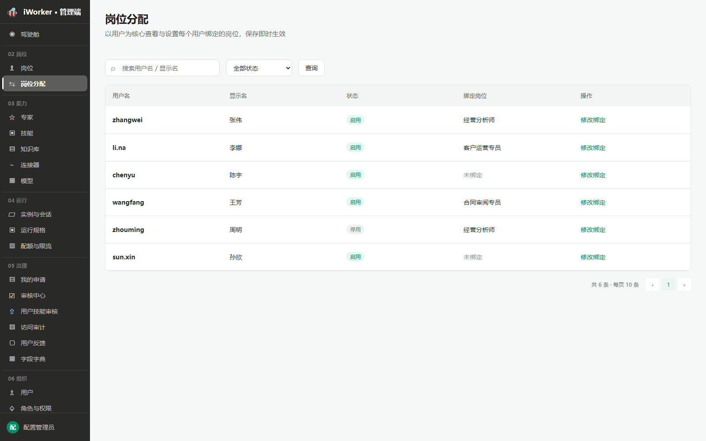
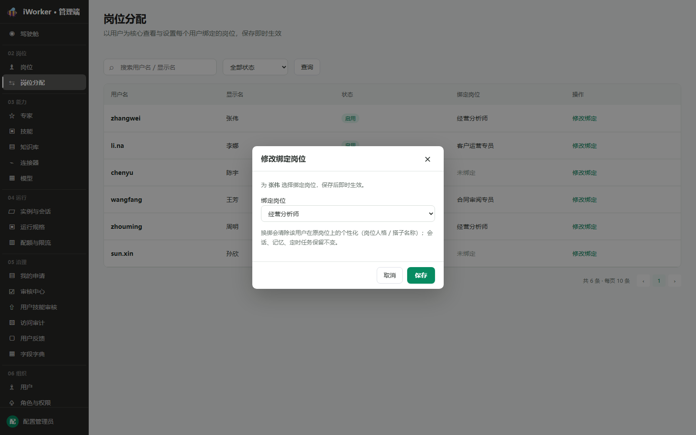

# 岗位分配产品需求

## 一、产品目标与入口

岗位分配以用户为核心维护"用户—岗位"一对一绑定关系，保存后即时生效；同时支持处理用户从客户端提交的岗位申请。

- **页面入口**：侧边栏"02 岗位 / 岗位分配"。
- **页面标题**：岗位管理。
- **页面说明**：管理用户岗位绑定，支持直接分配与处理用户岗位申请。
- **权限要求**：无页面权限时不展示入口。

## 二、页签结构

页面顶部展示两个页签：

| 页签 | 说明 |
| --- | --- |
| 用户岗位分配 | 以用户为核心查看与设置每个用户绑定的岗位，保存即时生效 |
| 岗位申请审批 | 查看和处理用户从客户端提交的岗位申请，支持通过、驳回和重新绑定 |

- "岗位申请审批"页签标题后展示待审核数量徽标，数量为 0 时不展示徽标。
- 切换页签时保留各页签内的筛选条件和分页状态。
- 默认进入"用户岗位分配"页签。

## 三、用户岗位分配

### 3.1 查询区

查询区从左到右展示：

1. **搜索框**：占位"搜索用户名 / 显示名"，支持用户名、显示名模糊搜索。
2. **状态筛选**：全部状态、启用、停用。
3. **查询按钮**：点击后按当前搜索词和状态筛选刷新列表，并回到第 1 页。

搜索和状态可以组合使用。无匹配结果时展示"没有匹配的用户"，保留查询条件。

### 3.2 分配列表

#### 3.2.1 展示字段

| 字段 | 展示规则 |
| --- | --- |
| 用户名 | 用户登录名，使用强调字重 |
| 显示名 | 用户显示名称；无内容显示"—" |
| 状态 | 启用为绿色标签，停用为灰色标签 |
| 绑定岗位 | 展示当前岗位名称；无岗位显示"未绑定" |
| 操作 | 固定展示【修改绑定】 |

列表根据页面可用高度动态计算每页条数，底部展示总条数、每页条数和分页器。

#### 3.2.2 状态筛选

选择"停用"后仅展示停用用户。停用用户仍保留原岗位绑定关系，也允许管理员修改或清除绑定。

### 3.3 修改绑定

点击【修改绑定】打开"修改绑定岗位"弹窗。

弹窗规则：

- 顶部提示"为 显示名 选择绑定岗位，保存后即时生效"。
- **绑定岗位**为单选下拉框，只展示已发布岗位。
- 默认选中用户当前绑定岗位；首项为"未绑定"，用于清除绑定。
- 换绑提示：换绑会清除该用户在原岗位上的个性化（岗位人格 / 搭子名称）；会话、记忆、定时任务保留不变。
- 点击【保存】后更新绑定关系、关闭弹窗、刷新列表并提示"岗位绑定已更新"。
- 点击【取消】、关闭按钮或遮罩，放弃本次修改。

## 四、岗位申请审批

### 4.1 列表规则

- 仅展示状态为"待审核"的岗位申请，已通过、已驳回、已重新绑定的申请不展示。
- 默认按提交时间由近到远排列，点击列头"提交时间"可切换升降序。
- 无待审核申请时展示空状态：标题"暂无待审核的岗位申请"，副文案"新的用户岗位申请会显示在这里"。
- 列表根据页面可用高度动态计算每页条数，底部展示总条数、每页条数和分页器。

### 4.2 展示字段

| 字段 | 展示规则 |
| --- | --- |
| 用户名 | 用户登录名，使用强调字重 |
| 显示名 | 用户显示名称；无内容显示"—" |
| 状态 | 取该用户在分配列表中的启用/停用状态，启用为绿色标签，停用为灰色标签 |
| 现有绑定岗位 | 展示用户当前已绑定的岗位名称；无绑定显示"未绑定" |
| 申请岗位 | 展示用户申请的岗位名称，使用强调字重 |
| 提交时间 | 申请提交时间，精确到分钟；支持点击列头排序 |
| 操作 | 【通过】为链接样式、【驳回】为危险链接样式、【重新绑定】为链接样式 |

### 4.3 操作

#### 4.3.1 通过

点击【通过】打开确认弹窗。

- 弹窗标题："确认通过岗位申请"。
- 正文展示："确认通过 显示名 的岗位申请？"
- 补充说明："确认后将使用现有岗位绑定接口，把该用户设置为「申请岗位名称」。"
- 确认按钮文本："确认通过"。
- 点击【确认通过】后：将用户绑定岗位更新为申请岗位，申请状态变为"已通过"，关闭弹窗，刷新列表并提示"岗位申请已通过，绑定已更新"。
- 点击【取消】、关闭按钮或遮罩，放弃本次操作。

#### 4.3.2 驳回

点击【驳回】打开驳回弹窗。

- 弹窗标题："驳回岗位申请"。
- 确认按钮文本："确认驳回"。
- **驳回原因**为必填项（红色星号标记），多行文本框，最多 500 字，占位提示"请输入明确的驳回原因"。
- 未填写驳回原因时点击【确认驳回】显示错误提示"请输入驳回原因"并聚焦输入框，弹窗保持打开。
- 填写后点击【确认驳回】：申请状态变为"已驳回"，记录驳回原因，关闭弹窗，刷新列表并提示"岗位申请已驳回"。
- 点击【取消】、关闭按钮或遮罩，放弃本次操作。

#### 4.3.3 重新绑定

点击【重新绑定】调用"修改绑定岗位"弹窗（与 3.3 节修改绑定弹窗一致），完成后执行以下流程：

- 弹窗中可选择任意已发布岗位，不限于申请岗位。
- 顶部提示"为 显示名 选择绑定岗位，保存后即时生效"。
- 换绑提示：换绑会清除该用户在原岗位上的个性化（岗位人格 / 搭子名称）；会话、记忆、定时任务保留不变。
- 点击【保存】后：更新用户绑定岗位，申请状态变为"已重新绑定"，关闭弹窗，自动切换到"用户岗位分配"页签，清空搜索和状态筛选，将刚操作的用户置顶高亮聚焦，并提示"岗位绑定已更新"。
- 点击【取消】、关闭按钮或遮罩，放弃本次操作，申请状态保持"待审核"不变。

## 五、业务规则

- 每个用户同一时间最多绑定 1 个岗位。
- 换绑为覆盖关系，不保留多个并行岗位。
- 可绑定岗位仅包括"已发布"岗位；未发布、审核中及已停用岗位不进入下拉选项。
- 用户停用不自动解除岗位绑定。
- 清除绑定只解除岗位关系，不删除用户，不影响历史会话、记忆与定时任务。
- "通过"操作直接将用户绑定到申请岗位，等效于管理员手动修改绑定。
- "重新绑定"操作允许管理员选择与申请岗位不同的岗位，处理完成后申请标记为"已重新绑定"。
- "驳回"操作不改变用户现有岗位绑定关系。

## 六、异常与空状态

| 场景 | 页面处理 |
| --- | --- |
| 分配列表查询无结果 | 展示"没有匹配的用户"，保留条件 |
| 申请列表无待审核记录 | 展示"暂无待审核的岗位申请"，副文案"新的用户岗位申请会显示在这里" |
| 无可绑定岗位 | 修改绑定弹窗下拉框仅展示"未绑定" |
| 保存失败 | 弹窗保持打开并展示失败原因 |
| 绑定岗位在保存前被停用 | 阻止保存并刷新可选岗位 |
| 无操作权限 | 【修改绑定】【通过】【驳回】【重新绑定】置灰或不展示 |
